# 加固型袖珍摄像头综述:东芝 BW10、三星 W200、柯达 Easyshare Sport 和 Playsport TechCrunch

> 原文：<https://web.archive.org/web/http://techcrunch.com/2011/07/15/rugged-pocket-cam-round-up-toshiba-bw10-samsung-w200-kodak-easyshare-sport-and-playsport/>

夏天到了，很有可能你们中的一些人正在考虑挑选一些东西来记录你的假期。iPhones 和傻瓜相机都不错，但如果你想带着它去游泳池或海滩，确信一个错误的飞溅不会永久损坏你的相机是很好的。我们这里有几款防水翻盖口袋相机供您选择，但哪一款值得您的血汗钱呢？

我没有包括图像样本，因为老实说，所有这些相机都有微小的传感器和小而弱的镜头，这些因素结合起来会产生嘈杂的图像，清晰度很差等等。但是它们很便宜，而且不适合度假(也就是说，不会被浅水、沙子和泥土绊倒，也不会有短暂的跌落)。你不可能拥有一切。

[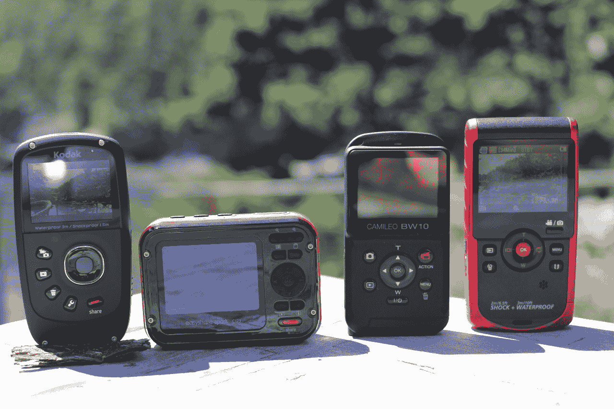](https://web.archive.org/web/20230203152149/https://techcrunch.com/wp-content/uploads/2011/07/guys2.jpg)

以下是他们，排名不分先后:

* * *

[柯达 play sport——160 美元](https://web.archive.org/web/20230203152149/http://store.kodak.com/store/ekconsus/en_US/pd/PLAYSPORT_Video_Camera__Zx5/productID.221644700)

[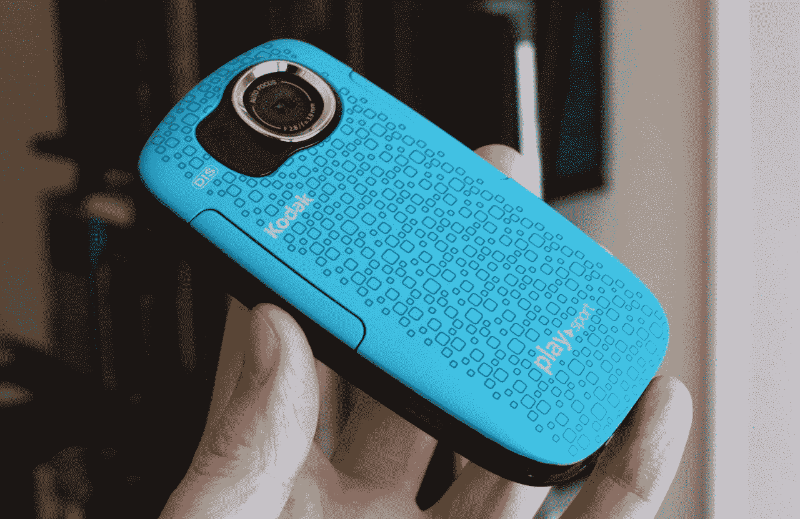](https://web.archive.org/web/20230203152149/https://techcrunch.com/wp-content/uploads/2011/07/img_2404.jpg)

**赞成**:

*   手感不错
*   宽角物镜
*   额外的视频选项

**缺点**:

*   呆滞菜单
*   小型液晶显示屏
*   容易意外打开左舷门

我喜欢旧的 Playsport，新的似乎是一个渐进的改进。它更紧凑，表面上符合人体工程学布局——至少对惯用右手的人来说是这样。与其他设备相比，它没有太多的可塑性，我个人认为它看起来是最好的。它比三星同样大小的 BW10 重得多，但形状更好。

[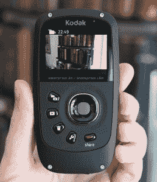 ](https://web.archive.org/web/20230203152149/https://techcrunch.com/wp-content/uploads/2011/07/img_2400.jpg) [ 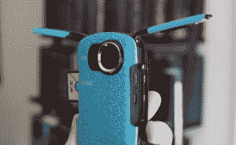](https://web.archive.org/web/20230203152149/https://techcrunch.com/wp-content/uploads/2011/07/img_2402.jpg)

有几个额外的视频选项:除了 1080p/30，还有 720p 的 30 和 60 fps，以及 WVGA (640×360)模式，更易于管理的文件大小和 SD 播放。然而，浏览菜单是一种耐心的锻炼；d-pad 僵硬，在选项之间移动缓慢。液晶显示器虽然小，但无疑是最清晰的相机。

我发现打开设备端口的区域有点太容易了。一个简单的手滑(或者一个可能弹出你的 SD 门，沙子进去。该区域的其他摄像机明显更安全。

* * *

[三星 W200–160 美元](https://web.archive.org/web/20230203152149/http://www.samsung.com/us/photography/camcorders/HMX-W200RN/XAA)

[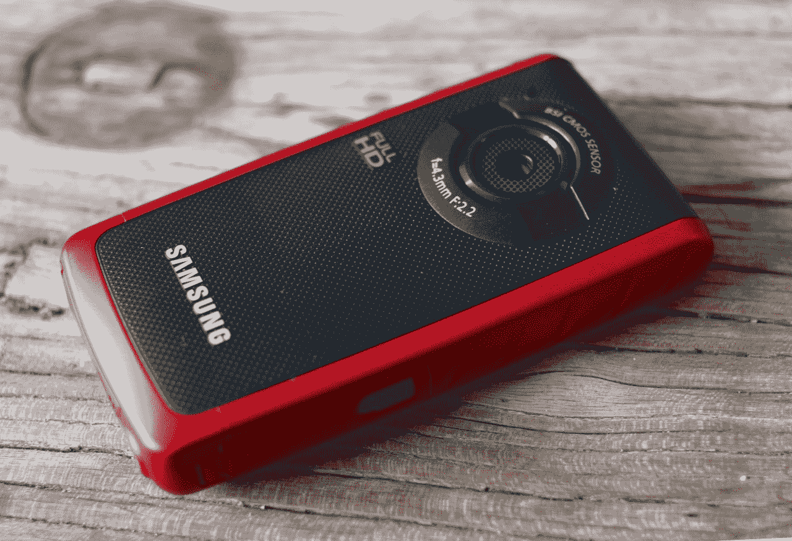](https://web.archive.org/web/20230203152149/https://techcrunch.com/wp-content/uploads/2011/07/img_0102.jpg)

**优点**:

*   图像稳定
*   弹簧加载端口门感觉安全
*   最大的液晶显示器
*   多镜头、单文件录制

**缺点**:

*   有点大
*   老实说，很丑
*   只有两种视频模式
*   内置 USB 插头非常方便

W200 无疑是这些设备中最大的。当然，它仍然很小，但感觉更笨重。它也感觉很好，很结实，这种感觉延伸到了它的端口门，在 Playsport 上太容易打开，在 BW10 上又太复杂。W200 的门是弹簧加载的，只有用力才能打开——但是是很好的那种用力。它们会在你需要的时候打开。

[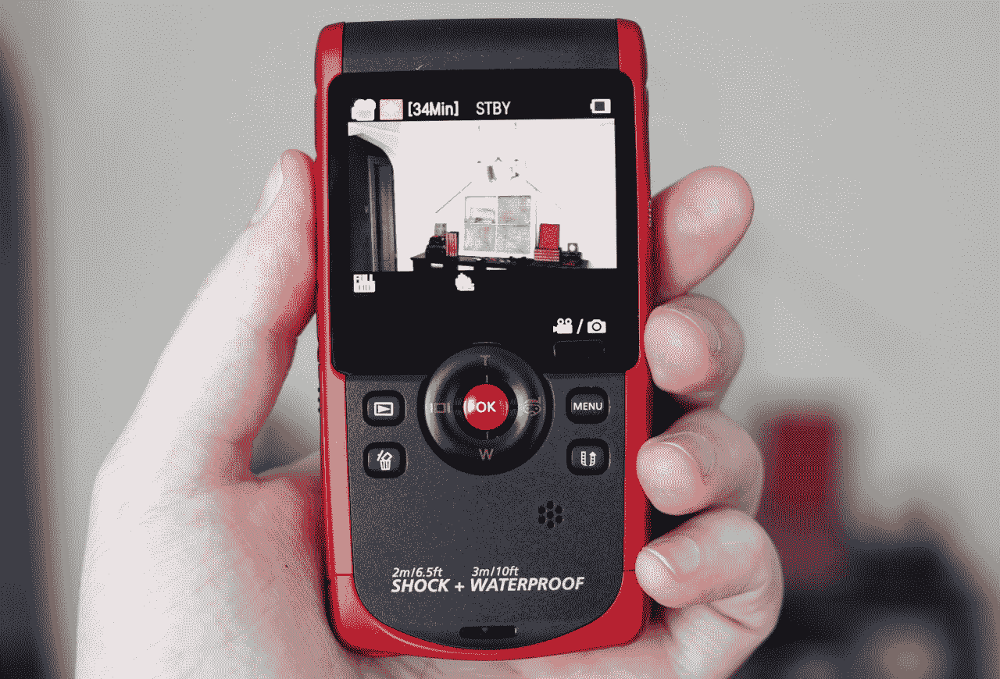](https://web.archive.org/web/20230203152149/https://techcrunch.com/wp-content/uploads/2011/07/img_0103.jpg)

屏幕是这里最大的一个产品，差不了多少，但是值得一提。额外的空间用于在图片上方和下方的黑色区域显示信息。菜单很吸引人，而且操作快捷。d-pad 手感僵硬，但实际上反应非常好。不幸的是，中间的按钮非常深，因为它是在照片模式下用来设置焦点的，你必须以相当的方式按下它才能做出选择。这不是一个真正的实质性问题，但它困扰着我。底部有一个翻盖 USB 插头，如果它适合你的设置，这很方便，如果你只想有一个端口来插入电缆，这就有点麻烦了。

只有两种视频模式，1080p/30 和 720p/30，太差了。它有令人钦佩的能力来“暂停”录音而不创建新文件，这将受到许多不喜欢事后编辑的人的欢迎。拍摄静态照片的感觉比其他照片更好，包括相机形状的 Easyshare Sport。

它的自动关机程序突然发出水滴声，差点让我心脏病发作。你可以把它关掉。

* * *

[东芝 Camileo BW10–130 美元](https://web.archive.org/web/20230203152149/http://www.toshiba-multimedia.com/eu/camileo-camcorders/bw10/)

[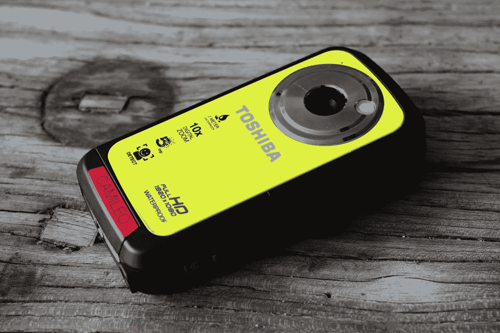](https://web.archive.org/web/20230203152149/https://techcrunch.com/wp-content/uploads/2011/07/img_0095.jpg)

**优点**:

*   小型的，紧凑的
*   漂亮的点击控制
*   简单易用

**缺点**:

*   视野是怎么回事？
*   极慢的孔径响应
*   必须用指甲打开舱门

BW10 是这些设备中操作最简单的，所有这些设备的操作都非常简单。但是 BW10 可以随时拍照或录像，你可以在录像的同时拍照。LCD 有两种模式，一种显示您记录的内容，另一种显示整个画面，并附有指南，显示相机实际记录的内容。

等等，什么？

[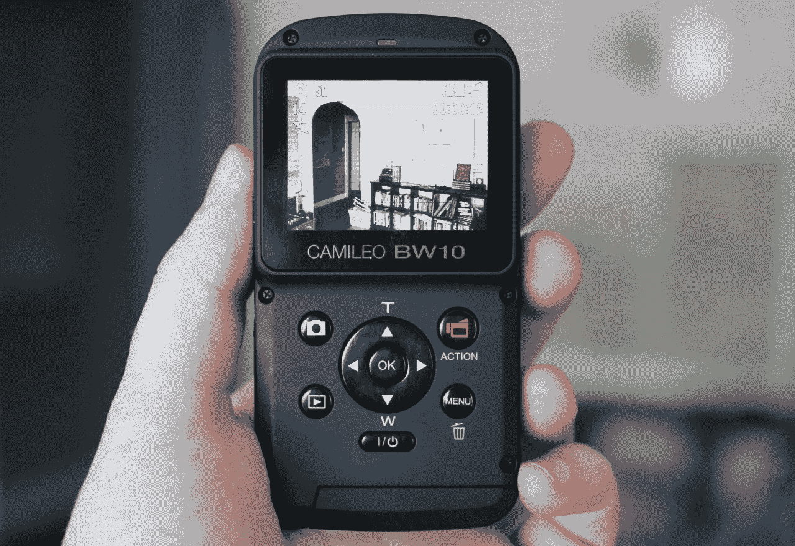](https://web.archive.org/web/20230203152149/https://techcrunch.com/wp-content/uploads/2011/07/img_0107.jpg)

是的，显然东芝觉得 BW10 应该剪掉边缘，只记录中间，而不是记录它通过广角镜头看到的一切。盒子边界之外的任何东西都不会被记录下来——即使它在那里。搞什么鬼？我很确定我没有弄错这一点，这只是一个非常愚蠢的限制。

BW10 也需要很长时间才能从灯光变化中恢复过来。从室外到室内，当相机快速打开光圈时，镜头会暗几秒钟。这需要很长时间，实际上还会影响图像的投射，随着光圈的打开，图像会从暖到冷。

端口门非常安全——我可能会说太安全了，因为你需要点击的微小开关不是用手指就能轻易做到的。真的没什么大不了的，但是开门应该是一个精确的动作，这很烦人。

* * *

[柯达 Easyshare Sport——80 美元](https://web.archive.org/web/20230203152149/http://store.kodak.com/store/ekconsus/en_US/pd/SPORT_Camera/productID.222433400)

[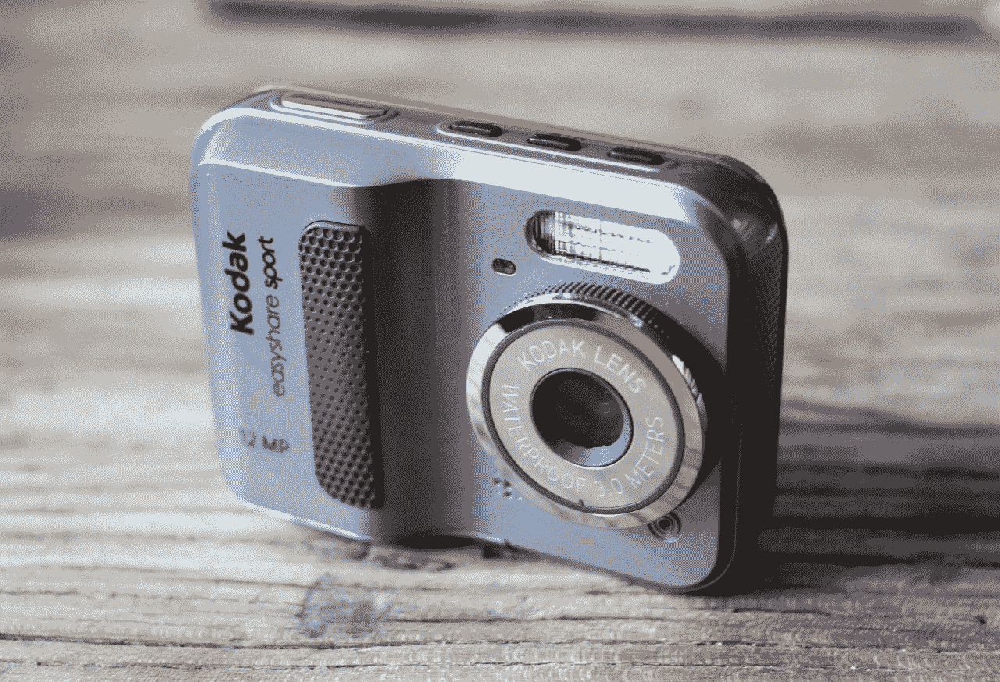](https://web.archive.org/web/20230203152149/https://techcrunch.com/wp-content/uploads/2011/07/img_0093.jpg)

**优点**:

*   形状像照相机，如果你喜欢的话

**缺点**:

*   总是在静止拍摄模式下启动
*   没有视频选项
*   USB 端口放置不当

Easyshare Sport 更像是一款防水的廉价傻瓜相机，但它似乎比其他傻瓜相机更适合这些人。问题是它不太好。它有一个很大的把手，可以安装为它供电的 AA 电池，但快门按钮并不在它的顶部，也不在你预期的位置。整个控件布局有点随意。例如，为什么缩放按钮没有映射到 D-pad？为什么 D-pad 这么小，而中央按钮又这么难按，以至于当我试图选择一个菜单选项时，最终会同时按下各个方向？为什么在模式选择中，视频不在“自动”旁边？整个事情给人一种没有任何设计的感觉。

[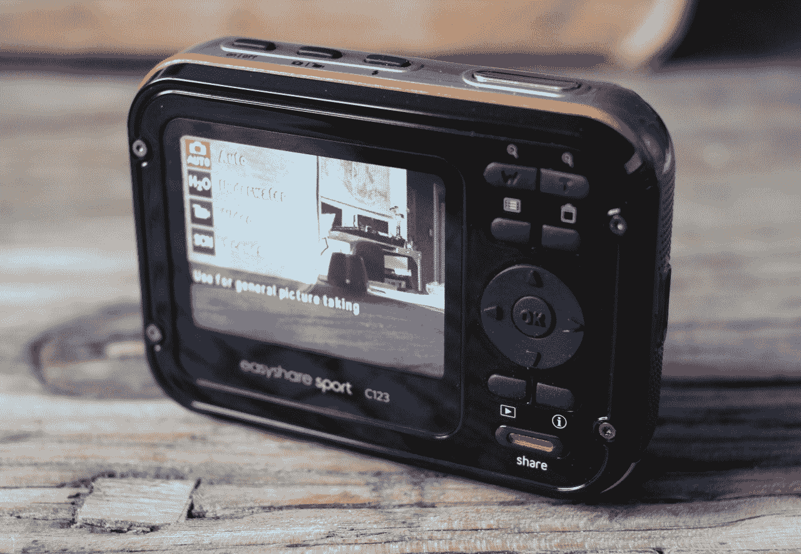](https://web.archive.org/web/20230203152149/https://techcrunch.com/wp-content/uploads/2011/07/img_0094.jpg)

质量也不怎么样。它看起来像是有一个真正的镜头，但它或多或少是一个针孔，就像这些相机的其余部分一样(这些相机也做了一些长度，以使它们看起来像是有真正的圆形镜头)，它的缓慢表现在 LCD 上图像的起伏上。即使在光线充足的房间里，图像也是模糊和跳动的。只有一种视频模式(水下算的话有两种，但我没有)，我不信任。

要接触 USB 端口，你必须打开电池和 SD 卡所在的底部面板，这首先是一种痛苦。没有把手，而且必须同时向两个方向按压，这意味着如果你的手是湿的，那就别想了。不太方便用户使用。

**我们的选择**

[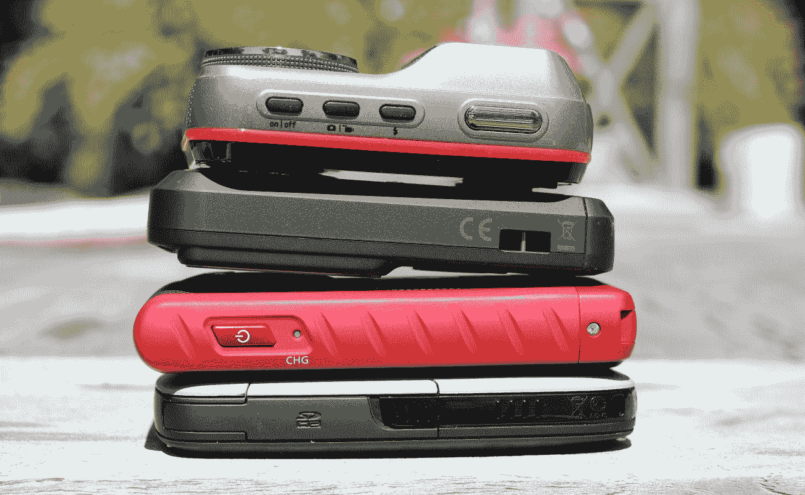](https://web.archive.org/web/20230203152149/https://techcrunch.com/wp-content/uploads/2011/07/guys4.jpg)

东芝做出了太多的妥协，我不会为 Easyshare Sport 支付一美元。所以它介于 W200 和 Playsport 之间。在我看来，它是这样分解的:

**Playsport**

*   更清晰、更精确的 LCD
*   更多视频模式(60fps 可用作慢速模式)
*   更宽的镜头

**W200**

*   更大的液晶显示器
*   卓越的视频质量(尽管还没那么好)
*   图像稳定和录音暂停等便捷功能

我不能告诉你哪个对你来说是最好的选择。如果我必须选择，我会选择 W200，因为最终产品更好——这些相机都不能产生良好的图像，但 Playsport 在图像和视频方面明显不太清晰。他们有相同的建议零售价，所以努力思考相机的哪个部分对你来说是重要的，并根据这一点做出选择。