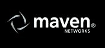

# 雅虎宣布以 1.5 亿美元收购大型视频公司——Maven Networks。

> 原文：<https://web.archive.org/web/https://techcrunch.com/2008/01/31/rumor-yahoo-to-announce-large-video-acquisition-today/>

# 雅虎宣布以 1.5 亿美元收购大型视频公司——Maven Networks。

***08 年 2 月 12 日更新**:交易已经[确认](https://web.archive.org/web/20230218040538/https://techcrunch.com/2008/02/12/yahoo-confirms-maven-networks-acquisition/)。价格是 1.6 亿美元。]*

我们得到消息，雅虎将在今天或明天宣布收购一家视频初创公司。起初，我们认为目标可能是 Metacafe，它在 2006 年谷歌/YouTube 交易后几乎被雅虎收购。不久之后，它收购了一个基于网络的视频编辑器 Jumpcut 。但是它不是一个视频聚合器，我们听说过，而是一个平台公司。价格超过 1 亿美元。

价位限制了候选人的数量。Brightcove 是我们最大的猜测。如果是 Brightcove，考虑到投资者到目前为止已经向该公司投入了 8600 万美元，价格必须远远超过 1 亿美元。随着事态的发展。

关于在线视频领域及其参与者的精彩概述，请看 Brightcove 首席执行官 Jeremy Allaire 和 SVP 营销 Adam Berrey 写的这篇文章。

**更新**:是*不是* Brightcove。三个独立的消息来源证实，这是 [Maven Networks](https://web.archive.org/web/20230218040538/http://www.maven.net/) ，另一家总部位于波士顿的视频创业公司。价格被认为是 1.5 亿美元。Maven 是媒体网站的视频托管平台，包括福克斯新闻频道、CBS Sports、CNet 和 Scripps Networks。但是雅虎可能更想要它的视频广告网络、定位和插入技术。迄今为止，Maven 已经从包括 Accel、General Catalyst 和 Prism Ventures 在内的投资者那里筹集了 3000 万美元。