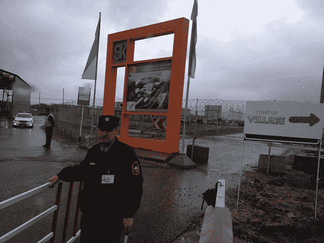
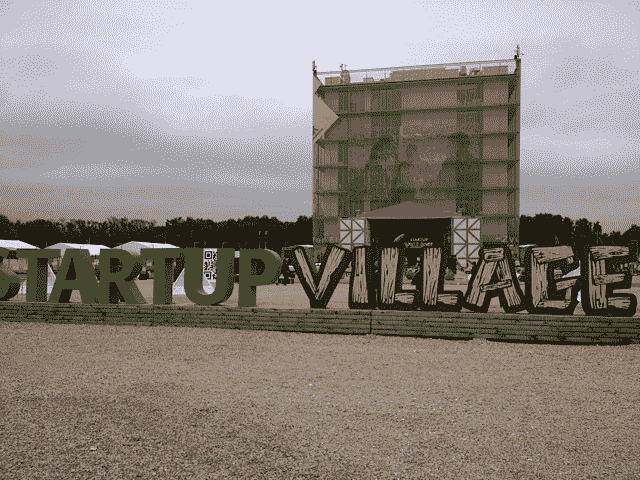
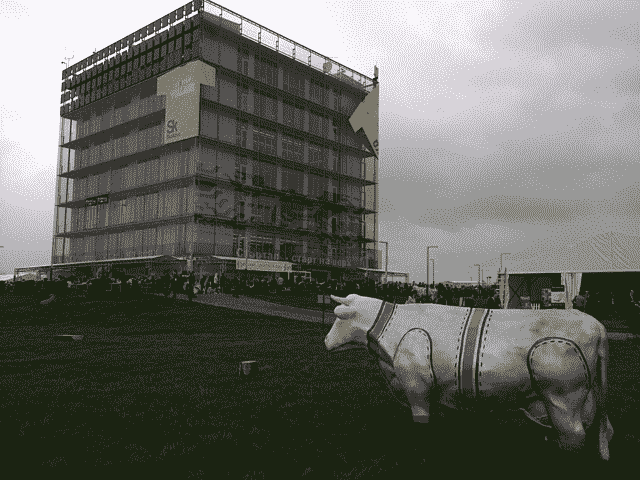
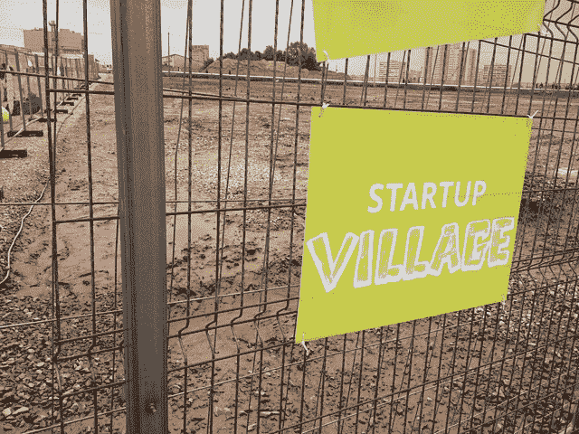
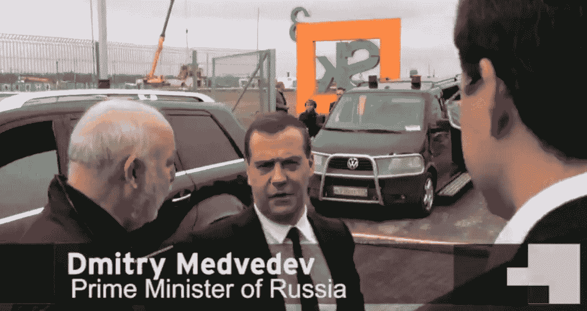
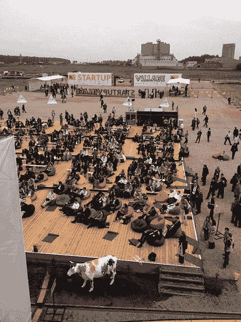
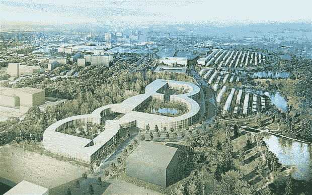
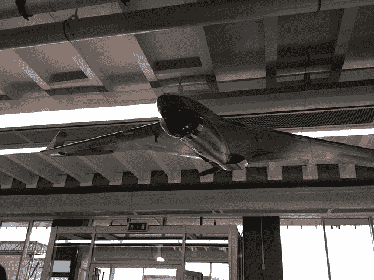
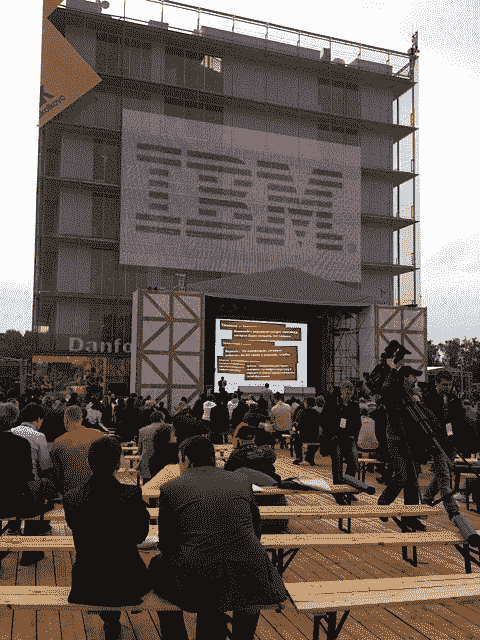

# 俄罗斯希望斯科尔科沃科技城能实现大跃进

> 原文：<https://web.archive.org/web/http://techcrunch.com/2013/05/31/russia-hopes-the-skolkovo-tech-city-will-produce-its-great-leap-forward/>

在冷战高峰时期，苏联建立了一个“Naukograd”或“科学城”网络。这些是国家建立的科学家集群，致力于帮助中国与西方竞争的技术，尤其是在核武器和太空探索领域。那些日子当然已经一去不复返了，但今天的俄罗斯——尽管已经摆脱了前苏联的日子——现在面临着一场新的竞赛:如何重振经济，在下一次科技工业革命中参与全球竞争，并摆脱对石油和天然气的依赖。

因为俄罗斯有一个问题。能源部门约占俄罗斯出口的三分之二，约占俄罗斯国内生产总值的 30%，几乎占联邦预算收入的一半。在美国，近 3%的 GDP 用于研发，而俄罗斯企业仅花费 1%。

经济已经进入低迷，现代世界需要重新平衡。正如经合组织所指出的，如果俄罗斯想要在未来繁荣，特别是在科学和技术领域，它需要一个繁荣的中小企业和创业文化。尽管俄罗斯在这些领域拥有一些最佳产品，但它很难将这种科学、技术和研究能力转化为全球商业成功。

虽然与过去的诺格勒完全不同，但在莫斯科郊外创建大型新科技集群的新项目[斯科尔科沃](https://web.archive.org/web/20230308060138/http://www.sk.ru/)会成为俄罗斯的创新快车道吗？

因此，在一个典型的俄罗斯解决问题的方法中，它提出了斯科尔科沃，一个巨大的新的以科学为基础的城市，以推动其经济进入一个技术和创新的新时代。斯科尔科沃创新中心将是一个规划中的高科技商业区，拥有自己的一套法律，旨在鼓励科技公司。这个 400 公顷的场地预计将永久容纳 20，000 多人，另外还有 10，000 人通勤上班。换句话说，这是一个典型的俄罗斯规模的大型项目。但是与过去不同的是，整个项目由一个特别创建的非营利组织——斯科尔科沃基金会——运营。

【T2

斯科尔科沃创新中心将主要由俄罗斯联邦预算资助。去年投入了约 220 亿卢布，预计今年将投入 173 亿卢布。这显然是俄罗斯人自己认可的对过去类似项目的现代化改造。他们主要关心的是，这行得通吗，这钱花得明智吗？

本周的周一和周二，我被邀请参加一个现场展示日，一个被称为“创业村”的活动。在那里，从生物技术到工程再到互联网初创公司，各种公司以一种让人想起传统商展的方式向游客和潜在投资者展示他们的产品——我要补充的是，如果那个商展只针对说俄语的人。

在斯科尔科沃，迄今为止，只有立方体形状的七层“超立方体”展览中心已经建成。这是一座玻璃和混凝土的建筑，外观粗糙，让人想起许多创业中心，点缀着投球区、会议室、媒体区，当然还有豆袋。围绕它的是围绕生物技术、生命科学和 it 等领域的临时展馆。

从航空测绘无人机到平视显示器，再到(或许具有讽刺意味的)石油和天然气勘探设备，这些种类繁多的产品展示了斯科尔科沃最终将接纳的公司的巨大范围。

尽管下了几场雨，把会场外面的部分地区变成了潮湿的沼泽，但总体上友好的庆祝气氛并没有被浇灭，尤其是当太阳最终出来的时候。外面的便携式厕所增加了“音乐节”的气氛。这当然不是普通的俄罗斯事件。

但是天气和没有红地毯不足以阻止总理梅德韦杰夫，他参观了活动，听取了公司的推销，试用了展出的产品，并与官员交谈(尽管你会从我们的视频中看到，我们很难获得采访)。

在西方人看来，这一切顶多看起来“迷人”,即使有时有点偶然——尤其是如果你是一位穿着高跟鞋的女士，不得不穿过大片砾石路。

一个有如此多政府支持的项目怎么能在迎风招展的帆布馆里举办活动呢？普通俄罗斯人通常会问斯科尔科沃项目这样的问题。

然而，正如我的联系人指出的那样，这种完全非正式的活动正是他们想要的。“看到这么多重要人物穿着牛仔裤，对我们来说是件大事，”一位年轻的企业家对我说。对他们来说，非正式是一种接触更自由的西方创新诠释的方式，远离旧的白大褂和沉闷的官场西装。

但是斯科尔科沃的吸引力对于俄罗斯新一波创业公司来说不仅仅是装饰性的。

与俄罗斯其他地区的公司相比，设在那里的公司将享有特权。斯科尔科沃地区正被打造为一个独立的经济特区，拥有自己的边境管制和针对初创企业的立法激励措施，比如为期 5-7 年的免税期。它还制定了特殊法律，允许其他国家的企业家在那里工作——实际上是俄罗斯的“创业签证”。

由时任俄罗斯总统的梅德韦杰夫于 2009 年 11 月宣布，该联合体由俄罗斯寡头维克多·维克塞尔伯格(Viktor Vekselberg)领导，前英特尔首席执行官克雷格·巴雷特(Craig Barrett)担任联合主席。

它有一条全新的高速公路连接斯科尔科沃和莫斯科，还计划修建通往首都和伏努科沃国际机场的铁路。

它的五个“集群”将专注于不同的领域，包括信息技术、能源、核技术、生物医学和空间技术。清洁能源将是一个特别的焦点，城市将“吃自己的狗粮”——回收几乎所有的废物，以创造一个最少或零排放的节能城市。这个城市只允许电动车通行。

斯科尔科沃城的主要元素将是大学和科技园区。麻省理工学院已经签约共同管理这所大学的创建，据报道，它的参与获得了 3 亿美元。斯科尔科沃科技学院将拥有由麻省理工学院设计的课程，只提供研究生学位，并且用英语授课——这在俄罗斯很少见。麻省理工学院在中国、葡萄牙、新加坡和阿联酋的阿布扎比也有类似的安排，但西方大学以前从未以这样的方式或这样的规模接触过俄罗斯本土的人才。

监督所有这些活动的非营利组织斯科尔科沃基金会(Skolkovo Foundation)与俄罗斯和国际公司签署了多项合作协议，包括 IBM、Rusnano、Rostelecom、俄罗斯风险投资公司和 ITFY。IBM 将在该网站上建立实验室和新的工作岗位，以换取许可其与科技公司如何开发其知识产权和商业化有关的专有技术。微软和西门子也已经同意将实验室设在那里，该基金会表示，它已经招募了 52 家风险投资公司参与整个项目。

也就是说，到目前为止，斯科洛沃的旅程并不顺利。斯科尔科沃创新基金(Skolkovo innovation fund)的一名高级副总裁上月被停职，原因是警方调查他涉嫌两年前向一名讲师支付过高薪酬。这位讲师后来成为一名反对普京总统任期的议员。也就是说，这笔交易与俄罗斯当前政治格局之间的联系有些模糊。

据俄罗斯最高执法机构调查委员会称，斯科尔科沃高管阿列克谢·贝尔图科夫(Aleksey Beltyukov)向议员伊利亚·波诺马廖夫(Ilya Ponomaryov)支付 75 万美元，以换取 10 场讲座和一篇研究论文，这违反了法律。Beltyukov 在此案继续审理期间已从 Skolkovo 离职，但我的调查显示，在此案继续审理期间，他仍是 Skolkovo 项目的顾问。

与此同时，调查陷入了否认和反否认的反复。Ponomaryov 说合同是真实的，他的所有行为都是合法的，对他的指控是出于政治动机。与此同时，斯科尔科沃基金会也对波诺马廖夫提起了自己的诉讼。

值得注意的是，斯科尔科沃基金会的负责人维克多·维克塞尔伯格是俄罗斯最富有的商人之一，他拥有政府对该项目的大力支持。但这也意味着，该项目应该独立于政治光谱的所有方面。

斯科尔科沃的政治道路坎坷不平。它也得到副总理弗拉季斯拉夫·苏尔科夫的支持，但在政府被迫发布糟糕的经济数据后，他于本月早些时候辞职。俄罗斯 2 万亿美元的经济正以自 2009 年收缩以来最慢的速度增长。

为了混淆视听，媒体大肆渲染苏尔科夫的辞职及其对斯科尔科沃的影响，却往往没有注意到俄罗斯政治的弱点。总理有几个副总理，所以很有可能另一个会简单地接过斯科尔科沃的接力棒。目前，普京已经任命总统顾问安德烈·富尔先科监督该项目。

但在“创业村”活动期间，有人看到苏尔科夫本周参观了创业村展览，好像什么都没有发生过。

可以确定的是，苏尔科夫将继续他的关系，在斯科尔科沃的参与下，主持 10 月份在莫斯科[“2012 开放创新论坛”](https://web.archive.org/web/20230308060138/http://www.forinnovations.org/)举行的一次重要的全球/俄罗斯会议。

苏尔科夫最近在伦敦经济学院(London School of Economics)的问答环节公开为斯科尔科沃辩护，而调查委员会发言人弗拉基米尔·马丁(Vladimir Markin)在报纸上撰文攻击苏尔科夫，后者称刑事调查过于严厉。

很明显，试图弄清楚这一切对斯科尔科沃意味着什么需要一个“克里姆林学”的博士学位。

但无论如何，斯科尔科沃要攀登的主要山峰很可能是批评者，他们认为投入该项目的资源数量与结果之间的差距太大，迄今为止，结果是有限的。

当然，参观实际上只有一栋建筑的建筑工地(这是在该政策首次宣布三年后)不会激发巨大的信心。

此外，当像 [Digital October](https://web.archive.org/web/20230308060138/http://www.digitaloctober.com/) 这样的私营部门孵化器——位于莫斯科市中心，是许多创业公司的所在地——在没有数十亿政府资金的情况下存在并蓬勃发展时，人们不禁要问，为什么俄罗斯政府似乎如此热衷于花这么多钱，吸引这么多国际合作伙伴。

然而，毫无疑问的是，斯科尔科沃现在有一个很大的蒸汽头，这种规模的项目显然不是一夜之间发生的。像罗马一样，斯科尔科沃也不是一天建成的。

当我参观现场时，我可以亲眼看到，占地 400 公顷的斯科尔科沃工地上到处都是正在进行的其他建筑项目。据发言人说，排水和电力等基本服务都已进入地下。当代表们在创业村活动中四处走动时，一些建筑显然正在进行中。

此外，城市的大部分核心都是在其他地方预制的，这意味着一些建筑应该会很快建起来。一位发言人说，该网站的核心，科技园，甚至可能在今年年底完工。

【T2

该项目的另一个方面是 Vekselberg 的主要顾问的参与，这可能让观察者保持谨慎乐观。其中包括负责国际业务的副总裁康纳·勒尼汉。经验丰富的勒尼汉曾在多个爱尔兰政府部门任职，曾任爱尔兰科学、技术和创新部长。他也曾是 O2 的高管。换句话说，他以前做过类似的大项目，有一个国际网络可以利用。另一个是芬兰 IT 巨头 Tieto 的创始人 Pekka A. Viljakainen 的参与，他精力充沛，乐观向上，拥有广泛的技术网络。Viljakainen 还让创业村活动感觉更接近你在欧洲或美国任何地方都能找到的创业活动。

但也许最有说服力的是负责对外交流和广告的副总裁亚历山大·切尔诺夫(Alexander Chernov)的出席。切尔诺夫在俄罗斯圈子里被认为是一个能干成事的人。他曾是一名记者，后来成为俄罗斯可口可乐公司的高管，但更为人所知的是，他是获得索契冬奥会(2014 年索契冬奥会)提名和俄罗斯获得 2018 年国际足联世界锦标赛举办权提名的团队成员。

切尔诺夫指出，斯科尔科沃不会垄断俄罗斯向有利于创新的新经济的推进。他表示，该基金会正集中精力在俄罗斯各地巡回宣传其理念和公司，最近去了 16 个不同的中心:“俄罗斯到处都有创新，我们只需要展示它，”他表示。

但最终，他说，斯科尔科沃项目将是俄罗斯的旗舰项目，它得到了最高层前所未有的支持。正如他告诉我的:

“合作伙伴的需求如此之高，政府的承诺如此之强，他们都在推动这项工作。每当高级官员访问斯科尔科沃时，通常都会受到强烈的批评，例如，大学尚未建成，或者技术园区尚未投入使用。他们不接受借口。这就是我们的经营环境。”

切尔诺夫对最近围绕该项目的政治难题不屑一顾:“我们得到了政府的大力支持。是的，苏尔科夫先生非常合作和支持。他决定离开政府。但我相信我们将会有一个新的政府联络员。”

关于警方“突袭”调查斯科尔科沃的支出，他拒绝评论案件的具体情况，表示当调查有结果时会发表声明。但他强调，占据基金会头脑的不是这个，而是斯科尔科沃继续工作并创造成功的愿望。“认为我们是总理的项目很好，但我们仍然必须交付。”

是的，斯科尔科沃仍然需要拿出成绩，这是毫无疑问的。在硅谷这样的地方，这种自上而下的高压举措对西方人来说几乎总是完全陌生，委婉地说，在硅谷，政府参与大型技术项目会被视为令人惊讶。

当然，这可能会忘记西方政府曾经如何大力投资于新技术，尤其是在二战后——这些举措往往会启动我们今天所知的私营部门环境。许多新兴国家——马来西亚的 Cyberjaya 和迪拜互联网城——都有与斯科尔科沃类似的项目。绝不是孤军奋战。即使是以色列非常成功的创业生态系统也主要是由政府支持的 Yozma 项目启动的。

事实上，斯科尔科沃会成为俄罗斯科技特洛伊木马，在全国范围内促进创业、创新和企业家精神吗？

站在狂风肆虐的建筑工地上，远处回荡着起重机和卡车的哔哔声，这很难说。当然，如果它成为俄罗斯的负担，那将是一种耻辱。

但将整个斯科尔科沃项目仅仅视为一个建筑工地，可能会忽略那里的团队可以获得的巨大资源及其享有的持续政治资本。假设一些全球最大的科技公司继续广泛参与国际市场，斯科尔科沃目前有很多优势。

斯科尔科沃向国际合作伙伴敞开大门，是一座超绿色城市，是一个远离旧“瑙科格拉德”的世界。但这种情绪惊人地相似。问题是，斯科尔科沃能产生俄罗斯一直在寻找的那种“大跃进”吗？看起来我们就要知道了。