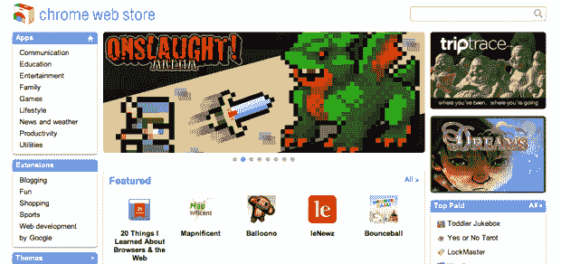
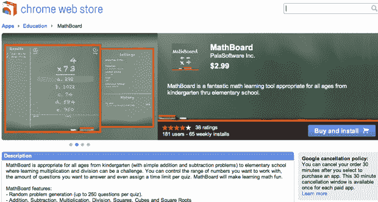

# 谷歌的 Chrome 网上商店 的销量很少

> 原文：<https://web.archive.org/web/https://techcrunch.com/2011/01/04/sales-have-slowed-to-a-trickle-on-googles-chrome-web-store/>

12 月，经过[几个月](https://web.archive.org/web/20230320003404/https://techcrunch.com/2010/05/19/chrome-web-store/)的期待和与第三方开发者的讨论，谷歌终于[推出了](https://web.archive.org/web/20230320003404/https://techcrunch.com/2010/12/07/live-from-googles-chrome-event-chrome-os-web-store-and-more/)Chrome 网络商店——一个让用户购买和“安装”TweetDeck、MOG 和数百个其他网络应用的在线门户网站。这是第一个使用统一支付系统(在这里是谷歌结账)帮助开发者将网络应用货币化的平台之一，它将深度集成到谷歌的 Chrome 浏览器中。不幸的是，据我们所知，没有人真的在上面买东西。

Chrome 网络商店的用户界面看起来非常类似于 iTunes，而且，就像 iTunes 一样，最突出的部分之一是一个“顶级付费”应用程序列表。位居榜首的是[幼儿点唱机](https://web.archive.org/web/20230320003404/https://chrome.google.com/webstore/detail/cgllhajannolhgkllnfpapalgaioobkg)，这是一款售价 1.99 美元的彩色小应用，可以让你播放 12 首儿童歌曲，比如《巴士上的轮子》。而且，根据网上商店的统计，这个星期它已经被安装了六次。哎哟。

公平地说，谷歌并没有按照购买量的顺序对其“付费排行榜”进行排序(尽管我不确定这是为什么)——列表中的其他一些应用做得更好，但即使是这些应用也仍然表现平平。最近活跃的付费应用是 MathBoard，每周安装 65 次，售价 2.99 美元(减去谷歌的费用，所以每次大约 2.56 美元)。换句话说，它的周薪约为 165 美元。这并不是说*没什么，*但考虑到商店里其他应用的收入可能都比这少，这并不好。

现在，销售可能在假期有所放缓，但影响不会那么大。然而，对此还有一个更重要的解释:谷歌没有做太多向用户展示网络商店。事实上，Chrome 目前的稳定版本仍然没有在任何地方提供 Chrome 网络商店——只有当你直接进入网络商店并安装应用程序时，它才会出现。也就是说，谷歌*已经*在一些网站(包括 TechCrunch)上为该商店放置了横幅广告，该商店在推出时得到了大量宣传，所以这并不是什么秘密。

有一些免费的应用程序越来越受到关注，比如[的快速笔记](https://web.archive.org/web/20230320003404/https://chrome.google.com/webstore/detail/mijlebbfndhelmdpmllgcfadlkankhok)，这个星期已经安装了 8000 个。显然，免费应用程序比付费应用程序获得更多安装是很常见的，但是这种差异——65 次付费安装对 8，000 次免费安装——似乎非常明显。

有一点很清楚:谷歌在网络商店方面还有很长的路要走。仍然无法区分基本上只是书签的应用程序和完全成熟的网络应用程序。虽然购买流程本身非常简单(假设你已经有了谷歌结账账户，你只需点击几下就能买到东西)，但我认为谷歌必须做一些工作，教育人们他们到底在买什么。

*感谢布莱恩·肯尼什的提醒。肯尼什是 [Disconnect](https://web.archive.org/web/20230320003404/https://techcrunch.com/2010/12/13/former-googler-launches-disconnect-browser-extension-that-disables-third-party-data-tracking/) 的幕后黑手，这是一个浏览器扩展，可以让你屏蔽脸书连接*

等服务