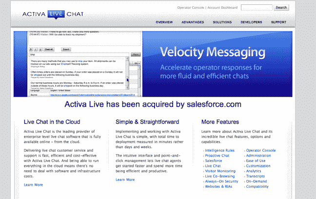

# Salesforce 收购企业聊天初创公司 Activa Live | TechCrunch

> 原文：<https://web.archive.org/web/https://techcrunch.com/2010/09/24/salesforce-buys-enterprise-chat-startup-activa-live/>

# Salesforce 收购企业聊天初创公司 Activa Live

似乎 Salesforce 刚刚收购了企业聊天初创公司 [Activa Live。](https://web.archive.org/web/20230326023631/http://www.activalive.com/)我们已经与 Salesforce 确认了此次收购。

Activa Live 开发 Activa Live Chat，这是一款企业级的按需实时聊天软件，用于客户服务、支持和在线主动销售互动。该软件允许公司实时监控、识别和吸引在线访问者，帮助提高销售额和客户满意度。

该软件还包括一个功能，可以在信息发送前显示访问者正在键入的内容，并帮助实时聊天代理找到客户问题的最佳答案，而无需在固定回答库中搜索。Activa 也作为应用程序在 [Salesforce 的应用程序交换中提供。](https://web.archive.org/web/20230326023631/http://sites.force.com/appexchange/listingDetail?listingId=a0N300000016cbCEAQ%5C)

Activa 在所有平台上都有基于浏览器的版本和桌面版本。该公司的技术被百思买(Best Buy)、美国服饰(American Apparel)和许多其他知名品牌所采用。虽然细节尚不清楚，但我们认为主动实时聊天将被集成到 Salesforce 的服务云(一个 SaaS 客户服务平台)中。

最近的 Salesforce 收购包括 [Sitemasher、](https://web.archive.org/web/20230326023631/http://www.techvibes.com/blog/sitemasher-sold-and-winding-down-but-to-whom)和 [Jigsaw。](https://web.archive.org/web/20230326023631/https://techcrunch.com/2010/04/21/salesforce-buys-jigsaw-for-142m-in-cash-plus-earn-out/)

