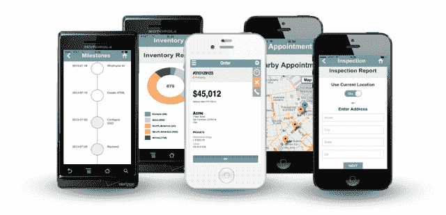
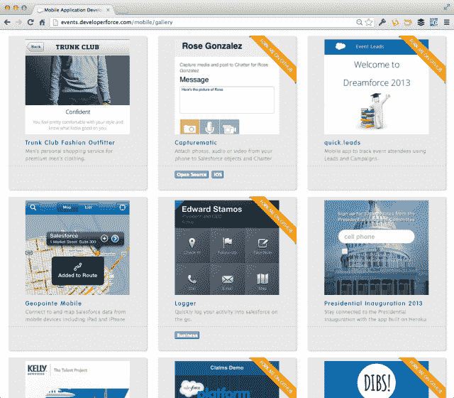
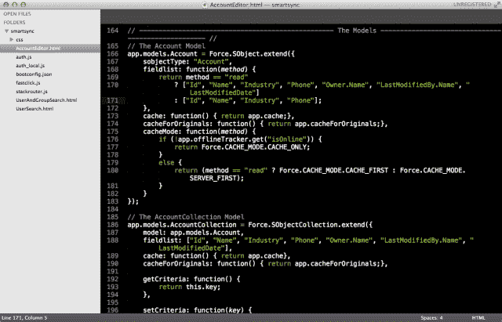

# Salesforce.com 将移动包翻倍，为面临设计挑战的开发人员添加设计模板 

> 原文：<https://web.archive.org/web/http://techcrunch.com/2013/07/31/salesforce-com-doubles-mobile-packs-adds-design-templates-for-design-challenged-developers/>

# Salesforce.com 将移动包翻倍，为面临设计挑战的开发人员增加设计模板

Salesforce.com 将其提供的移动包增加了一倍，为开发者增加了设计模板和同步数据的功能。

这是 Salesforce 帮助客户使用其平台构建应用程序的努力的一部分，这些应用程序可以在我们每天面临的数百个公司所谓的“微时刻”中提高生产力。是的——如果它闻起来像营销，它通常是。但是这个新版本的骨架上有一些肉，即使它是用商标 Salesforce spin 包装的。以下是几个亮点。

首先，Salesforce 在其移动包中提供了四个新的应用框架: [Knockout.js](https://web.archive.org/web/20230130002559/https://techcrunch.com/2011/09/09/node-js-knockout-2011-winners-revealed/) 、 [Appery.io](https://web.archive.org/web/20230130002559/https://techcrunch.com/2013/04/23/visual-mobile-app-builder-tiggzi-relaunches-as-appery-io-adds-new-enterprise-features/) 、 [Sencha Touch](https://web.archive.org/web/20230130002559/https://techcrunch.com/2011/10/24/sencha-raises-15-million-for-their-html5-app-development-tools/) 和 [Xamarin](https://web.archive.org/web/20230130002559/https://techcrunch.com/2013/04/16/xamarin-launches-test-cloud-automated-mobile-ui-testing-platform-acquires-mobile-test-company-lesspainful/) 。都是开发者社区比较知名的 app 框架。

该公司还为面临设计挑战的开发人员提供新的模板。20 多个开源 HTML5/CSS 模板可通过移动包与 Salesforce 中的客户数据连接。

Salesforce 还推出了示例移动设计模板供开发人员试用:

一项新的[同步功能](https://web.archive.org/web/20230130002559/http://blogs.developerforce.com/engineering/2013/07/introducing-mobile-sdk-2.html)是该公司 Mobile 2.0 SDK 版本的一部分，允许开发人员在重新上线时同步他们创建的离线数据:

【T2

Salesforce.com 正在推动微时刻的概念，所以期待在接下来的几个月里从他们那里听到更多。我现在可以看到了——首席执行官马克·贝尼奥夫(Marc Benioff)在 Dreamforce 的舞台上，以他惯常的方式踱步，谈论所有关于你生活中那些微小时刻的应用程序。只要他们继续在营销信息背后添加内容，我没意见。