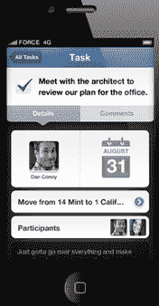
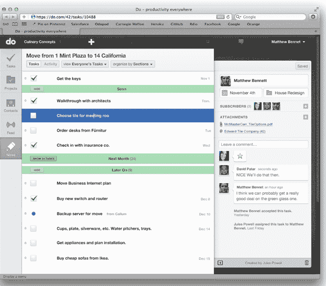

# Salesforce 的 Do 是一款面向企业和消费者的简单任务管理应用 

> 原文：<https://web.archive.org/web/https://techcrunch.com/2011/11/08/salesforce-launches-do-as-a-simple-task-management-app-for-both-businesses-and-consumers/>

# Salesforce 的 Do 是一款面向企业和消费者的简单任务管理应用

9 月，Salesforce 创始人马克·贝尼奥夫[暗示](https://web.archive.org/web/20221205110125/http://www.techmeme.com/110926/p56#a110926p56)将推出一款新的工作管理产品，[Do.com。](https://web.archive.org/web/20221205110125/https://do.com/)今天，CRM 巨头终于发布了关于 Do 的更多细节，这是一款面向企业和消费者的简单任务管理移动和网络应用。虽然该应用程序仍处于私人测试阶段，但我们已经邀请了 200 名 TechCrunch 开发者。使用邀请代码“XIBUSPAHYN ”,你可以在这里注册应用程序。

Do 诞生于今年早些时候 Salesforce 对社交生产力和任务管理应用 Manymoon 的收购。Manymoon 是 Google Apps Marketplace 的最爱，也是该平台下载量最大的应用扩展之一。

Do 任务和项目管理应用程序允许小团队和个人管理任务列表、组织项目和记录笔记。该应用程序允许你向其他用户分配任务(非 Do 用户可以发送电子邮件加入)，在联合任务中，用户可以对任务进行评论，接受和拒绝分配等。

Do 也是一个类似 Evernote 的应用程序，允许你在应用程序中记笔记，并根据笔记的部分内容给自己分配任务。

正如 Salesforce 所说，该应用程序既可以用于日常消费、列表管理，也可以用于企业内部的小团体。因此，你可以使用该应用程序来计划晚宴或协调营销活动。一旦您与共享用户有了许多不同的任务，您将看到一个类似 Chatter 的活动订阅源，其中包含实时提醒和对特定任务的任何评论的访问。

该应用可通过基于网络的 HTML5 应用以及 iOS 应用获得。Do 也将在 Google Apps Marketplace、Salesforce App Exchange、Chrome Web Store 和 LinkedIn App Marketplace 中提供。这些应用程序之一中的任何操作都将在您的 Do 帐户中同步。Do 集成了 Dropbox，因此你可以通过文件共享服务在应用程序中共享文件。

Do 目前是免费的，但 Salesforce 表示，最终将增加付费功能，如管理控制和定制。目前，Do 仍处于私人测试阶段，但将在未来几周内向更多观众开放，并最终在 11 月下旬向公众开放。

当然，Salesforce 的企业社交网络 Chatter 和 Do 有一些相似之处，后者也具有社交通信功能。但是 Salesforce 的高级副总裁 Sean Whiteley 说，Do 是为非常小的团体和团队设计的，而 Chatter 是大型企业和商业的理想选择。Whiteley 还表示，将来它最终会将 Do 与 Chatter 集成在一起。

