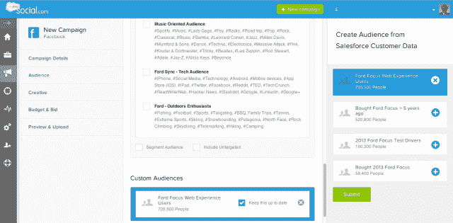

# Salesforce.com 通过 Social.com TechCrunch 将其广告工具嵌入 CRM 和社交监听

> 原文：<https://web.archive.org/web/https://techcrunch.com/2013/04/23/salesforce-social-com/>

# Salesforce.com 将其广告工具植入 Social.com 的客户关系管理和社交倾听

今天，Salesforce.com 推出了名为 sales force Social.com 的新产品，扩展其社交广告产品。

得益于[去年对 Buddy Media](https://web.archive.org/web/20230121232524/https://techcrunch.com/2012/06/04/salesforce-lines-up-against-oracle-on-social-push-buys-buddy-media-for-689m/) 的收购，Salesforce 已经为群邑和宏盟等许多大型广告公司开展社交广告活动。但今天，它将广告产品分解为一个独立的实体，与 Buddy Media 的社交发布功能截然不同。

产品营销副总裁戈登·埃文斯(Gordon Evans)表示，尽管 Salesforce 已经开展了近 50 万次社交活动，“但这里仍然存在一个问题——公司在其 CRM 系统中坐拥这些令人难以置信的客户数据，但他们并没有真正以非常有效的方式(与广告活动)联系起来。”他补充说，公司也缺乏“充分利用公共社交网络上共享的所有信息”的能力

鉴于 Salesforce 的核心业务是在线 CRM 系统，以及[对社交监听服务 Radian6](https://web.archive.org/web/20230121232524/https://techcrunch.com/2011/03/30/salesforce-buys-social-media-monitoring-company-radian6-for-326-million/) 的收购，sales force 在解决这些问题方面处于有利地位。Evans 给了我一个产品的快速演示，虽然他说它包括用于在脸书和 Twitter 上创建、优化和自动化广告活动的工具，“这对每个强大的广告管理组织都是必要的”，但这里的新功能是与 Salesforce CRM 和 Radian6 的集成。

例如，Evans 创建了一个“测试脸书”活动，通过从 Salesforce 导入数据，他能够将该活动定位于不同的客户群。(去年秋天，脸书开始允许广告商根据客户关系管理联系信息锁定用户。)他指出，随着公司 CRM 数据的更新，广告定位也在更新。所以你可以发起一个在线竞赛，然后把广告对准参加竞赛的人。随着越来越多的人注册，他们会被添加到目标中。

埃文斯还创建了一个测试 Twitter 活动，他查看了显示热门话题和相关对话的 Radian6 数据。利用这些数据，一家公司可以找到合适的主题作为其广告的目标，并根据该主题，Social.com 推荐推文中包含的内容。埃文斯承认，广告商已经可以使用社交收听数据来定制他们的广告，但他说，他们必须进行“转椅分析”，这需要他们“登录到用户界面的多个应用程序。”现在，他们可以在一个地方完成所有工作。

这里的大主题是将各种 Salesforce 产品整合在一起。埃文斯说，通过这样做，Salesforce 希望吸引其现有的 CRM 和倾听客户，他们“试图弄清楚他们的社交广告策略应该是什么”，同时也为广告公司创造一种产品。

哦，如果你想知道 Salesforce 怎么会有这么好的网址，据报道，几年前[以 260 万美元的价格收购了](https://web.archive.org/web/20230121232524/http://fusible.com/2011/09/salesforce-com-is-the-mystery-domain-buyer-of-2-6-million-social-com/)的 Social.com 域名。