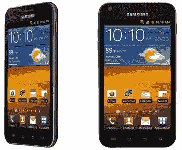
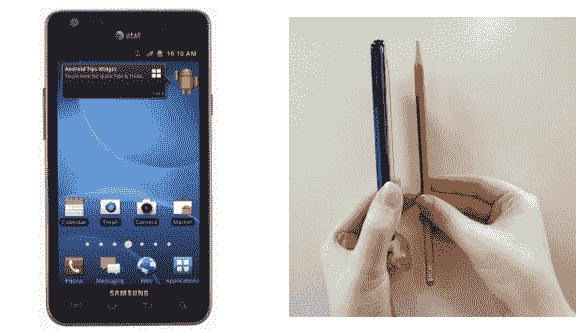
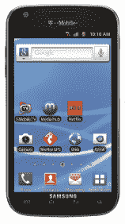

# 三星正式宣布为 T-Mobile、Sprint 和美国电话电报公司推出 Galaxy S II TechCrunch

> 原文：<https://web.archive.org/web/http://techcrunch.com/2011/08/30/samsung-announces-the-galaxy-s-ii-for-t-mobile-sprint-and-att/>

# 三星正式宣布为 T-Mobile、Sprint 和美国电话电报公司推出 Galaxy S II

它来了！终于来了！

自 5 月以来，经过几个月在世界各地闲逛，从韩国到加拿大到处发布(由于飓风艾琳，加上一天的延迟)，三星的 Galaxy S II Android 超级手机终于前往美国。

正如预期的那样，三星利用今天在纽约的新闻发布会宣布了为美国三大运营商设计的美学上独特的 Galaxy S II 版本:T-Mobile、Sprint 和 AT。&T。与此同时，威瑞森坚持要为[做点别的。](https://web.archive.org/web/20230204233723/https://techcrunch.com/2011/08/05/verizon-roadmap-promises-september-8-launch-for-droid-bionic-superphone-finally/)

就在我们说话的时候，关于这些设备的新闻正在不断传来，当信息发布时，本帖将会更新。

## 冲刺

首先发布公告的是 Sprint，他证实了之前的泄露，即他们的变体将被命名为“三星 Galaxy S II Epic Touch 4G”。Sprint 的设备将于 9 月 16 日(T5)在**上市(他们声称将是第一家上市的)，两年合约价格为 199.99 美元。**

**Sprint 的 Galaxy S II Epic 4G Touch 规格:**

*   安卓 2.3(姜饼)配合三星的 UI 大修，TouchWiz 4.0
*   4.52 英寸 Super AMOLED Plus 显示屏
*   1.2 Ghz 双核 CPU(三星 Exynos)
*   WiMax 4G
*   800 万像素后置摄像头，带 LED 闪光灯
*   200 万像素前置摄像头
*   1080p 视频录制
*   预装应用:Nova 2 HD、Swype、北极星 Office
*   蓝牙 3.0
*   冲刺 ID
*   802.11b/g/n WiFi
*   多达 8 台设备的 WiFi 热点

## 美国电话电报公司(American Telephone and Telegraph Company)

美国电话电报公司只是说他们的变体将在“未来几周”推出**，但已经发布了以下规格。有趣的是，AT & T 的 4.3 英寸显示屏比 Sprint 和 T-Mobile 的 4.52 英寸显示屏都要小，但 AT & T 的机型也是所有机型中最薄的(8.89 毫米)**

**AT & T Galaxy S II 规格:**AT&T 三星 Galaxy S II 规格

*   支持美国电话电报公司尚不完善的 4G HSPA+网络
*   安卓 2.3(姜饼)配合三星的 UI 大修，TouchWiz 4.0
*   屏幕:4.3 英寸 Super AMOLED Plus
*   1.2 Ghz 双核 CPU(三星 Exynos)
*   800 万像素后置摄像头，带 LED 闪光灯
*   200 万像素前置摄像头
*   1080p 视频录制
*   HDMI 输出:HDMI 通过带 HDCP 的 HDTV 智能适配器
*   连接:Wi-Fi 802.11 a/b/g/n，蓝牙 3.0
*   电池:1650 毫安时
*   传感器:运动 UX、6 轴陀螺仪、接近度、光线、噪声(观众 A2220)

## T-Mobile

T-Mobile 刚刚发布了他们的新闻稿——到目前为止，他们只是称它为“T-Mobile Galaxy S II ”,而不是以前的“Hercules”代号或任何其他花哨的名称。到目前为止，除了 4.52 英寸的屏幕之外，没有其他规格被提及，尽管几乎可以肯定它与 Sprint/美国电话电报公司的型号几乎相同(除了明显的差异，如没有 WiMax 或 Sprint ID)