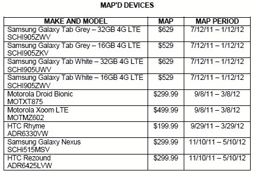

# 三星 Galaxy Nexus，HTC Vigor 将于 11 月 10 日推出？

> 原文：<https://web.archive.org/web/http://techcrunch.com/2011/10/17/samsung-galaxy-nexus-htc-vigor-to-launch-november-10/>

# 三星 Galaxy Nexus，HTC Vigor 将于 11 月 10 日推出？

随着对 iPhone 4S 的大肆宣传已经见顶，并回到稳定水平，来自另一个思想流派的用户正在为他们自己的大事件感到兴奋。冰淇淋三明治，以及下一款纯谷歌手机，三星 Galaxy Nexus，预计将在短短的两天内在 T2 亮相。

虽然我们肯定会在首次亮相时得到一些关于[已经泄露的规格](https://web.archive.org/web/20230204105700/https://techcrunch.com/2011/10/06/nexus-prime-details-leaked-new-name-verizon-exclusive/)的澄清，但我们可能会早一点获得发布日期和价格。

根据 [Engadget](https://web.archive.org/web/20230204105700/http://www.engadget.com/2011/10/14/verizon-pricing-release-windows-for-galaxy-nexus-htc-rezound-r/) 发布的一份匿名泄露的威瑞森文件显示，[三星 Galaxy Nexus](https://web.archive.org/web/20230204105700/https://techcrunch.com/2011/10/14/the-galaxy-nexus-pops-up-in-verizons-device-management-system/) 和 [HTC Vigor(代号 rezond)](https://web.archive.org/web/20230204105700/https://techcrunch.com/2011/09/26/htc-vigor-photo-leak-reveals-1-5-ghz-dual-core-processor-720p-display-and-4g-lte-support/)的合同最低广告价格为 299.99 美元。这两款手机也定于 11 月 10 日至 5 月 10 日的地图期间，这表明它们可能最早于 11 月 10 日发布。但是在我们进一步讨论之前，在这种情况下，有必要练习一下玩世不恭，因为这份泄露的文档可能在大约五分钟内就在 Word 中完成了。不过，这些型号似乎也有道理，所以我们还是要谨慎行事。

至于 11 月 10 日的发布日期，一切都还没有确定。即使那是 Galaxy Nexus 和 Vigor 的地图时期开始的时候，实际的发布可能会晚一点，因为我们已经看到冰淇淋三明治和 Nexus 事件被推迟了一次。不管怎样，它应该给你一点额外的时间开始存钱。

