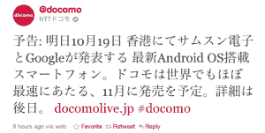

# 三星 Galaxy Nexus 泄露:图片、规格和发布日期 

> 原文：<https://web.archive.org/web/https://techcrunch.com/2011/10/18/samsung-galaxy-nexus-leaked-image-specs-and-launch-date/>

# 三星 Galaxy Nexus 泄露:图片，规格和上市日期

日本最大的无线运营商之一 NTT DoCoMo 似乎在几个小时前泄露了三星 Galaxy Nexus 的公告。

根据一条推特“谷歌和三星电子的最新 Android 操作系统智能手机将于 10 月 19 日在香港[发布。DoCoMo 几乎相当于世界上最快的，定于 11 月发布。以后再多。”(任何日语流利的人，请随意添加谷歌翻译无法做到的清晰性。)](https://web.archive.org/web/20230205021011/https://techcrunch.com/2011/10/13/samsung-google-announce-ice-cream-sandwich-event-october-19-in-hong-kong/)

尽管我们仍在等待确认已经泄露的[规格](https://web.archive.org/web/20230205021011/https://techcrunch.com/2011/10/06/nexus-prime-details-leaked-new-name-verizon-exclusive/)，一个名为 [Android HDBlog](https://web.archive.org/web/20230205021011/http://android.hdblog.it/2011/10/18/galaxy-nexus-caratteristiche-tecniche-complete-e-immagine-reale/) 的意大利博客似乎有了官方图片(休息后的全尺寸版本)。

 我们不确定这是 100%真实的交易，因为我们希望图像中的文本是中文的。(正式发布会将在香港举行。)然而，该博客声称这直接来自日本，他们所谓的“日本运营商”已经确认 11 月 20 日可用。

根据 Android HDBlog，这些是我们将在三星 Galaxy Nexus 上看到的规格:

*   尺寸:5.4 英寸 x 2.7in 英寸 x .35in 英寸(薄得惊人，不过博客还提到其最厚处为 0.45 英寸)
*   安卓 4.0 冰淇淋三明治
*   1.2GHz 双核 TI OMAP 4460 处理器
*   4.65 英寸 720×1280 AMOLED 高清显示屏(可能只是 Super AMOLED Plus 的意大利语翻译)
*   500 万像素 CMOS 后置摄像头，带 LED 闪光灯，可拍摄 1080p 视频
*   130 万像素 CMOS 前置摄像头
*   NFC！！
*   1GB 内存，16/32 GB 板载存储

我们仍然不确定是否支持 microSD 卡，但如果没有，我会感到有点震惊。

[")](https://web.archive.org/web/20230205021011/https://techcrunch.com/wp-content/uploads/2011/10/samsung-galaxy-nexusofficial.jpg)

*发展中……*

[第一张图片通过 [Ameblo.jp](https://web.archive.org/web/20230205021011/http://ameblo.jp/povtc/entry-11052000228.html)