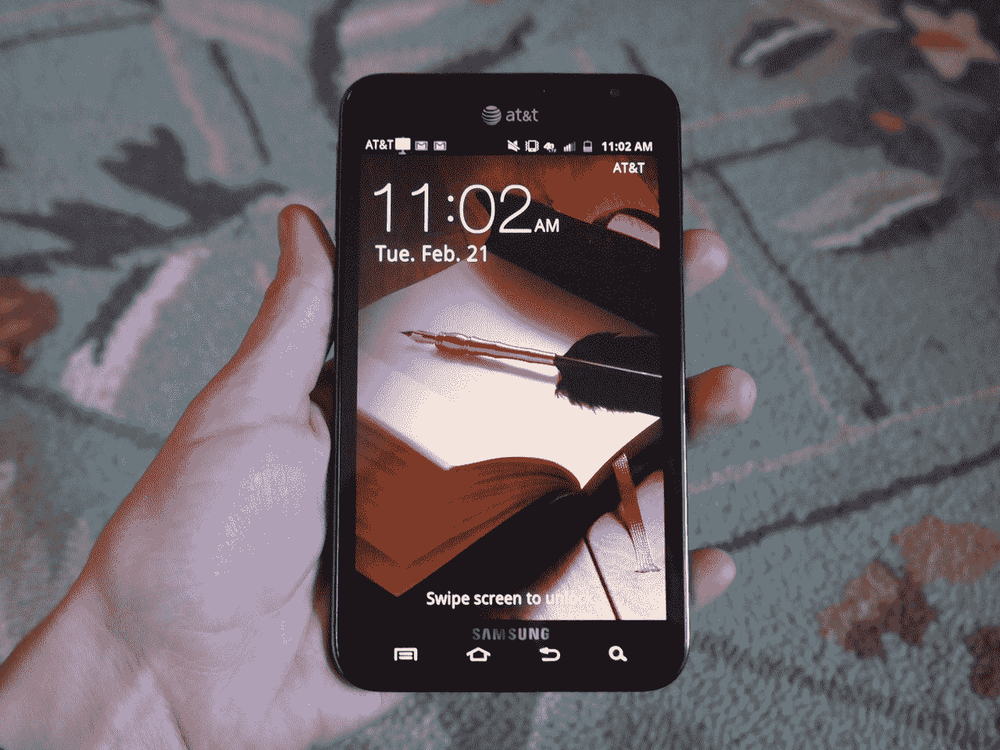
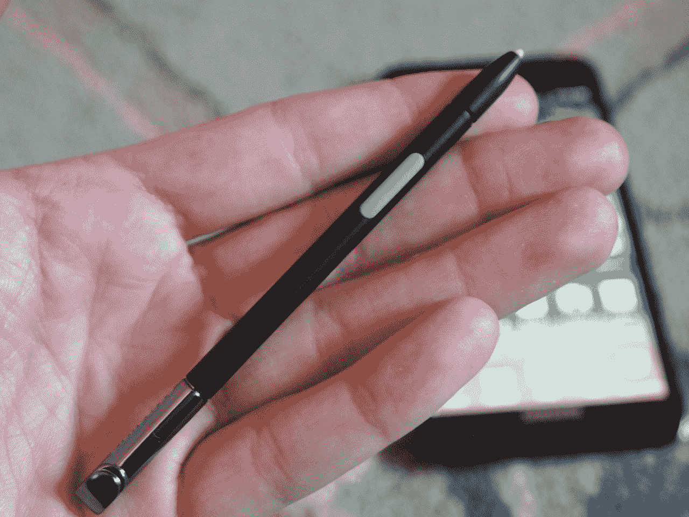
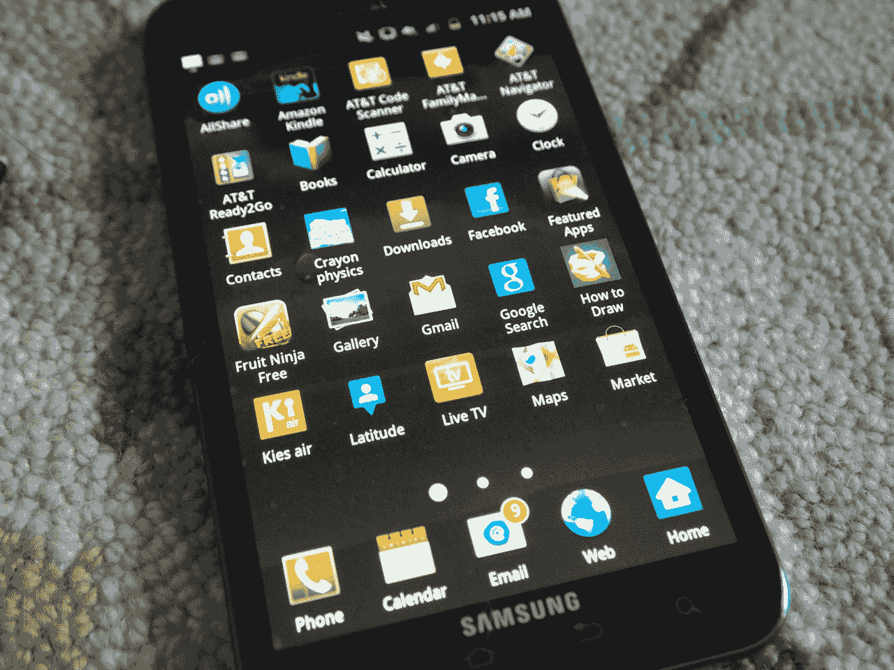
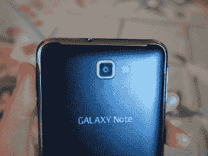
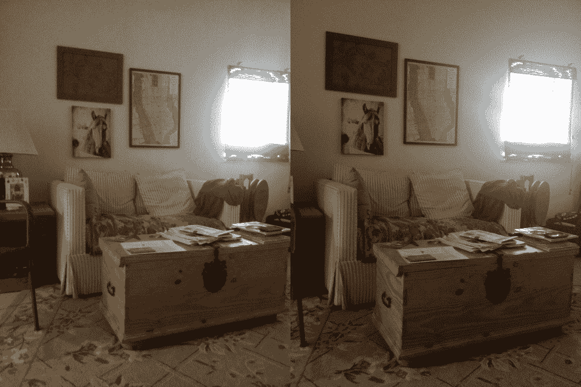
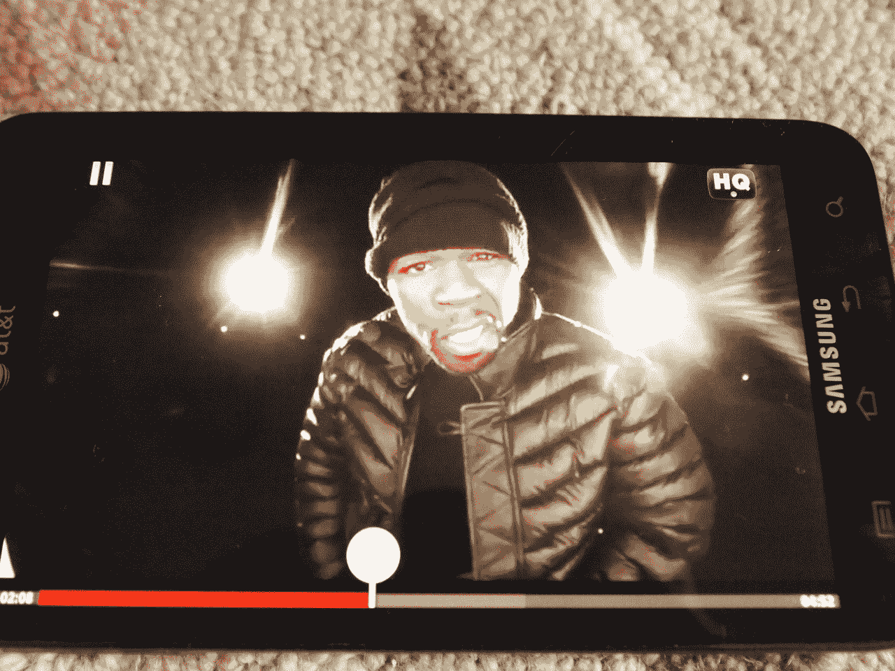
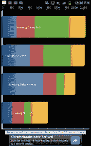
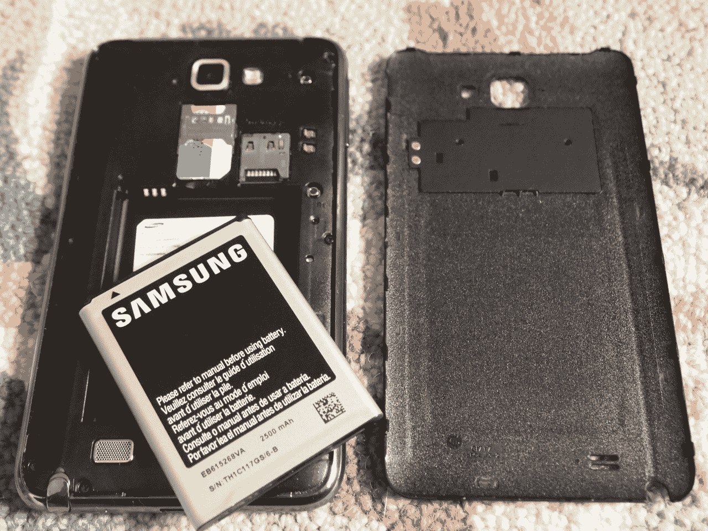
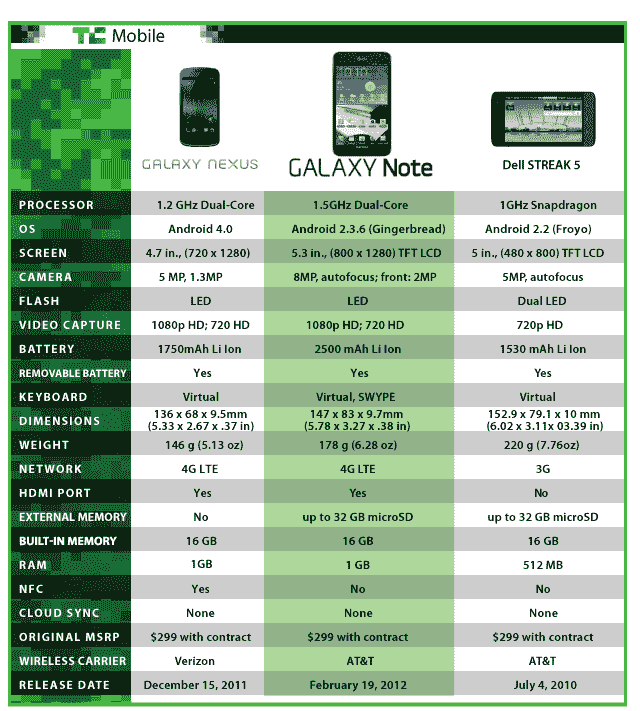

# 三星 Galaxy Note 评测:你以为你是谁？大人物先生？

> 原文：<https://web.archive.org/web/https://techcrunch.com/2012/02/21/samsung-galaxy-note-review-who-do-you-think-you-are-mr-big-stuff/>

## 简短版本

当我去三星拿 Galaxy Note 时，有人告诉我一件事，在我使用这款手机的最后一周左右时间里，我一直记在心里。“人们吓坏了，说它太大了，直到他们玩了它——然后他们喜欢上了它。”我还被告知，S-Pen 不仅仅是一个手写笔，我通常会对玩一些不同于普通 Android 手机的东西感到兴奋。那么我现在对巨型 5.3 英寸 S-Pen 包装的 Galaxy Note 有什么看法呢？

坦率地说，我认为他们错了。

**特性:**

*   5.3 英寸 1280×800 高清 Super AMOLED 显示屏
*   美国电话电报公司 4G LTE
*   安卓 2.3.6 姜饼
*   1.5GHz 双核处理器
*   800 万像素后置摄像头(1080p 视频拍摄)
*   200 万像素前置摄像头(720p 视频拍摄)
*   s 笔
*   建议零售价:合同价 299.99 美元

**优点:**

*   展示简直太棒了
*   轻薄
*   固态电池寿命

**缺点:**

*   到处都有点落后
*   不太适合拍照
*   方式，*方式*太大

## 长版本

**硬件/设计:**

显然，我们在这里需要谈论的第一件事是规模，老实说，我认为这可能会排除相当多的人。它太大了。现在，你们中的许多人会因为我是一个女孩而大叫犯规，但我要说的是:首先，对于一个女孩来说，我的手相当大，其次，我的男性同行已经证实，事实上，纸币太大了，不舒服。

事实是，你不能舒适安全地单手操作。我觉得我总是在下滑，几乎掉了下来，或者只是太努力地去做我需要做的事情。如果你用的是 S-Pen，这个问题会稍微消失一点，因为你用一只手握着笔，用另一只手涂鸦。但我们中的许多人只有一只手可以在手机上做我们需要做的事情，这就是 Note 失败的地方。

就材料和制造质量而言，我觉得这款超级手机相当漂亮。它看起来很像 Galaxy S II，电池门上有这种缝线风格的纹理。它很漂亮，重量为 6.28 盎司，厚度仅为 0.38 英寸。microUSB 是方形的，位于手机底部，S-Pen 插槽就在它的右侧，而音量摇杆位于左上角，锁定按钮位于右上角。

老实说，除了尺寸之外，我对这里没什么可抱怨的。一切都感觉坚实，优质，看起来也很好。我只是不能享受它，因为我没有 XXL 的手。

**S-Pen:**

【T2

我想你们中的许多人无论如何都会翻到这一节，所以我想我会给你们省些麻烦，把它放在更靠近开头的地方。S-Pen 很棒，但这不足以证明这款手机本身的价值。

 很有趣，肯定。你有画笔、记号笔、铅笔和荧光笔；完全控制颜色和厚度，并可以添加文本。你可以放入照片，裁剪，截屏，分享一切。另外，S-Pen 是压力敏感的，所以它甚至可以拾取明暗笔画。它还有一个小按钮，可以帮助你执行快捷命令，如抓取屏幕(按住按钮，按住屏幕)或打开 S-Memo 应用程序(按住按钮，双击)。

我花了很长时间在老板的照片上到处涂鸦，但是即使过了一个星期，我也不能真正以任何有用的方式将 S-Pen 融入我的日常生活。提醒你一下，Siri 每天至少给我设置五个提醒，至少发两三条短信。

 它需要两只手来使用，这使得它在很大程度上失去了平衡，而且它似乎总是需要更长的时间来取出并开始使用它，而不是仅仅通过触摸来照顾它。

现在，我不是最艺术的人，我会说，我的更有创造力的朋友比我花了更多的时间画画，产品给人留下了非常深刻的印象。然而，Wacom 风格的 S-Pen 无法取代真正的 Wacom 笔和/或平板电脑，我的图形艺术家/动画师朋友是这样说的。

所以这真的让它处于一种中间状态:你不能用它做真正的工作，也不能让它在任何其他日常生活中有用。所以基本上只是为了好玩。

**软件:**

Galaxy Note 在三星定制的 TouchWiz UI 下运行 Android 2.3.6 姜饼。用户界面进行了一些调整，以充分利用额外的屏幕空间，在底部提供了五个虚拟主页按钮和一个 5×5 的应用程序/图标网格。

我注意到三星设备的 Android 和 TouchWiz 都让速度变慢了。与此相比，三星 50 美元的 Focus Flash 在 Windows Phone 上运行得非常好，这必须归结于软件。好消息是，TouchWiz 实际上增加了一些可用性，而不仅仅是沉重的定制外观。

可调整大小的窗口小部件实际上允许有一点区别，这很好，但 TouchWiz 有很多更微妙的功能，使它比其他覆盖图更直观。例如，当您向下滚动地址簿右侧的字母时，您可以向左滑动一点来移动到名称中的下一个字母。所以，如果你的通讯录里有 24 个 J 的名字，你可以把范围缩小到“Jo”或“Ja”之类的。

另一个好处是，三星的高清 Super AMOLED 显示屏基本上是黑色的。所有菜单中的用户界面恰好都是黑色的，大多数应用程序可以配置为在黑色背景上显示浅色文本，因此这往往有助于电池正面。

与此同时，有很多预装的应用程序，如亚马逊 Kindle、Qik Lite、蜡笔 phsyics 和 How To Draw(显然是为 S-Pen 准备的)，以及许多美国电话电报公司应用程序。当我进入 Android Market 试用一些游戏时，一款 Gameloft 游戏(NFL Pro 2012)与我的设备不兼容。真扫兴。另一方面，精确应用程序，如《我的水在哪里》和《水果忍者》使用 S-Pen 要容易得多。试了几次后，我在水果忍者上得到了有史以来的最高分。美好时光。

**摄像机:**

 毫无疑问，Note 的 800 万像素摄像头拍摄的照片非常棒。如果你有两只手来拍照，那么你的身材会很好，但是祝你好运。我真的很难用一只手拿着纸条，用另一只手拍一些东西…这是个笑话。

而且似乎也没有实体快门按钮，这意味着你必须找到一种方法来释放拇指，并点击小软快门。好消息是照片非常棒，色彩还原和感光度都非常好。快门真的很快，一松开就能拍出照片。

视频质量也非常好，尽管在低光设置和室外光之间切换需要一些时间。但我发现音符优雅地做到了这一点，一个缓慢的过渡，但至少在回放时看起来不太明显——一个稳定的转变。

如果你有手(接球手的手套大小)来操作它，笔记本相机会对你非常好。

Galaxy Note(左)和 iPhone 4S(右)的对比照片:

**显示:**

你必须把它交给三星。他们知道展示。这款 5.3 英寸的高清 Super AMOLED 几乎是它所能达到的最好水平，除了我希望有更多这样的屏幕。我[希望它是一个平板电脑](https://web.archive.org/web/20221208234103/https://beta.techcrunch.com/2012/02/15/evidence-of-a-samsung-galaxy-note-10-1-sprouts-up-all-over-the-place/)，并且[整个手写笔的东西可以被视为一个伟大的配件](https://web.archive.org/web/20221208234103/https://beta.techcrunch.com/2012/01/25/samsung-employee-leaks-new-info-on-future-galaxy-tabs/)(也许对孩子们来说)，并且没有人会再一次不得不拿着这些东西中的一个到他们的面前。

看电影棒极了，从图片到时钟部件，一切看起来都清晰、明亮、美丽。但是，同样，所有这些不动产在任何常规使用场景下都会产生很多问题。我会比拿着一袋爆米花看《盗梦空间》的时候更频繁地发短信，如果我不能给我最亲爱的朋友发一条简单的“嘿，对不起，我刚刚收到这条短信”,那还有什么意义呢？

**性能:**

 谈到性能，这里其实没什么可抱怨的。即使有 TouchWiz 陪着玩，这封短信也非常简洁，一旦 ICS 进入设备，事情应该会变得更好。我对这张纸条最大的不满是在浏览网页的时候。每当我滚动或放大一些文本时，笔记就会多花半秒钟来完成我的要求。这在 Android 上很常见，但值得注意。

Note 的基准测试也很顺利。superphone 在 Quadrant 上获得了 2703 分，Quadrant 测试的重点是图形。另一方面，Browsermark 给这封信打了 48610 分。就美国电话电报公司的网络而言，我对通话质量如此之好感到惊讶。

在数据部门，我看到平均速度下降了 24Mbps，上升了 8Mbps。

**电池:**

如果有一件事真的超出了我对 Note 的预期，那就是电池寿命。巨大的高清 Super AMOLED 显示屏和 4G LTE 收音机会让你相信这东西不会熬过早餐，但事实并非如此。

在现实世界的使用场景中，这张纸条整天都伴随着我。这并不是说我可以带着它狂欢到凌晨，但它会让你过了晚餐时间。但是我不知道你是怎么用手机的，那我就跟你分享几个数字吧。

当我们进行官方电池测试时，我们发现 Note 的续航时间略低于 6 小时。我们通过真正推动手机，在浏览器中运行连续的图像搜索来测试这一点。在任何时候，我都可以进来玩一个游戏或者检查其他东西进行测试，然后继续运行程序。但无论如何，手机都不会停止工作。

给你一个小背景，Droid 4 只在那里呆了 3 小时 45 分钟，而 Droid RAZR Maxx(摩托罗拉的电池野兽)和我呆了令人震惊的 8 小时 15 分钟。

## 与 Galaxy Nexus 和 Streak 5 正面交锋:

点击查看我们对这场比赛的看法[。](https://web.archive.org/web/20221208234103/https://beta.techcrunch.com/2012/02/16/samsung-galaxy-note-review-head-to-head-with-the-galaxy-nexus-and-dell-streak/)

## 动手视频:初步印象

## 结论

是这样的。

我赞赏三星在这一点上的创新思维，但这种创新思维的问题是，我认为它正朝着错误的方向前进。我明白，随着移动视频和游戏占据主导地位，人们越来越喜欢更大的屏幕，但这必须有一个界限。不幸的是，我认为 Galaxy Note 穿越了它。

不管显示屏有多漂亮，或者 S-Pen 有多好玩(/没用)，这东西就是太他妈大了，没法享受。我无法告诉你我在做哪怕是最简单的事情时有多沮丧，比如拍照、玩游戏，甚至是写短信或搜索查询。别让我想起我把这东西举到面前时的表情。

也许如果你有一双大手，并且在生活中无法得到足够的涂鸦，那么音符*可能会适合你。但对于其他任何人，我建议要么等待 Galaxy S III(这肯定会非常棒)，要么坚持等待我们听到的传闻中的 [Galaxy Note 10.1](https://web.archive.org/web/20221208234103/https://beta.techcrunch.com/2012/02/15/evidence-of-a-samsung-galaxy-note-10-1-sprouts-up-all-over-the-place/) 。Note 作为一款很酷的平板电脑比作为一部巨型手机更有意义。*

点击查看我们所有的 Galaxy Note 评论帖子[。](https://web.archive.org/web/20221208234103/https://beta.techcrunch.com/tag/galaxy-note-review/)