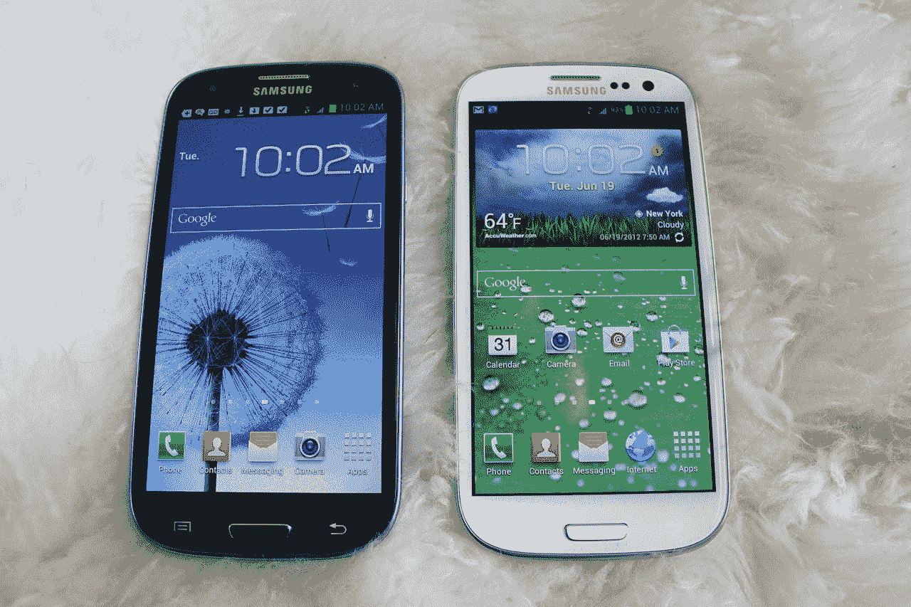
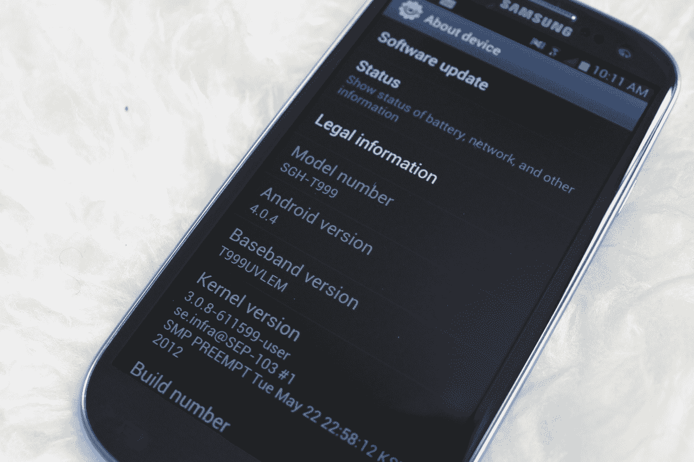
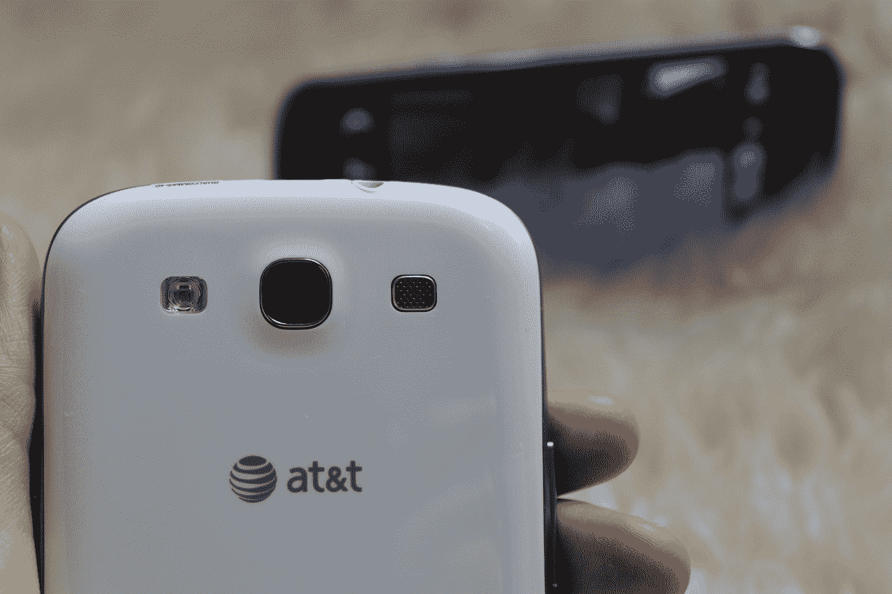
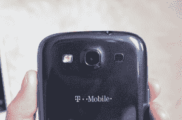
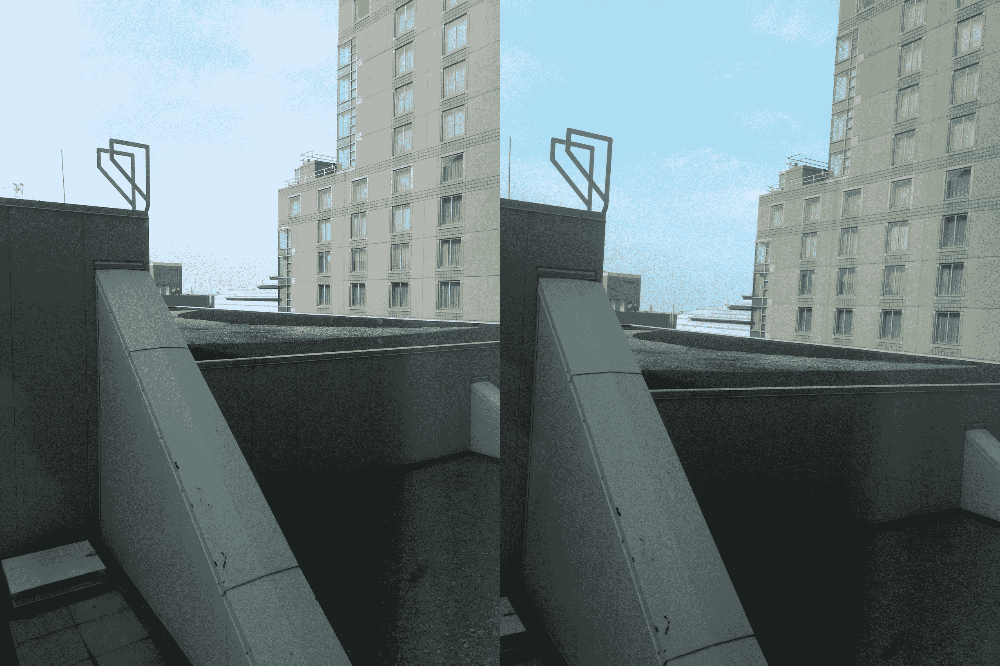
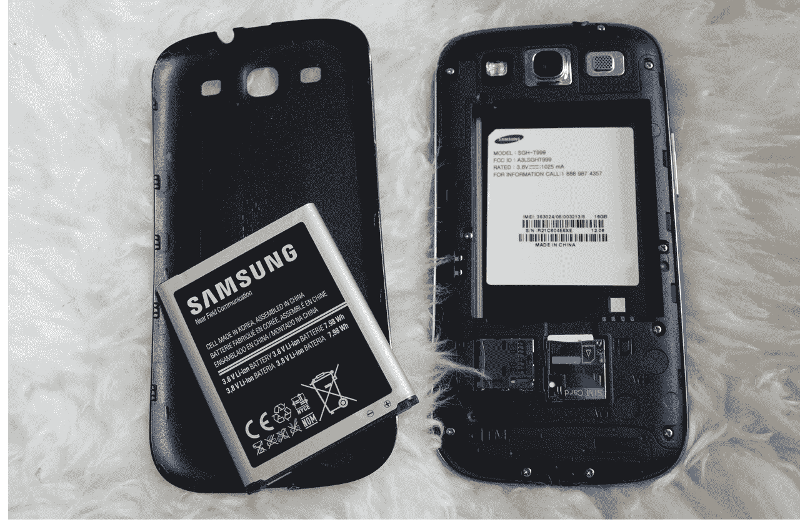
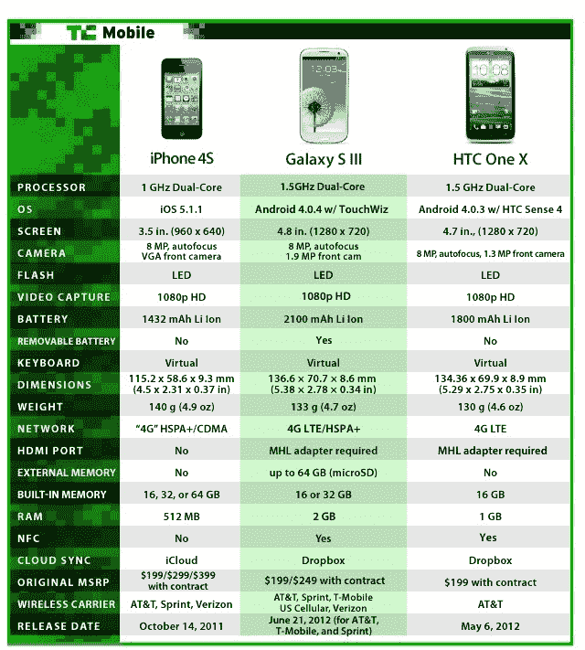

# 三星 Galaxy S III 评测:这是你一直在等待的手机 TechCrunch

> 原文：<https://web.archive.org/web/https://techcrunch.com/2012/06/19/samsung-galaxy-s-iii-review/>

## 简短版本

三星 Galaxy S III 是目前的安卓手机，在许多方面它都不负众望。很多人都很兴奋地看到这个东西出现在商店货架上。我们的份额？他们不会失望的。

恒星软件功能搭配漂亮的显示屏和规格，可以与市场上的任何其他产品竞争，使 Galaxy S III 不亚于一个完全的喜悦。从外形上看，它并不好看——塑料外壳让人感觉有点廉价——但一般来说，你看到的是最好中的最好。

**特色:**

*   4.8 英寸 720×1280 Super AMOLED 显示屏
*   安卓 4.0.4 冰淇淋三明治
*   三星的 TouchWiz 覆盖层
*   s 形梁/NFC
*   2GB 内存
*   1.5GHz 双核处理器
*   800 万像素后置摄像头(1080p 视频拍摄)
*   190 万像素前置摄像头
*   4G LTE 在[可用运营商](https://web.archive.org/web/20221207105457/https://beta.techcrunch.com/2012/06/04/samsung-galaxy-s-iii-to-debut-on-five-u-s-carriers-in-june-verizon-pre-orders-begin-on-june-6/)
*   MSRP: 16GB 的合同价格为 199 美元，32GB 的合同价格为 249 美元

**优点:**

*   大量很酷的软件，比如 S-Beam 和好友照片分享
*   漂亮的大显示屏
*   固态电池寿命

**缺点:**

*   塑料摸起来很便宜，还能抓出指纹
*   TouchWiz 又重又丑

## 长版本

**硬件/设计:**

正如我简单提到的，Galaxy S III 几乎完全由塑料制成，除了表面覆盖着大猩猩玻璃。这个设计的灵感来自大自然，考虑到所有的塑料，这看起来很傻。视线中没有一条直线，有圆角和锥形边缘。

背面的塑料看起来是刷过的，但摸起来很光滑，会留下印迹。蓝色版本比白色版本更糟糕，尽管白色版本只是附着在污垢、灰尘和其他难看的颗粒上，而蓝色版本只是喜欢污迹。

考虑到显示屏的尺寸，这款手机薄得令人难以置信(0.34 英寸)，重量为 4.3 盎司，感觉有点太轻了。你知道——便宜的那种灯。我们再一次回到塑料上。

现在，我知道用金属或其他(更高级的)材料制造这款手机会让易用性变得更加困难。这个家伙有多个无线电，还有一个 NFC 芯片，几乎一切都运行顺利。有了金属框架，同样流畅的易用性将更难实现。

一个细长的 home 按钮位于显示屏的正下方，左边是音量摇杆，右边是锁定按钮，左上角是 3.5 毫米耳机插孔。手机背面的摄像头是方形的，右边是扬声器格栅，左边是 LED 闪光灯。MicroUSB 接入在底部。

**软件:**

三星 Galaxy S III 拥有丰富的软件功能。首先，这款手机运行 Android 4.0.4 冰淇淋三明治，顶部安装了三星的 TouchWiz UI。就美学而言，我并不是 TouchWiz 的狂热粉丝(我更喜欢纯 Android ICS)，但至少定制的覆盖层附带了一些有用的花絮，如可调整大小的小部件和联系人中的导航快捷方式。

但这与三星在 NFC 和 WiDi (WiFi Direct)方面所做的事情相比，根本不算什么。

首先，三星推出了一种新的赚钱方式，叫做[探测](https://web.archive.org/web/20221207105457/https://beta.techcrunch.com/2012/06/12/samsung-wants-to-automate-your-phone-with-nfc-equipped-tectiles/)。TecTiles 本质上是邮票大小的 NFC 贴纸，可以与三星任何配备 NFC 功能的手机配合使用，允许用户对特定的磁贴进行编程，以便在点击时执行各种操作。因此，我床头柜上的一个检测器可以设置闹钟并降低铃声音量(为睡觉时间做准备)，而我前门上的一个检测器可以将我连接到我家的 WiFi 网络。这项服务运行良好，我对 TecTiles 唯一真正的抱怨是，它们每包 5 个要 14.99 美元。

另一个 NFC 友好功能是三星的 S Beam。它的工作原理类似于 Android Beam，但作用距离更远，让用户在没有 WiFi 或手机信号的情况下在几秒钟内分享内容。这包括分享照片、视频、音乐、网页等。

根据我的经验，S Beam 运行良好，在设备之间传输内容的速度相当快。人们主要关心的是 S 射线能有多少用处。当然，Galaxy S III 将是一款受欢迎的手机，但这并不意味着一群朋友中的每个人都会去买一部。

GSIII 还装载了三星的新 GroupCast 功能，该功能可以同步 Galaxy S III 设备，以便您可以共享 PDF、PowerPoint 或照片库演示文稿。该功能似乎对现场或办公室外的工作人员有所帮助，尤其是考虑到三星正在提供该设备的企业友好型版本。它甚至允许用户在演示文稿上做标记，尽管我不认为这是一个协作工具，因为标记会相对快速地消失，并且无法保存。

这款手机采用了三星的云同步/共享服务 AllShare Play，允许用户在任何连接 AllShare 的设备上共享内容，如 Galaxy 平板电脑、支持 DLNA 的电视、机顶盒和蓝光播放器，以及运行 AllShare Play 应用程序的三星智能电视和 Windows PCs。这使得用户可以从家用设备上下载文件，并将 Galaxy S III 上的电影放到电视上。

除了这些主要功能，Galaxy S III 还具有一些小功能，使其更容易使用。像动作控制(倾斜手机放大图像，或平移手机将图标从一个主屏幕移动到另一个主屏幕)这样的事情似乎有点随意，因为点击来缩放或在屏幕上滑动手指来重新排列图标一样快速无缝。然而，像在短信对话中把手机举到你面前发起呼叫这样的功能是有意义的。这款手机在放下时还会调暗亮度，以节省电池电量，并且当你离开手机时，如果你错过了一个电话或信息，它会发出额外的提醒。

软件中最令人失望的(让大家知道，我对这里提供的特性集印象深刻)是 S Voice。它本质上是一个 Siri 的竞争对手，允许你用语音发出命令。首先，在听自然语言方面，它没有 Siri 聪明(“告诉我最近的汉堡店”把它搞糊涂了)。第二，它的功能比 Siri 少。这是一个很好的功能，但它看起来像是一个没有做得很好的副本。(相信我，[这并不是说 Siri 无论如何都工作得很好](beta.techcrunch.com/2011/11/02/siri-why-are-you-so-underwhelming/))。

弹出式播放器可以让你在一个更小的窗口中继续播放一个视频，在其他任务之上，这也是一个智能功能，因为多任务对我们来说变得越来越重要。Flipboard 预装在设备上，就像许多运营商应用程序一样。

**摄像头:**

Galaxy S III 上的相机快如闪电，尽管我不能说我完全被图片质量打动了。与用我的 iPhone 4S 拍摄的照片相比，用 Galaxy S III 拍摄的一切都显得褪色和单调。幸运的是，有许多不同的场景模式，对焦设置，曝光，ISO，白平衡和各种效果应该可以帮助你找到你想要的图像。

但也许是为了弥补不那么令人印象深刻的图像质量，三星 Galaxy S III 相机有几个软件惊喜，肯定会令人高兴。有连拍，每秒 3 张的速度拍摄多达 20 张照片，还有最佳拍摄，可以拍摄 8 张照片，并根据眨眼、微笑、灯光等标准自动为您提供最佳照片。Galaxy S III 还可以让你在录制 1080p 视频时拍摄静态图像，并具有 HDR 模式。

更重要的是，GSIII 相机有一个拍摄模式，叫做好友照片分享。它可以识别图像中的人脸，并让你用联系人的名字给他们加标签。从那以后，这款手机总能识别出约翰·比格斯和马特·伯恩斯之间的区别，让我直接从他们的姓名标签上与他们分享照片。

 分享拍摄是另一个重要的相机功能，因为它允许您通过 WiFi Direct 与多达五个 GSIII 设备分享照片。假设你和你的朋友在一个生日聚会上，你想确保每个人都可以欣赏这些照片。只需打开 Share Shot，连接您想要共享的设备。从那里，你拍的每张照片也会出现在他们的画廊里，直到你选择不同的拍摄模式。

总而言之，GSIII 相机有不少锦囊妙计，但如果它只是你在寻找的美丽图像，你可能需要继续寻找。

三星 Galaxy S III(左)和 iPhone 4S(右)的对比照片:

**显示:**

这个展示真的不会错。三星的高清 Super AMOLED 屏幕是目前最好的，4.8 英寸的屏幕有足够多的超级清晰内容可供欣赏。黑色很深，颜色很亮，像素之间真的没有什么区别。事实上，4.8 英寸的显示器每英寸有 306 像素，这是我见过的像素密度最大的显示器之一。

除此之外，还要考虑显示屏的尺寸。靠近 5 英寸的标志，Galaxy S III 的显示屏比我想象的要大得多。但在手机上安装大屏幕并保持舒适的关键是设备和边框的厚度。这款手机已经非常薄了，甚至可以让更小的手牢牢抓住它。

但是 Galaxy S III 的边框才是真正的救星。它们在每一侧占用不到半厘米，允许一个巨大的屏幕适合一个相对舒适的手机。圆角和弧形边缘也有助于抓握和单手操作。

**表现:**

HTC 最近在基准测试方面表现出色，但现在有了一位新警长。在我们进行的三项测试中，三星 Galaxy S III 击败了我测试过的所有安卓手机。在 Quadrant 中，测试了从 CPU 到内存到显卡的所有东西，Galaxy S III 获得了令人印象深刻的 4911 分。HTC One S 以 4371 台位居第二，而大多数其他手机(包括 Galaxy Note)都远低于 3000 台。

就浏览而言，Galaxy S III 的得分为 103，780，而 One S 的得分为 100，662。然而，与大多数手机相比，GSIII 遥遥领先，因为我们通常会看到分数在 60，000 左右。

作为这款手机和美国电话电报公司 4G LTE 网络力量的证明，我可以有把握地说这款手机速度很快。我们看到了平均 9.6Mbps 的下降和 8.39Mbps 的上升，这是非常出色的。我还没有看到 Galaxy S III 在性能方面有任何问题，考虑到这款手机在硬件和软件方面都超出了预期，这就说明了很多问题。我无法告诉你我有多感激这第二 GB 的内存。

**电池:**

电池寿命是这样的。三星 Galaxy S III 拥有 2100mAh 电池，与市场上的其他手机相比，这是相当大的电池。尽管如此，所有让 Galaxy S III 令人惊叹的额外功能(如 NFC 和 WiFi Direct 功能)最终都在大力消耗电池。再配上 4G LTE 无线电，肯定会有一些麻烦。

也就是说，在我们的电池测试中，Galaxy S III 持续了整整 5 小时 15 分钟。考虑到在持续的谷歌图片搜索过程中屏幕从不关闭，这真是太好了。在现实世界的场景中，它应该至少可以撑过晚餐时间，根据你的使用情况，它甚至可以陪你度过那些深夜派对。

给你一个小背景，Droid 4 只在那里呆了 3 小时 45 分钟，而 Droid RAZR Maxx(摩托罗拉的电池野兽)和我呆了令人震惊的 8 小时 15 分钟。HTC One S 的续航时间不到五个小时。

另一个好处是电池是可拆卸的，所以如果你是一个严重的电力用户，你可以随时购买另一个电池，并在一天中更换它们。

## 与 One X 和 iPhone 4S 正面交锋:

## 结论

最终，三星 Galaxy S III 是你一直在等待的手机。它通常构造良好，有令人难以置信的显示屏，坚固的电池寿命，大量有趣的功能，它工作得很好。我发现自己并不经常提到安卓手机。

当人们问我他们应该买什么手机，或者他们应该等待这个或那个(相信我，我经常被问到这个)，我总是说，“不，永远不要等待。只需购买目前最好的手机，不要担心花费超出预期，因为在大约两年的时间里，你每天都会使用它。”

但在过去的几个月里，当 phandroids 向我咨询电话推荐时，我一直让他们等着。你知道吗，我很高兴我这么做了。就像 Galaxy S II 和它之前的 Galaxy S 一样，这是要击败的 Android 手机。

这是你一直在等的电话。