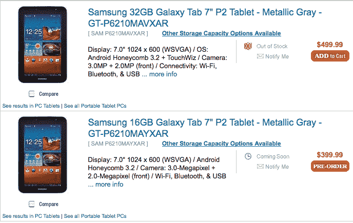

# 三星 Galaxy Tab 7.0 Plus 上市预购| TechCrunch

> 原文：<https://web.archive.org/web/http://techcrunch.com/2011/10/11/samsung-galaxy-tab-7-0-plus-gets-listed-for-pre-order/>

# 三星 Galaxy Tab 7.0 Plus 上市预购

当三星[首次宣布 Galaxy Tab 7.0 Plus](https://web.archive.org/web/20230313075534/https://techcrunch.com/2011/09/30/samsung-announces-the-dual-core-galaxy-tab-7-0-plus/) 纯 WiFi 平板电脑时，他们没有提到任何关于定价或可用性的事情。我们认为这意味着在我们有机会近距离接触石板之前会有一点等待，但也许我们错了。J & R 电子零售商[已经为预购](https://web.archive.org/web/20230313075534/http://www.jr.com/product/productListing.jsp?Ntt=samsung+galaxy+tab+7.0)列出了 32GB 和 16GB 版本的设备。

据 [Unwired View](https://web.archive.org/web/20230313075534/http://www.unwiredview.com/2011/10/11/samsung-galaxy-tab-7-0-plus-pre-orders-start-in-the-us-priced-from-399-99/?utm_source=feedburner&utm_medium=feed&utm_campaign=Feed%3A+UnwiredView+%28Unwired+View%29&utm_content=Google+Reader) 报道，在 J&R，你可以以 399.99 美元的价格预订 16GB 的型号，而 32GB 的 Galaxy Tab 7.0 Plus 将花费 499.99 美元。32GB 型号目前被列为“缺货”，而 16GB 型号似乎仍被列为可用。无论如何，32GB 版本的“添加到购物车”按钮仍然有效，似乎只是另一种预订方式。

作为更新，Galaxy Tab 7.0 Plus 配备了 1024×600 WSVGA 触摸屏、Android 3.2 蜂巢、1.2 GHz 双核处理器、300 万像素后置摄像头和 200 万像素前置摄像头，可用于视频聊天。它的特点是支持 microSD 卡，并直接包装网飞应用程序。

不幸的是，J&R 没有提供发货时间表，只是简单地说他们正在等待制造商的发货。尽管如此，如果您已经爱上了三星的 7 英寸蜂窝平板电脑，J&R 的预订单肯定会让您手里拿着第一台 7 英寸的 Galaxy Tab。