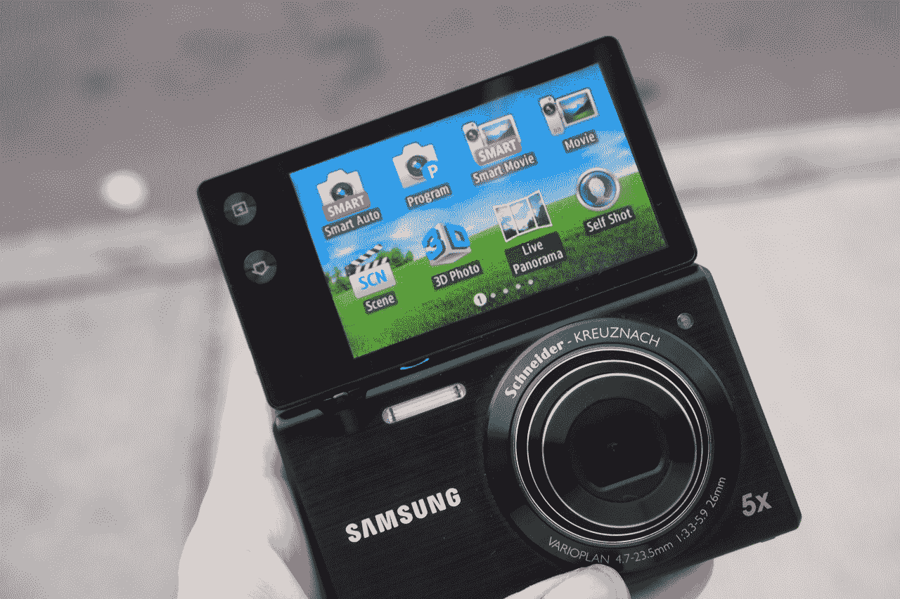

# 三星 MV800 评测:献给我们所有人的自恋者 TechCrunch

> 原文：<https://web.archive.org/web/http://techcrunch.com/2011/10/24/samsung-mv800-review-for-the-narcissist-in-all-of-us/>

**简而言之:**虽然翻转屏幕自拍的想法只是一个小噱头，但 MV800 是一个可爱的小傻瓜。无论你是对自己着迷，还是内心深处隐藏着一个自恋者，这个东西只是恳求你给自己拍照。如果你的经历和我的一样，你会真的，*真的*喜欢它。

**功能:**

*   3 英寸电容式翻盖式液晶触摸屏
*   1610 万像素
*   26 毫米广角镜头
*   全高清视频拍摄
*   5 倍光学变焦
*   建议零售价:279 美元

**优点:**

*   有趣的软件功能多得数不过来
*   紧凑(美观)的设计:应该可以舒适地放在任何口袋里
*   直截了当的界面:对于一个老奶奶来说足够容易理解

**缺点:**

*   触摸屏不如我希望的那样灵敏——浏览图片有点乏味
*   没有麦克风输入，尽管有 720p 视频捕捉功能
*   三星可能在一些时髦的功能上做过头了——姿势指南，我在和你说话

**长版:**

傻瓜相机最近被一流的手机相机占领，但这并不意味着它们没有市场。我向你保证，无论你的手机摄像头能玩出多少酷的把戏，三星 MV800 都能做得更好。

**硬件:**

MV800 的名气在于它的翻转式 3 英寸液晶显示屏，通过一个铰链连接到设备上。在我使用它的时候，铰链屏幕似乎足够坚固。当相机翻转时，我觉得有点松动，但总的来说，翻转屏幕不会给你带来任何麻烦。

当它翻转过来时，相机的背面有一个有纹理的黑色涂层，这确实增强了我在自拍时握持相机的能力。在背面，你还会发现一个辅助快门按钮，使自拍变得更加容易。但是翻转屏幕不仅仅是自拍。有时候你需要把相机举得高高的，或者举得低低的，才能拍出你想要的照片，尽管你的脸不一定能跟着拍。这个屏幕可以让你从任何角度看到你正在拍摄的东西。

MV800 配备了 Schneider-Kreuznach 26 毫米广角镜头，具有 5 倍光学变焦。老实说，图像质量不一定是这个小家伙的强项。当然，这并不是说 MV800 画面不好，但它肯定比不上你从 DSLRs、微四三分之一等更高性能的系统上看到的画面。

我用 MV800 和我的奥林巴斯 E-PL2 微型四分之三相机拍摄了一些测试照片，向你展示了不同之处。

**奥林巴斯:**

**三星:**
T3

在左侧，您会发现一个用于充电和 HDMI 输出的 microUSB 端口，对于任何希望利用 MV800 的 720p 视频捕捉功能的人来说，这应该是一个好消息。在顶部，你可以找到标准的快门按钮、变焦开关和电源按钮，而电池、microSD 卡接口和三脚架插槽位于相机的底部。就构造、手感和总体美学而言，MV800 具备其基础。

**软件:**

如果 MV800 铰链屏幕的自恋本质没有让你着迷，我敢打赌软件会。任何喜欢拍照取乐(而不是作为一个严肃的爱好或职业)的人都会喜欢摆弄这款相机的软件功能。首先，界面超级容易理解，即使你对摄影一无所知。

除了视频和静止图像的智能自动和程序设置，MV800 还提供了不同的场景选项，让您根据自己的环境获得最佳拍摄效果。除了你的标准过滤器(下面是我的最爱)，三星还包括拍摄 3D 照片的能力，以及实时全景拍摄。

然后事情变得非常有趣。三星在 MV800 上包含了一个名为 Magic Frame 的功能，玩起来非常有趣。有两种用途:你可以将 magic frame 与你已经拍摄的照片一起使用，或者在三星的预设相框中使用。它基本上带来了一个小窗口(形状像圆形、方形或心形)，你可以把一张图片放在另一张图片的上面。假设我有一张广告牌的照片…我可以用魔法框架把我自己的照片放在广告牌上，这几乎可以让我成为电影明星。

另一方面，如果你觉得没有足够的创造力来处理主镜头和副镜头，三星有很多不同的框架，你可以在其中取代你的脸，或任何其他东西(除了鬼，它是看不见的)。

以下是我最喜欢的一些:

MV800 还具有画中画模式，这对任何精通 Photoshop 的人来说都是无用的，但这不是 MV800 的人口统计数据。这款相机是为那些通常不懂相机或 Photoshop 的人设计的，他们中的一些人可能只是想要一张他们孩子的棒球队的照片，在底部角落有一张他们孩子的特写。或者类似的东西，我猜。

然后我们有滑稽脸，它使用相机的面部识别技术以尴尬/滑稽的方式扭曲你的脸。它与 Mac 上的 PhotoBooth 非常相似，只是有更多的选项和面部识别功能。对于某些类型的图片，也有一些模式，可以将相机设置为所有正确的设置，无论你想捕捉什么。

MV800 上最糟糕和最笨拙的功能是它的姿势指南。你有各种不同的姿势可供选择(由一些黑发模特女孩表演)，然后这些姿势被“勾画”到 LCD 取景器中供你模仿。这太奇怪了。不仅仅是尝试和给定的姿势相匹配是非常尴尬的，而且你还会把自己和三星认为有足够吸引力出现在他们所有相机上的这个女孩进行比较。而且她足够有魅力，只是让我觉得没那么有魅力。因为我认为这款相机的许多拥有者将会是热衷于拍摄脸书个人资料照片的少女，所以相机能提供的自尊越多越好。

MV800 带有内置的照片编辑器，以及故事板功能。Storyboard 允许您从库中选择一些图片，并以有趣的方式将它们编辑在一起，甚至添加有趣的边框。正是这些特性使得 MV800 比噱头更有用。无论你是想添加时髦的效果，创造一个特殊和独特的记忆，还是简单地裁剪随机家伙的手，MV800 永远不会让你改变平台。你可以对相机上的照片做任何你想做的事情，直接把它带到最近的照片打印机，在整个过程中不需要电脑。

**结论:**
三星 MV800 不是一款正经的相机，不过还好。如果你(或你认识的人)想找乐子，MV800 是 300 美元以下的绝佳选择。它很可爱，小巧，有足够多的功能让你全神贯注，它可能会得到“哇！”也是出于你的(不太懂相机的)朋友。