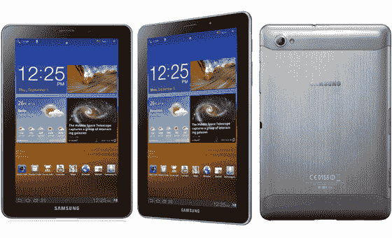
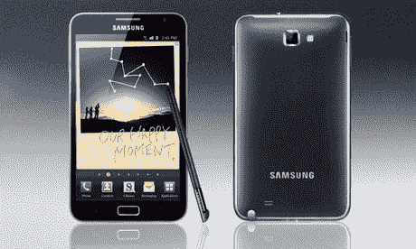

# 三星发布双核 Galaxy Tab 7.7 和 5.3 英寸 Galaxy Note 

> 原文：<https://web.archive.org/web/http://techcrunch.com/2011/09/01/samsung-unveils-dual-core-galaxy-tab-7-7-and-5-3-inch-galaxy-note/>

尺寸很重要。不要让任何人告诉你不同。

三星明白这一点，因此试图为你可能拥有的任何尺寸的口袋或背包制造一款平板电脑。我们都知道 GalTab 10.1 和 8.9，但今天甚至更小的型号也加入了这一行列。在柏林的 IFA 发布会上，三星今天发布了 Galaxy Tab 7.7 和 5.3 英寸的 Galaxy Note。

如果一些尺寸差异还不够的话，三星还对设计部门进行了改革。这两款 noobs 看起来都不太像最初的 Galaxy Tab 10.1。这不一定是件坏事，因为 GalTab 因涉嫌模仿 iPad 的“商业外观”而受到苹果的猛烈抨击。不管怎样，三星的这两块石板都是新东西，这就是我们一直想要的。

7 英寸的赛车配备了超级 AMOLED Plus 显示屏，这是它所能达到的最好水平。我们有一个 1.4GHz 的双核处理芯片，Wi-Fi 信道绑定以提高连接和速度，并支持 HSPA+。据称，5100 毫安时的电池可以提供长达 10 小时的视频播放。对于尺寸为 196.7 毫米 x 133mm 毫米 x 7.89mm 毫米，重量不到一磅(准确来说是 0.73 磅)的平板电脑来说，这是非常令人印象深刻的。

【T2

slate 运行 Android 3.2 Honeycomb 和三星最新版本的 TouchWiz UX。一个 300 万像素的后置摄像头带有自动对焦和 LED 闪光灯(和 1080p 视频拍摄)，一个 200 万像素的前置摄像头用于视频聊天。这款平板电脑有 16GB、32GB 和 64GB 三种规格，最高支持 32GB 的 microSD 卡。

7 英寸的很棒，我一直是这种尺寸石板的粉丝。对我来说，就游戏而言，它比标准的 iPad 式 10 英寸外形要好得多，因为 iPad 有点大，一只手拿不动。至少对我来说是这样。但更有趣的是更小的 Galaxy slate，三星的 Galaxy Note。

Note 配备了 5.3 英寸的 Super AMOLED 显示屏，整体尺寸为 110 毫米×58.2 毫米×12.3 毫米。对于平板电脑来说，这是非常小的尺寸。像它的老大哥一样，Note 也运行在 1.4GHz 的双核处理器上，但被降至 Android 2.3 姜饼而不是蜂巢。奇怪的是，这个小家伙的摄像头比 7 英寸的 GalTab 要好，后置 800 万像素，前置 200 万像素。后置摄像头也能够进行 1080p 的视频拍摄。

这款笔记本还配备了一种叫做 S Pen 的特殊类型的手写笔，这意味着在旅途中更容易记录数据。在我们拿到这张钞票和它著名的 S 笔之前，这是否真的是一个谜。Note 支持 HSPA+和 WiFi，但也是一款支持 LTE 的设备。

现在你可能会认为 5.3 英寸的显示屏侵犯了智能手机的地盘，但我不同意，原因如下:你见过有人在三星 Infuse 上说话吗？它有一个 4.5 英寸的显示屏，当举起来对着某人的脸时，它看起来有点大。机会是，智能手机显示屏不会比这大太多。至少，我们希望不会。

不管怎样，这些应该会对平板电脑领域产生一些影响。随着知识产权战争席卷全球，差异化应该成为一个主要焦点。还有什么比创造一个全新的尺码类别更能让你脱颖而出呢？

如果你看不够，我们在休息后增加了三星 Galaxy Note 的介绍视频。

[YouTube http://www.youtube.com/watch?v=bfMmMrUwRnI&w=640&h=390]