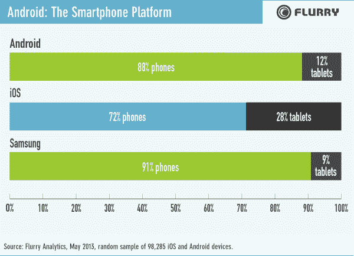

# 三星用户更喜欢应用程序，对广告更开放，比其他 Android OEMs 用户更喜欢 iOS 用户 TechCrunch

> 原文：<https://web.archive.org/web/http://techcrunch.com/2013/08/20/samsung-users-more-fond-of-apps-more-open-to-ads-and-more-like-ios-users-than-those-of-other-android-oems/>

# 三星用户更喜欢应用程序，对广告更开放，比其他 Android OEMs 用户更喜欢 iOS 用户

Flurry 的新[研究显示，在用户统计方面，三星在许多方面更类似于 iOS，而不是其他 Android 制造商。与安卓平均水平相比，三星用户更有可能同时使用智能手机和平板电脑应用，也更符合广告商更喜欢的人口统计数据。](https://web.archive.org/web/20230129230019/http://blog.flurry.com/bid/100089/Samsung-The-True-Ruler-of-the-Android-Kingdom)

三星手机用户使用应用程序的时间比使用其他安卓设备的用户多 14%，使用平板电脑应用程序的时间比其他用户多 10%。在手机上，他们使用更多的新闻杂志、工具、健康和健身、照片和教育应用程序，而在平板电脑上，他们花更多的时间在通信软件上。

Flurry 发现，与其他安卓用户相比，  三星 gear 的用户更有可能符合所谓的“人物角色”，这些人物角色集合了吸引广告商的不同性格特征。根据一项涵盖 4.5 万多台安卓设备的研究，他们比平均水平更有可能成为商务和休闲旅行者、游戏玩家、体育迷、价值购物者、小工具爱好者和其他喜欢花钱的人。

三星落后于其他安卓原始设备制造商的一个领域是平板电脑用户的比例。91%的三星设备用户拥有手机，相比之下，只有 9%的用户拥有平板电脑，而在其他安卓用户中，这一比例为 88%的手机和 12%的平板电脑。然而，这两者都被苹果打败了，根据 Flurry 的数据，苹果的 iOS 在手机上的使用率为 72%，在平板电脑上的使用率为 28%。

三星正在占据 Android 智能手机市场，这种做法有助于它利用一系列设备在高端和低端收入领域的增长，同时赢得广告商和开发商认为最有吸引力的用户。这意味着它即将举行的全球开发者大会可能会非常受欢迎。这也意味着三星正在成为苹果更大的威胁，不仅仅是因为市场份额，还因为人口吸引力，这可能对应用生态系统和移动广告收入平衡产生重大影响。