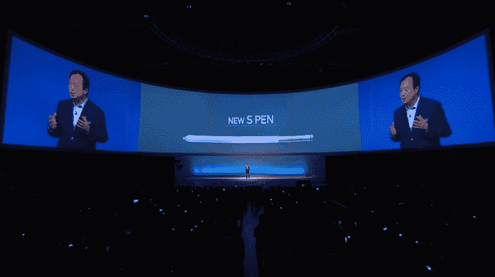
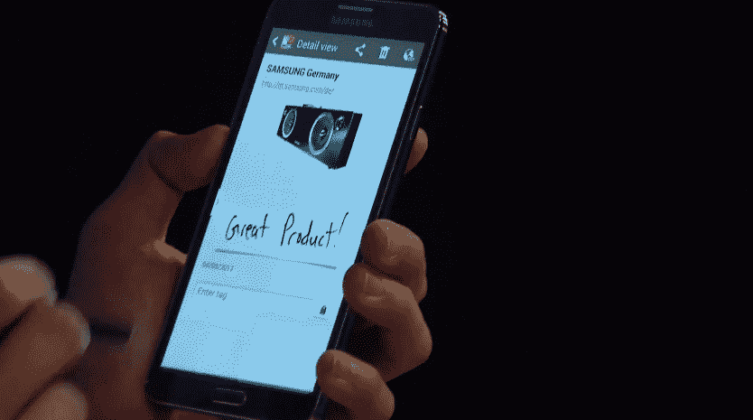

# 三星发布了 Galaxy Note 3，这是平板电脑 更轻薄的进化版

> 原文：<https://web.archive.org/web/https://techcrunch.com/2013/09/04/samsungn-reveals-the-galaxy-note-3-the-slimmer-and-lighter-evolution-of-the-phablet/>

三星的大型[Unpacked epset 2 活动正在进行](https://web.archive.org/web/20230401173746/https://techcrunch.com/2013/09/04/watch-samsung-galaxy-gear-note-event-livestream/)，正如预期的那样，该公司已经利用该场地宣布了 Galaxy Note 3 智能手机。Note 是最初的平板手机，新版本延续了最适合手大的人使用的大屏幕设备的传统。

新的 Galaxy Note 3 采用了极其纤薄的边框和圆角设计，标志着迄今为止与 Galaxy 设备设计语言略有不同。它比上一代产品更薄更轻(168 克)，尽管提供了更大的 5.7 英寸屏幕。它也比 Galaxy Note 2 提供了更长的电池寿命，还有一个新的改进的 S Pen。此外，它还支持更快、更“无缝”的多频段 LTE。

该相机具有 4K 视频录制功能，带有新的 CRI LED 闪光灯，应该可以改善弱光摄影。三星声称，在播放视频时，电池寿命延长了近四个小时，正常使用时的总体性能也应该比上一代产品延长了 40%。

三星强调 Galaxy Note 的工艺，它采用了缝合的皮革后盖(有黑色、白色和粉色可供选择)。它还有一个金属边缘，还有一个翻盖钱包配件，有 10 种不同的颜色，还具有一个更大的 S View 窗口盖，用于查看信息，拨打电话和访问更多信息，而不必激活整个显示屏。

【T2

新的 S Pen 设计用于更大的屏幕。三星称之为开启 Note 功能和力量的“钥匙”。这通过许多新的界面控件来实现。当你可以激活“Air Command”时，屏幕上会出现一个点，这是一个工具轮，可以快速访问备忘录、剪贴簿、编剧和 finder 搜索功能。还有一种三星称为“circle”的东西，它使用圆圈绘制手势来捕捉你想保存到剪贴簿的内容，通过 Air Command 调用。Box 是一种多任务处理方式，让你通过一个画中画的界面同时做两件事。

三星的 Knox 移动安全功能，旨在通过 BYOD 设备用户的消费者和企业使用的分区软件来帮助提高企业和消费者的安全性。Note 3 将于 9 月 25 日在全球 149 个国家发售。

三星的智能手机命运目前是主要审查的对象，因为该公司被认为在增加其整体市场份额方面可能已经达到了上限。该公司正在与投资者和分析师举行会议，讨论面对这些担忧的长期计划，Note 系列推动了相当多的销售，尽管没有旗舰产品 Galaxy S4 那么多。很难估计 Note 2 本身的突破性销量，但三星过去曾表示，预计该设备的出货量将超过 2000 万部。

Galaxy Note 3 规格:

*   151.2 毫米 x 79.2 毫米 x 8.3 毫米
*   5.7 英寸 SuperAMOLED 1080p 显示屏，像素密度为 368 ppi
*   2.3GHz Snapdragon 800 处理器或 1.9GHz 三星 Exynos 八核处理器，具体取决于市场
*   安卓 4.3
*   1300 万像素后置摄像头，200 万像素前置摄像头
*   3GB 内存
*   32 或 64GB 存储
*   MicroSDXC 卡存储扩展
*   蓝牙 4.0、WiFi 802.11ac、LTE 类别 4
*   3200 毫安时电池
*   LED/红外组合

除了 9 月 25 日之外，还没有关于 Galaxy Note 3 可用性的信息，三星官方新闻材料仅表示，它将在“今年晚些时候”向美国所有主要运营商发售。

正在开发…

