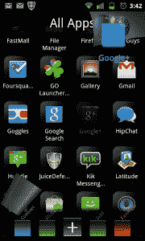

# 三星新的 Android 用户界面雄心勃勃，但存在缺陷 TechCrunch

> 原文：<https://web.archive.org/web/http://techcrunch.com/2011/09/02/samsungs-pure-breeze-android-ui-is-ambitious-but-flawed/>

Android 的一个优点是你可以广泛地定制东西。快速浏览一下 Android 市场，你会发现大量的插件、皮肤和启动器替代品，所有这些都可以让你生活中的 Android 设备焕然一新。令人震惊的是，[三星](https://web.archive.org/web/20230203054559/https://twitter.com/#!/SamsungCarla/status/109687047345811456)已经决定将他们的帽子扔进定制环，用他们自己的名为 Pure Breeze 的发射器替代，由他们的[圣荷西移动实验室](https://web.archive.org/web/20230203054559/https://www.facebook.com/pages/Samsung-San-Jose-Mobile-Lab/175674769170390)开发。

对于门外汉来说，启动器替代品是从本质上重做 Android 设备 UI 的应用程序，其中一些比其他的做得更好。不幸的是，三星的新生努力大多属于后一类。

三星表示，Pure Breeze 的宗旨是在应用程序之间轻松导航，它尽最大努力以这一思想简化一切(无论是好是坏)。

圣荷西实验室称 Pure Breeze 的主屏幕等同于“风筝”这很像你的标准主屏幕设置，除了一些关键的不同:它是半透明的(这很重要)，只有一个很长的页面可以滚动。在使用的早期阶段，这对我来说是一个障碍；我必须抵制住左右滑动来访问其他东西的诱惑，因为那里什么也没有。

应用程序抽屉按钮位于屏幕底部的中心，并像以前一样工作。这里的不同之处在于，它预装了应用程序组，可以通过左右滑动来访问。通过按住并拖动应用程序，可以轻松地将它们移入或移出这些群组。当按住一个应用程序的图标时，它也可以被发送到垃圾桶或风筝。很公平。

 当一个应用程序正在打开，用 Home 键退出时，半透明的主屏幕开始发挥作用。它从一个角落俯冲下来，盖住它，让应用程序部分可见。这就是 Pure Breeze 真正要做的:按下返回键让风筝再次飞走，让用户完全回到之前的位置。再次点击返回键，它会把你带到之前打开的应用程序。Pure Breeze 有效地创建了一个应用程序链，理论上允许用户跟踪线索回到他们离开的地方。

这听起来很棒，而且在很大程度上，它工作得非常好，但是有几个问题。

链条可能会变得足够长，以至于淹没一些功能较弱的设备，当试图找到你放在风筝上的应用程序时，半透明的主屏幕可能会非常分散注意力。Pure Breeze 与众不同，许多使用它的用户会尝试做他们通常做的事情，但最终会迷路。只有一个主屏幕页面，所以在决定使用什么部件时要谨慎。在主屏幕上按下菜单按钮时，会显示纯 Breeze 设置，而不是设备菜单。

也许我有点苛刻，但对于这么少的回报来说，这似乎是一个过于激烈的转变。应用程序链接的概念是一个新颖的想法，效果出奇的好，但所有的小失误都会拖累一切。这是圣何塞移动实验室的第一个版本，这当然是一个雄心勃勃的版本，但希望未来的版本会更好。

这款应用几天前在安卓市场上线，有免费版本和付费版本。

[YouTube http://www.youtube.com/watch?v=nRwaR4GyLmU&w=640&h=345]