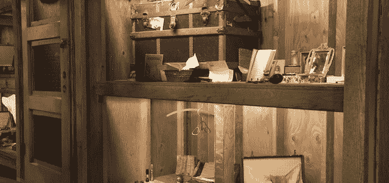
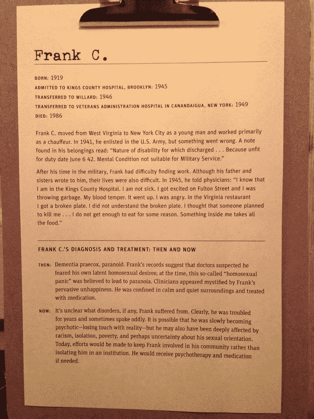

# 旧金山的全年龄科学博物馆探索精神疾病和微妙的同性恋

> 原文：<https://web.archive.org/web/http://techcrunch.com/2013/04/10/san-franciscos-all-age-science-museum-explores-mental-illness-and-subtly-homosexuality/>

# 旧金山的全年龄科学博物馆探索精神疾病和微妙的同性恋

旧金山耗资 3 亿美元新建的豪华科学博物馆采取大胆举措，鼓励孩子们问:“什么是正常的？”在探索博物馆的海边挖掘处，一个昏暗的 20 世纪精神健康展览醒目地坐落在光弯曲实验和激光之间。精神健康剪贴板详细描述了那些不幸的人们的治疗，他们因为今天我们认为很正常的行为，包括同性恋，而被送进了精神病院并被下了药。“常态是一个不断变化的景观，”联合策展人帕梅拉·温弗瑞解释说，她希望孩子和成年人都能理解医学如何帮助定义传统。

最引人入胜也最具争议的人物是“弗兰克·C”，他因医生所谓的“同性恋恐慌”而被送进了精神病院。1942 年退伍后，他在一家餐馆外暴跳如雷。他告诉医生，“我知道我在金斯县医院。我没有生病。我在富尔顿街兴奋起来，我在扔垃圾。我的血脾气。我上去了。我很生气。在弗吉尼亚餐馆，我打碎了一个盘子……我以为有人想杀我”

在描述对他行为的治疗时，“医生怀疑他害怕自己潜在的同性恋欲望；当时，这种所谓的‘同性恋恐慌’被认为会导致妄想症……他被关押在平静和安静的环境中，并接受药物治疗”。

长期以来，科学上认为正常的分类一直由《精神病学诊断圣经》、《精神疾病诊断和统计手册》( [DSM](https://web.archive.org/web/20230404114939/http://en.wikipedia.org/wiki/Diagnostic_and_Statistical_Manual_of_Mental_Disorders) )管理[。其有争议的第五次添加已经将阿斯伯格症纳入了一个新的总括类别，自闭症谱系障碍。“性别认同障碍”现在是“性别焦虑”，指的是“一个人经历/表达的性别与指定性别之间明显不一致的情绪困扰”。换句话说，今天“不正常”的，明天可能就相当正常了。](https://web.archive.org/web/20230404114939/http://articles.latimes.com/2012/dec/09/news/la-heb-dsm5-american-psychiatric-association-20121207)

温弗瑞认为,“改变正常面貌”展览的另一个重要观点是，精神疾病是常见的，而且通常是短暂的。人们进出抑郁症。精神分裂症等疾病并不总是会在社交上削弱附属者。而且，也许最重要的是，大多数人要么经历过，要么与受精神疾病影响的人关系密切。“这是一种能够以安全的方式触及一些敏感话题的方式，”她解释道。随着网络激进分子艾伦·施瓦茨的自杀，精神疾病是一个及时且发人深省的话题。

这个特殊博物馆的影响不能低估:国家的旗舰科学博物馆是全国各地展览的舞台。据官员称，这是湾区最大的教师发展组织，巡回展览接触了超过 1.8 亿人。

探索博物馆馆长丹尼斯·巴特尔解释说，希望创造“一个真正为自己着想的群体”