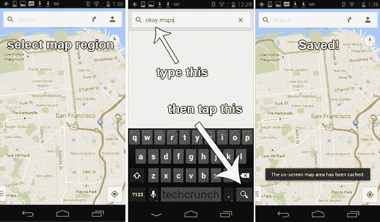

# “好地图”复活节彩蛋将离线模式带回新的谷歌地图应用 

> 原文：<https://web.archive.org/web/https://techcrunch.com/2013/07/10/save-maps-offline-new-google-maps/>

# “好地图”复活节彩蛋将离线模式带回新的谷歌地图应用程序

新的 Android 版谷歌地图于昨晚深夜开始发货，但人们已经对地图的老功能之一:离线地图模式的突然消失感到不满。在以前的地图版本中，用户可以保存大块的地图供以后使用(比如当你在国外漫游时，下载几兆的数据会花费你 70 到 80 亿美元。)在新地图里，不能。

谷歌表示，新版本的功能还没有完全准备好。但是等等！有一个复活节彩蛋有点像是把它带了回来。

**当你想缓存一张地图以备后用时，你可以做的就是:**

*   将地图视图缩放至想要缓存的区域
*   点击搜索栏
*   输入“好的地图”(向谷歌眼镜上使用的“好的，眼镜”语音命令致敬)
*   点击搜索按钮

嘭！缓存。

这不像以前的“离线可用”按钮那么简单，而且它可能偶尔会出问题(因此它是一个复活节彩蛋)，但它似乎能完成任务。

(注意:你显然需要使用最新的、刚刚发布的地图版本(没有内置离线地图模式的版本)才能实现这个功能。此外，就像旧的地图应用程序一样，导航和方向也不能离线使用。这些东西都是在谷歌的服务器上生产出来的。这只是保存一份地图数据到您的手机。使用它来避免在旅行或其他无数据的情况下走进一个死胡同，但不要指望谷歌地图的其余部分能够工作。)