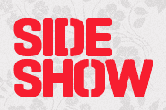

# 假设媒体收购数字机构 Sideshow TechCrunch

> 原文：<https://web.archive.org/web/https://techcrunch.com/2011/06/21/say-media-acquires-digital-agency-sideshow/>

# 说媒体收购数字机构 Sideshow

[说媒体](https://web.archive.org/web/20221210051537/http://www.crunchbase.com/company/saymedia)，这家在[video egg 和博客软件制造商](https://web.archive.org/web/20221210051537/https://beta.techcrunch.com/2010/09/21/video-egg-will-acquire-six-apart-and-rename-itself-say-media/) [Six Apart](https://web.archive.org/web/20221210051537/http://www.crunchbase.com/company/six-apart) 合并后成立的公司，今天早上[宣布](https://web.archive.org/web/20221210051537/http://www.businesswire.com/news/home/20110621005663/en/Media-Acquires-Sideshow-Digital)收购 [Sideshow](https://web.archive.org/web/20221210051537/http://sideshow.com/) ，这是一家在美国、欧洲和中东都设有办事处的数字机构。

Sideshow 团队将加入 SAY 的[媒体实验室](https://web.archive.org/web/20221210051537/http://www.saymedia.com/media.php)，该公司将其描述为“致力于为公司拥有和运营的媒体资产网络探索新产品和体验的创意和技术团队”。

Sideshow 为微软(Microsoft)和福克斯(FOX)等主要品牌带来了一些构建数字体验的专业知识，媒体称这对于人们创造、消费和货币化数字内容的新方式的发展至关重要(例如:[xoJane.com](https://web.archive.org/web/20221210051537/http://www.xojane.com/))。

SAY Media 表示，此次收购还将使其能够为最近收购的[Dogster](https://web.archive.org/web/20221210051537/http://www.crunchbase.com/company/dogster)及其合作伙伴网站网络创造更多内容和广告“体验”。

Sideshow 成立于 1999 年，是为数不多的纯粹专注于数字技术的机构之一。

收购条款没有披露。