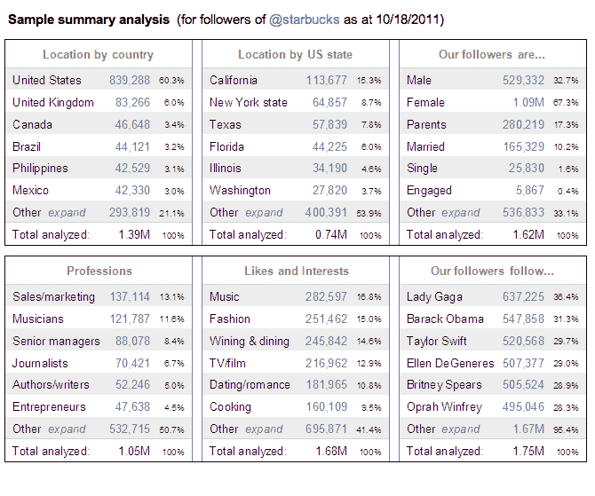

# Schmap 的深度分析平台可让您对您的 Twitter 关注者进行深度数据挖掘 

> 原文：<https://web.archive.org/web/http://techcrunch.com/2011/10/27/schmaps-in-depth-analytics-platform-lets-you-take-a-deep-data-dive-on-your-twitter-followers/>

无论是为了广告、定向信息，还是仅仅为了获取一般知识，了解谁是你的 Twitter 追随者是对任何公司或品牌都有用的信息。今天， [Schmap](https://web.archive.org/web/20230203202535/http://schmap.it/know-your-followers) 推出了自动化免费增值服务，让任何个人、公司或品牌都可以立即获得对其 Twitter 粉丝的深度人口统计分析。

Schmap 将在基本水平上细分 Twitter 粉丝，按照性别、婚姻状况、职业、喜欢和兴趣以及国家和美国各州的位置对粉丝进行细分。该服务的付费版本按照相同的类别划分关注者，加上按照城市划分的位置、技术使用分类、Twitter 影响力/活动等等。

大多数公司/品牌的付费服务从 39.95 美元到 149.95 美元不等；个人、慈善机构和当地商家为 4.95 美元至 24.95 美元。

Schmap 的首席执行官 Paul Hallett 认为，这项服务对于品牌和企业、广告买家、媒体、政治活动家、活动发起人和当地商人了解谁是他们的受众特别有用。

例如，Schmap 比较了许多名人的粉丝资料，包括查理·西恩、莎拉·佩林、老虎伍兹、比尔·盖茨、沃尔夫·布利泽和唐纳德·川普。Schmap 的分析显示，查理·西恩的粉丝是 iPhone 用户，经常发推特，喜欢聚会。萨拉·佩林的追随者是喜欢读书的宗教已婚父母。养宠物的推特用户最喜欢狼布利泽，最不喜欢老虎伍兹。火狐用户追随比尔·盖茨；唐纳德·特朗普很受健身狂热者的欢迎。

在后端，Schmap 评估了追随者选择在 Twitter 上公开的数据(他们的名字、位置、简历等。)，并使用一系列专有算法在语义上处理和解析这些数据

当然，很难想象 Twitter 不会提供这些分析，尤其是在提供更有针对性的广告时。Hallet 承认这是 Twitter 可以发布的东西(该公司已经在推进一个[数量的分析产品](https://web.archive.org/web/20230203202535/https://techcrunch.com/2011/09/13/twitter-analytics/))，但他确实相信开发者在这一领域有未来。尽管他表示，当 Twitter 开始提供竞争产品时，一些第三方开发者以前就吃过亏，但现在与第三方开发者的高级信号传输比一年前要好。

查看以下星巴克 Twitter 粉丝的样本摘要:

