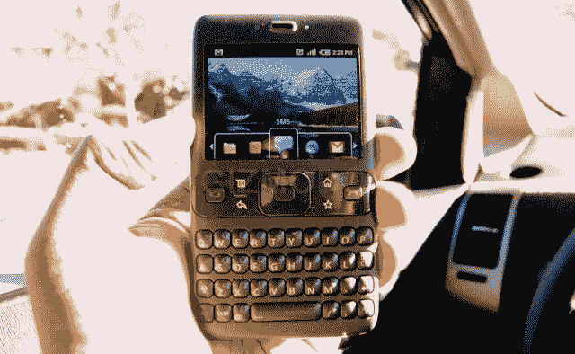

# 施密特:摩托罗拉移动不会得到优惠待遇(并不是说它需要)

> 原文：<https://web.archive.org/web/https://techcrunch.com/2011/11/08/schmidt-motorola-mobility-wont-get-preferential-treatment-not-that-it-needs-it/>

# 施密特:摩托罗拉移动不会得到优惠待遇(并不是说它需要)

埃里克·施密特继续他的亚洲之旅，今天在韩国发表演讲。出现了两个敏感话题:首先，如果交易完成，摩托罗拉移动是否会得到特殊待遇。据路透社报道，他的回应是:“我们将充分和独立地运行它，它不会违反 Android 的开放性……我们不会以任何实质性的方式改变我们的运营方式。”

我相信他。因为真的，他们不需要。

当谈到 Android 手机时，谁是需要被鞭策的呢？不是 HTC 和三星。手机制造商都很高兴，销售了大量手机，并在屏幕尺寸、分辨率和 CPU 时钟速度等容易膨胀的数字上展开竞争。他们赚了很多钱，生产了很多手机。谷歌不想让摩托罗拉成为安卓的海报男孩，从而吓到他们的摇钱树。

不，是*运营商*是谷歌存在的祸根。Android 最大的问题可以说是碎片化。运营商是生产统一 Android 生态系统的更新的最大阻碍，他们有太多的牌。苹果预见到并抢先解决了这个问题，将手机更新独家绑定到 iTunes，现在可能是谷歌表达不满的时候了。

我感觉到了 Android 世界的一种发展，一种对碎片化问题的承认，以及一种类似于要求制造商为所有手机测试一种安全的普通安装的解决方案，以更新手机将运行的最新版本的 Android。用户应该能够随时更新到这一点。当然，它动摇了一些东西，但我担心谷歌和其他公司只能忍受这么长时间的负面宣传，然后它开始在通常不关心版本号的人中间贬低这个平台。

施密特在韩国被问及的另一件事是史蒂夫·乔布斯传记中称安卓为“偷来的产品”的那一段。施密特对这个话题提出异议，称史蒂夫是一个“了不起的人”，但还是忍不住谈到了这个话题:“我还想指出，Android 的努力早于 iPhone 的努力。”当然有，埃里克，但它看起来像这样:

随便说说。