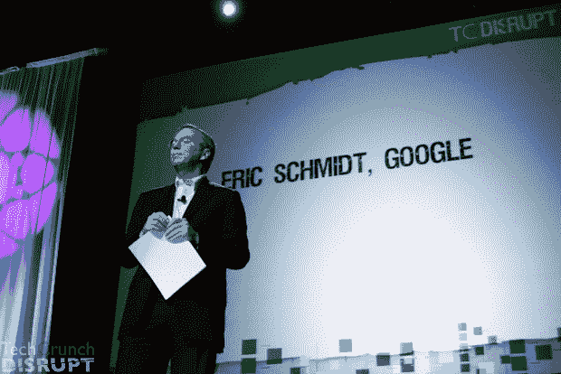

# 谷歌的施密特:汽车发明于电脑之前是个错误

> 原文：<https://web.archive.org/web/https://techcrunch.com/2010/09/28/schmidt-on-future/>

# 谷歌的施密特:汽车先于电脑被发明是一个错误

*有趣的事情即将发生*

这是谷歌首席执行官 Eric Schmidt 今天在旧金山举行的 [TechCrunch Disrupt](https://web.archive.org/web/20221207044018/http://disrupt.beta.techcrunch.com/2010-sf/) 大会上的开场白。他继续说，观众代表了人们使用电脑方式的又一次转变。施密特说:“我们现在有了增强版的人性。未来是让计算机做我们不擅长的事情。

施密特指出，由人类而不是计算机来驾驶汽车是荒谬的。"*你的车应该会自动驾驶。施密特说:“这很有意义。施密特评论道:“汽车先于计算机被发明，这是一个错误。”。*

现在，移动设备每天都伴随着我们大多数人。施密特说，这将继续向前发展。施密特强调说，这并不意味着精英阶层也是如此，而是普通人也是如此。他说:“智能手机是我们这个时代的标志性设备。

施密特表示，这些智能手机将继续让我们的生活变得更加轻松。他们将使你可以从任何地方获取信息。施密特说，更重要的是，他们会让你永远不孤独。你总是保持联系，也就是说和你的朋友保持联系。“如果你醒着，你可能在网上，”他说。

施密特说，这是“突破的黄金时代”。