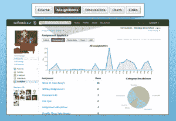

# 100 万用户，Schoology 以 600 万美元收购 Blackboard、Moodle 

> 原文：<https://web.archive.org/web/https://techcrunch.com/2012/04/16/schoology-series-b/>

为中小学提供一站式、基于云的学习管理系统的制造商 Schoology 今天宣布，它已经完成了 600 万美元的 B 轮风险投资。这轮融资由 [FirstMark Capital](https://web.archive.org/web/20221006160807/http://www.crunchbase.com/financial-organization/firstmark-capital) 牵头，现有投资者[Meakem Becker Venture Capital](https://web.archive.org/web/20221006160807/http://www.crunchbase.com/financial-organization/meakem-becker-venture-capital)也提供了部分资金，使这家总部位于纽约的初创公司的总融资额达到 930 万美元。

对于那些不熟悉的人来说，Schoology 是建立在 BlackBoard、Moodle 和 Edmodo 等服务背后的概念之上的，通过一个协作学习平台，允许学校通过一个好看的脸书式界面集成在线教育、课堂管理和社交网络。基于云的解决方案既可以作为独立产品免费提供，也可以作为面向学校和学区的收费企业级解决方案提供。

Schoology 对教师的吸引力在于，他们可以在几分钟内注册该服务，并可以使用唯一的访问代码轻松邀请学生进入系统。在这里，教师可以建立一个课程，创建课程计划，分配测试和测验，而学生可以提交他们的家庭作业，并加入小组参与合作学习项目等。然后，教师可以对作业进行评分，还可以利用与学校或校区内其他教育工作者的协作和内容共享，以及将应用程序添加到他们的工作流程中。

Schoology 认为其价值主张在于其平台可以跨学校和空间使用，允许各种组织参与共享课程、小组和讨论。从这个意义上来说，正如 FirstMark 董事总经理 Amish Jani 所说，Schoology 不需要花费数月或数年的时间来说服学校系统的负责人这项技术符合他们的需求，相反，“用户只需采用它，Schoology 就可以通过点击几下按钮来通知学区或大学他们可以获得的额外功能。”

目标是推动学校采用[开放教育资源](https://web.archive.org/web/20221006160807/http://www.oercommons.org/)。随着教育采用数字教科书、自适应学习和翻转课堂，将越来越需要将这些下一代技术结合在一起的平台。Schoology 希望成为这样的平台，就像[无限学习通过创建开放、扩展的数字教科书作为未来教育平台的框架来解决问题一样。](https://web.archive.org/web/20221006160807/https://beta.techcrunch.com/2012/04/05/publishers-sue-as-boundless-nabs-8m/)

Schoology 希望其系统与现有平台集成(这家初创公司为教师提供了将 Moodle 课程直接导出到 Schoology 的能力)并提供社交网络功能的事实将产生网络效应。有理由相信它开始发挥作用了，因为 Schoology 今天在平台上有近 100 万用户，遍布 18，000 所学校。

接下来，由于内容可以直接在其平台内构建、共享和购买，Schoology 希望鼓励开发者参与进来，并开始构建更广泛的智能教育应用程序，供教师和学生使用。Jani 还指出，教师可以“获得小额信贷，根据他们的需求个性化系统，父母可以被邀请参与教育过程，”从长远来看，这可以极大地促进这种网络效应，并提供急需的定制层，增加企业级服务的吸引力。

 Schoology 对其技术的愿景还延伸到了课堂之外，因为任何想要提供持续学习或在职培训的组织都可以将该平台用作其员工的教育工具。例如，Groupon 一直在使用 Schoology 进行销售领域的培训，通过分享其需要学习的专有材料，为销售经理提供快速教育新员工的机会。然后，他们可以对材料进行快速测验和测试，上传新的指南，并提供重温销售、最佳实践等的一般资源。

提供一个在基本的，比如说，家庭作业分享和更复杂的用户管理功能中保持直观的界面不是一件容易的事。保持足够低的门槛，以便可以在教室或公司层面有效地使用它来培训和教育员工，同时为这两种用例提供足够的定制是一条很难走的路。但 Schoology 似乎正在寻找平衡，作为一个全面服务的、基于云的学习管理系统，它看起来很好，实际上很容易使用。

更多信息，[请点击](https://web.archive.org/web/20221006160807/https://www.schoology.com/home.php)查看家庭学校学。