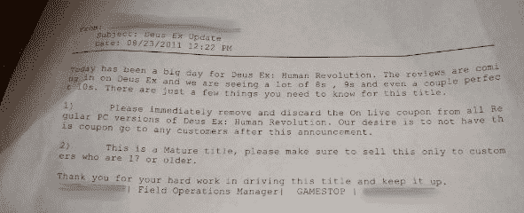

# 去你的，GameStop。

> 原文：<https://web.archive.org/web/http://techcrunch.com/2011/08/24/screw-you-gamestop/>

我们完了，游戏停止。

当你给我一个游戏的花生时，我睁一只眼闭一只眼，你还在用低于全零售的钱卖游戏。每次我走进商店，你的员工无休止地向我施压，让我预订我不想要的游戏，我对此不屑一顾。当我试图在发布日购买一个新版本却没有预定被拒绝时，我笑了，只是在我离开时有一本*奇迹般地*出现了。我想，这些都是我愿意支付的价格，来支持一家仅存的实体游戏店。

但打破游戏的全新副本上的封条拿出来(有价值！)不喜欢的东西，然后把游戏当新的卖？是的，我离开你了。

**事情是这样的:**

昨天早上，一个期待已久的标题叫做 *Deus Ex: Human Revolution* 终于发布给了一个热切的观众。盒子里藏着一个小小的惊喜:通过相对较新的游戏流媒体服务 [OnLive](https://web.archive.org/web/20230204224318/https://techcrunch.com/tag/onlive/) 免费获得同一款游戏的优惠券——如果直接通过 OnLive 购买，价格为 49.99 美元。至少，有*假定*是一张优惠券…

报告很快开始陆续出现:出于某种原因，GameStop 上售出的几乎所有游戏中都没有优惠券。

发生了什么事？工厂的人忘记打包一些优惠券了吗？没有。GameStop 是否制定了一项分销协议，以防止优惠券流入他们的手中？没有。

GameStop 的员工打开盒子，拿走优惠券，然后把产品放回货架上……在上面的命令下这么做。

第一个证据来自 [GameSpy](https://web.archive.org/web/20230204224318/http://pc.gamespy.com/pc/deus-ex-3-unofficial-title/1190175p1.html) 获得的一封电子邮件，据称是 GameStop 现场运营经理发送的。关键点是第一点:

“请立即删除并丢弃所有常规 PC 版本的 Deus Ex: Human Revolution 的 OnLive 优惠券，”上面写道。当然，这不可能是真的！一家公司奉命打开一个密封的产品，扔掉一个可以换取 50 美元 T2 产品的东西，然后装作什么都没发生？

但果不其然， [GameStop 在脸书](https://web.archive.org/web/20230204224318/http://www.facebook.com/GameStop?sk=wall)上跟进确认后二话不说:

> 关于 Deus Ex OnLive Codes: GameStop 的政策是，我们不会在没有正式合作关系的情况下推广竞争服务。
> Square Enix 在 PC 版的 Deus Ex: Human Revolution 中打包了竞争对手的优惠券，我们事先并不知道，但我们确实拉了这些优惠券。
> 新产品开盘时，我们充分保证碟片的状态为新品。如果您发现情况并非如此，请联系购买游戏的商店，他们将进一步提供帮助。

注意措辞。“可能”开了？试试*“都是”*开的。这是多么大的保证！如果你的光盘由于某种原因不能正常工作，他们会给你一个新的(大概同样剥离)副本。但如果你只是因为做空了一张价值 50 美元的债券而生气呢？啦啦啦啦，我们听不见。

GameStop 旗下的 OnLive 服务是一项“竞争性服务”，该服务被称为 pulse，GameStop 在 7 月份收购了种子实验室后推出。

GameStop:如果你想和经销商达成协议，不带优惠券就能拿到特刊，这很合理。虽然人们仍然会因为自己的钱包被克扣而懊恼，但这至少不是什么见不得人的事。但如果你打开一个密封的盒子，取出一张 50 美元面值的优惠券，然后重新放回货架上，你会作何感想呢？糟透了。一个顾客能走进来，购买了游戏，拿走优惠券，然后退回盒子要求全额退款吗？不是吗？这就不好了。

唉，他们走的是一条见不得人的路——现在他们走的这条路让 OnLive 的市场推广力度远远超过了那张愚蠢的优惠券。