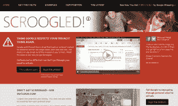

# Scroogled:为什么这么消极，微软？

> 原文：<https://web.archive.org/web/https://techcrunch.com/2013/02/10/scroogled-why-so-negative-microsoft/>

销售一空的 Surface Pro 确实让微软看起来度过了一个不错的一周，但当其硬件部门正在庆祝时，网络部门似乎执意要为其与谷歌的战争火上浇油。就在 Surface Pro 审查禁令于本周早些时候到期后——微软获得的赞誉远多于 Surface RT——其营销团队再次对谷歌发起了不必要的攻击性“ [Scroogled](https://web.archive.org/web/20230404124251/http://www.scroogled.com/) ”活动。

这次活动是微软目前为其 Outlook.com 电子邮件服务进行的最引人注目的营销活动，微软决定采取一种非常积极的方式。但是为什么呢？Outlook.com 是一个非常好的电子邮件客户端，它提供了许多区别于谷歌服务的功能。那么，为什么微软觉得有必要走反面呢？

【YouTube http://www.youtube.com/watch?v=63u-RG-31B0&w=640&h=360]

在这个新的活动中，微软提醒人们，邪恶的 Gmail 男子“查看你发送到 Gmail 的个人电子邮件，并利用这些内容销售广告。”它拥有所有必要的表面布满视频(谢天谢地，它们比 Windows 7 派对视频和臭名昭著的 [SongSmith 广告](https://web.archive.org/web/20230404124251/http://www.youtube.com/watch?v=3oGFogwcx-E)更上一层楼)，脸书和 Twitter 活动，甚至还有[一份请愿书](https://web.archive.org/web/20230404124251/http://www.thepetitionsite.com/997/086/864/tell-google-to-stop-going-through-your-email-to-sell-ads/)。顺便说一下，这份请愿书并没有像病毒一样传播开来。目前已有 4100 多人签名。微软希望达到 25000 英镑。

 众所周知，Gmail 的算法确实会评估你的电子邮件内容，为你提供个性化广告——谷歌在这方面相对开放[，你可以](https://web.archive.org/web/20230404124251/http://support.google.com/mail/bin/answer.py?hl=en&answer=6603)[选择退出这些](https://web.archive.org/web/20230404124251/https://www.google.com/settings/ads/preferences)。我们自己的莎拉·佩雷斯已经涵盖了所有这些论点。我不明白的是，为什么微软觉得有必要进行这样一场负面宣传。Outlook.com 是一个设计非常好的现代网络邮件客户端。仅在功能上，它就能与 Gmail 竞争。相当多的 Gmail 用户尝试过它(你也可以在你的 Gmail 账户上使用它)。它有 Gmail 没有的像 Active View 这样的工具。它的界面干净而现代，而 Gmail 开始感觉有点杂乱。

### “谷歌仔细检查每一封发送或接收的 Gmail 邮件，寻找关键词，这样他们就可以向 Gmail 用户投放付费广告。”

圣诞节前，微软开展了一项类似的活动，将谷歌现已付费的购物搜索置于其目标之下。考虑到必应的搜索结果也包含了相当数量的付费收录，这场运动也包含了适量的 FUD。我不认为那场运动给那些读过它的人留下了持久的印象。

为什么微软不专注于自己比谷歌做得更好的地方？人们不会因为隐私问题而集体转向 Outlook，但他们可能会转向这些功能。当然，电子邮件只是用户对现代网络应用套件期望的一部分，即便如此，微软也不需要 FUD。例如，其免费的基于 SkyDrive 的 Office Web 应用程序感觉比 Google Drive 工具功能更全，尽管它们很少被媒体大肆宣传。SkyDrive 本身也相当令人印象深刻，可以轻松跟上 Google Drive。Bing 是一个偏好问题，但与其关注谷歌的购物结果可能会或可能不会受到付费广告的驱动，为什么不强调 Bing 对社交搜索的关注——这是一个比谷歌更有优势的领域(尽管这是否是人们真正关心的事情仍有待观察)。

正如每一位经验丰富的政治家可能会告诉你的那样，像“Scroogled”广告这样的负面宣传活动可能会很有效，但潜在的反弹使它们成为一个危险的提议。微软的营销团队显然认为利大于弊，但即使该活动获得了大量媒体关注，我也怀疑它能否让人们改变主意。反而让微软看起来小家子气，不顾一切，过于咄咄逼人。

【YouTube http://www.youtube.com/watch?v=Fanf_5v3mkQ？feature = player _ detail page & w = 640 & h = 360]

【YouTube http://www.youtube.com/watch?v=-WIluNt0mvA？feature = player _ detail page & w = 640 & h = 360]