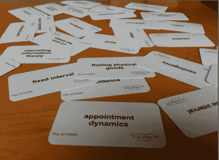

# SCVNGR 的秘密游戏机制 Playdeck 

> 原文：<https://web.archive.org/web/https://techcrunch.com/2010/08/25/scvngr-game-mechanics/>

一些公司保存着产品技巧、诀窍和商业秘密的剧本。例如，Zynga 有一个内部剧本，里面收集了“开发成功而独特的社交游戏的概念、技术、诀窍和最佳实践”。Zynga 的 playbook 已经进入了[传奇](https://web.archive.org/web/20230304114732/https://techcrunch.com/2009/09/11/yeah-but-did-you-steal-the-zynga-playbook-playdom/)的领域，甚至是一场诉讼的[主题。](https://web.archive.org/web/20230304114732/https://techcrunch.com/2009/09/10/zynga-accuses-playdom-of-stealing-trade-secrets-judge-issues-temporary-restraining-order/)

[SCVNGR](https://web.archive.org/web/20230304114732/http://www.scvngr.com/) ，做一款有[现实世界挑战](https://web.archive.org/web/20230304114732/https://techcrunch.com/2010/05/12/google-backed-scvngr-takes-on-foursquare-looks-to-boost-fun-with-challenges/)的手游，有 playdeck。这是一副列出了近 50 种不同游戏机制的卡片，可以混合搭配，为不同类型的游戏奠定基础。我重新发布了下面的附带文档，任何试图在产品中注入游戏元素的人都会感兴趣。

现在，应该有很多人。大约每六个月，一系列功能席卷网络，每个网站和应用都感受到采用它的压力。我们在社交、地理和现在的游戏机制中看到了这一点。当然，网络上的所有游戏都有某种游戏机制——那些让游戏变得有趣和令人上瘾的元素。但是[游戏机制正在将](https://web.archive.org/web/20230304114732/https://techcrunch.com/2010/03/27/facebook-fedex-amazon-fun/)推广到所有类型的应用程序，最著名的是 [Foursquare](https://web.archive.org/web/20230304114732/https://techcrunch.com/2010/08/21/foursquare-dennis-crowley-places-google-facebook/) (它可以让你检查地方以获得徽章和奖励)。在我们 7 月的社交货币峰会上，我们有一个小组探讨了[游戏机制是如何入侵一切](https://web.archive.org/web/20230304114732/https://techcrunch.com/2010/08/01/the-new-games-people-play-game-mechanics-in-the-age-of-social/)。(小组中的首席执行官之一是 SCVNGR 的 Seth Priebatsch)。从 [Mint](https://web.archive.org/web/20230304114732/https://techcrunch.com/2009/04/28/mint-turns-personal-finance-into-a-game-its-not-as-bad-as-it-sounds/) 到 [Huffington Post](https://web.archive.org/web/20230304114732/https://techcrunch.com/2010/04/29/the-huffington-post-starts-giving-out-badges-to-readers/) 的每个网站现在都有某种游戏机制。

SCVNGR 的 playdeck 试图将游戏机制分解成它们的组成部分。有些元素就像“成就”、“地位”和“虚拟物品”一样基本但也有更复杂的，如“约会动态”(玩家必须在特定时间返回，并执行一个动作以获得奖励，如 Farmville)，“免费午餐”(玩家因为其他人的努力而获得某些东西，如 Groupon)，“有趣一次，永远有趣”(一个简单的动作，无论你做多少次，都保持最低水平的享受，如 Foursquare 的签到)，以及“级联信息理论”(在最小的运球中发出信息，让玩家猜测并继续前进)。SCVNGR 的员工被要求记住这些闪存卡。现在你也可以了。会有一个小测验。

## SCVNGR 游戏动态游戏平台

**本文档指南**:本列表收集了游戏动力学术语、游戏动力学理论，它们有趣、有用，并可能适用于您在 SCVNGR 的工作。他们中的许多人在 SCVNGR 游戏层中有明确的应用(进展动态，现实化)，他们中的许多人没有…还没有(状态，虚拟物品)。他们中的许多人只是对你的游戏动力学理论(史诗意义，游戏的社会结构)的一般教育感兴趣。这些游戏动力学概念中的许多都是众所周知的，它们来源于整个互联网以及 Jane McGonigal、Ian Bogost 和 Jess Schell 等研究人员以及 gamasutra 上的文章(我强烈推荐阅读这些文章)。其他的仅供内部使用，在总部之外没有任何意义。除了本文档的链接，您还会收到一套闪存卡中的这些动态。请记住那些。如果你是工程/游戏设计团队的一员，你可以通过你的帐户访问我们内部的游戏动态可视化工具(拥有最新的动态)。下载适用于 iPhone & Android 的 SCVNGR 应用程序(如果您还没有下载)并开始玩。找到这些游戏动态存在的地方，或者可以通过使用我们的工具或其他工具在游戏层上实现它们的地方。

## 1.成就

**定义**:完成某事的虚拟或物理表现。这些通常被视为奖励本身。

**举例**:徽章、等级、奖励、积分，任何被定义为奖励的东西都可以是奖励。

## 2.约会动态

**定义**:要想成功，你必须在预定的时间返回并采取行动。约会动态通常与基于区间的奖励计划或回避动态密切相关。

例子**:咖啡馆世界和 Farmville，如果你在规定的时间回来做某事，你会得到好东西，如果你不回来，就会有不好的事情发生。**

 **## 3.逃避

**定义**:不是通过给予奖励，而是通过不制定惩罚来诱导玩家行为的行为。产生一致的活动水平，按计划安排时间。

**示例**:每 30 秒按一次控制杆，以免触电。

## 4.行为对比

**定义**:定义行为如何根据变化的期望而发生巨大变化的理论。

**例**:一只猴子按下杠杆，被给了生菜。猴子乐了，继续按杠杆。然后它得到一颗葡萄。猴子很高兴。下一次它按下控制杆，它又会得到莴苣。它没有像以前一样开心，而是发疯似的向实验者扔莴苣。(在一些实验中，第二只猴子被放在笼子里，但被拴在绳子上，这样它就不能够到生菜或杠杆。在葡萄奖励被拿走后，第一只猴子痛打了第二只猴子，尽管这显然与拿走没有任何关系。这种愤怒是完全不理智的。)

## 5.行为动力

**定义**:玩家持续做他们一直在做的事情的倾向。

**例子**:来自杰西·谢尔的[精彩的骰子演讲](https://web.archive.org/web/20230304114732/http://g4tv.com/videos/44277/dice-2010-design-outside-the-box-presentation/):“我花了十个小时玩《Farmville》。我是一个聪明人，不会花 10 个小时在某件事情上，除非它是有用的。因此，这一定是有用的，所以我可以继续做下去。”

## 6.幸福的生产力

定义:玩游戏让你在努力工作时比在放松时更快乐的想法。本质上，我们通过努力工作，做有意义和有回报的工作来优化自己。

**例子**:来自[简·麦戈尼卡尔的 Ted 演讲](https://web.archive.org/web/20230304114732/http://www.ted.com/talks/jane_mcgonigal_gaming_can_make_a_better_world.html)，她在演讲中讨论了魔兽世界玩家如何平均每周玩 22 小时(兼职工作)，通常是在一整天工作之后。他们愿意努力工作，也许比现实生活中更努力，因为他们在游戏世界中快乐的生产力。

## 7.级联信息理论

**定义**:该理论认为信息应该以尽可能少的片段发布，以便在游戏叙事过程中的每一点获得适当的理解水平。

**例子**:首先显示基本动作，随着你在各个关卡中的进展，解锁更多。使构建 SCVNGR 成为一个简单但分阶段的过程，以避免信息过载。

## 8.链式计划

**定义**:将奖励与一系列或有事项挂钩的做法。玩家倾向于将这些视为简单的个人偶发事件。解锁意外事件中的一步通常被玩家视为个人奖励。

**例子**:杀死 10 个兽人进入龙穴，每 30 分钟龙就会出现一次。

## 9.公共发现

**定义**:游戏动态，整个社区团结起来一起解决一个谜语、一个问题或一个挑战。非常流行，非常有趣。

**例子** : DARPA 气球挑战赛，围绕麦当劳专卖出现的寻找“木板路”的家庭手工业

## 10.同伴游戏

**定义**:可以跨多个平台玩的游戏

**例子**:可以在 iphone、facebook、xbox 上玩的游戏，完全无缝的跨平台游戏。

## 11.偶然性

**定义**:玩家在奖励计划的三部分范式中必须克服的问题。

10 个兽人挡住了你的去路

## 12.倒数计秒

定义:玩家只能在一定的时间内做一些事情。这将创建一个活动图，导致增加的初始活动疯狂增加，直到时间耗尽，这是一个被迫灭绝。

**例子**:宝石迷阵闪电战，30 秒内尽可能多的得分。奖励回合。定时级别

## 13.跨情境领导-董事会

**定义**:当一个排名机制应用于多个(不平等且孤立的)游戏场景时，会出现这种情况。玩家通常认为这些排名方案是不公平的，因为并非所有玩家都有“平等”的获胜机会。

**举例**:玩家被任意送入三条路径中的一条。获胜者由总得分最高者决定(即各条路线)。由于玩家只能走一条路(并且不能选择)，他们会察觉到游戏场景中的不公平，并感到不安。

## 14.抑制因素

**定义**:一个游戏元素，使用惩罚(或改变的情境)来诱导行为转变

**例子**:失去健康积分，亚马逊的收银台取消了所有的链接来引导买家购买，加速陷阱

## 15.无尽的游戏

定义:没有明确结局的游戏。最适用于可以刷新内容的休闲游戏或静态(但积极的)状态本身就是一种奖励的游戏。

**例子** : Farmville(静态是自己的胜利)、SCVNGR(挑战不断被社区建立以刷新内容)

## 16.羡慕

**定义**:拥有别人拥有的东西的欲望。为了有效地做到这一点，必须利用看别人有什么(窥淫癖)。

**例子**:我朋友有这件物品，我想要！

## 17.史诗意义

定义:如果玩家相信他们正在努力实现一些伟大的、令人敬畏的、比他们自己更伟大的事情，他们会有很高的动力。

**举例**:来自 Jane McGonical 的 Ted 演讲，她在演讲中讨论了魔兽争霸正在进行的故事线和涉及每个人的“史诗般的意义”,这激励玩家参与到游戏之外，并创建了世界上第二大维基来帮助他们实现个人任务和集体史诗般的意义。

## 18.灭绝

**定义**:灭绝这个词是用来指停止提供奖励的行为。这往往会引起玩家的愤怒，因为他们不再收到他们期待的奖励，感觉被背叛了。一般会诱发负面的行为动量。

**例子**:杀死 10 个兽人不再能提升你的等级

## 19.固定间隔奖励计划

**定义**:固定间隔时间表在固定的时间量后提供奖励，比如 30 分钟。这往往会在奖励后产生一个低参与度，然后逐渐增加活动，直到给予奖励，然后是另一个参与度的停顿。

**例** : Farmville，等待 30 分钟，农作物已经出现

## 20.固定比率奖励计划

**定义**:固定比例计划表在固定次数的行动后提供奖励。这造成了参与度的周期性低谷(因为第一次行动不会产生任何奖励，所以激励很低)，然后随着奖励越来越近，活动会激增。

**例子**:杀死 20 艘船，获得一个等级，访问五个地点，获得一个徽章

## 21.免费午餐

**定义**:一种动态，玩家觉得自己因为别人做了工作而免费得到了一些东西。为了避免在场景中破坏信任，工作被认为是已经完成的(只是不是正在讨论的玩家)是很重要的。玩家必须感觉到他们“幸运地”得到了一些东西。

**例子** : Groupon。由于另外 100 个人已经买了这笔交易，你可以便宜地得到它。没有粗略 b/c 你认识到工作已经完成(100 个人在花钱)，但你自己没有必要去做。

## 22.快乐一次，永远快乐

**定义**:一个动作令人愉快地一直重复的概念。一般来说，这与简单的动作有关。通常，这种行为的总体享受程度也是有限的。

**举例**:随处签到和 SCVNGR 上的签到和默认挑战背后的理论。

## 23.区间奖励计划

**定义**:基于时间间隔的奖励计划在一定时间后提供奖励。有两种口味:可变和固定。

**例子**:等 N 分钟，收租金

## 24.彩票

**定义**:一种完全靠运气决定胜负的游戏动态。这就产生了高度的期待。公平性经常受到质疑，然而赢家通常会无限期地继续玩下去，而输家会很快放弃游戏，尽管两者之间的区别是随机的。

**举例**:多种形式的赌博，刮票。

## 25.忠诚

**定义**:感觉与一个实体有积极持续的联系的概念，导致部分所有权的感觉。通常用视觉表现来加强。

**例子**:WOW 中的忠诚，在实体场所获得地位(市长职位，在最喜欢的顾客的墙上)

## 26.元游戏

**定义**:一个游戏分层存在于另一个游戏中。这些通常是被发现的，而不是被解释的(以免它们引起混乱)，并且倾向于吸引大约 2%的游戏玩家。它们很危险，因为它们会引起混乱(如果过于公开)，但也很强大，因为它们能让找到它们的人感到极大的满足。

**例子**:魔兽世界中隐藏的问题/成就需要你在完成其他任务时做一些特殊的(难以发现的)活动

## 27.微型引导板

**定义**:一个微集中所有个体的排名。通常非常适合分布式游戏动态，在这种情况下，您需要许多微型比赛或诱导忠诚度的愿望。

例子:成为本周乔酒吧的最佳得分者，并获得一份免费开胃菜

## 28.修饰语

**定义**:使用时影响其他动作的项目。通常修饰是在完成一系列挑战或核心功能后获得的。

**例子**:一个 X2 修改器，在你采取的下一个动作上加倍点数。

## 29.博弈的道德风险

**定义**:通过在游戏中操纵式地奖励人们，你去除了这一行为的实际道德价值，代之以基于游戏的虚假奖励的风险。提供太多激励去采取行动的风险，实际享受所采取行动的激励会丧失。由此得出的推论是，如果分数或奖励被拿走，那么这个人就失去了采取行动的所有动力(最初这种行动本身很有趣)。

**例子**:转述自[杰西·谢尔](https://web.archive.org/web/20230304114732/http://g4tv.com/videos/44277/dice-2010-design-outside-the-box-presentation/)“如果你每次刷牙时我都给你加分，你就会停止刷牙 b/c 这对你有好处，然后只为加分而刷牙。如果点停止流动，你的牙齿就会腐烂。”

## 30.所有权

定义:控制某物的行为，把它变成你的财产。

举例:所有权在很多层面上都很有趣，从接管位置到控制一个位置，再到简单地通过拥有许多朋友的数字表示来拥有人气。

## 31.骄傲

定义:拥有的感觉和对成就的喜悦

我有十个徽章。我拥有它们。它们是我的。有很多像他们一样的，但这些是我的。万岁。

## 32.隐私

**定义**:某些信息是私人的，不能公开发布的概念。这可以是一个消极因素(我不会采取行动，因为我不想分享这一点)或一个激励因素(通过分享这一点，我加强了自己的行动)。

**例子**:在推特上公布你的每日体重(这些是真实的，并被证明是保持节食的积极动力)。或者在你做任何事情的任何时候公开广播你的位置(这是侵犯性的，应该避免)。

## 33.渐进动态

**定义**:一种动态，通过完成分项任务的过程，成功被精确地显示和测量。

**例子**:一个进度条，从圣骑士 1 级升到圣骑士 60 级

## 34.比率奖励计划

**定义**:比率计划在一系列行动后提供奖励。有两种口味:可变和固定。

**例子**:杀死 10 个兽人，获得一个异能。

## 35.实时对延迟机制

**定义**:实时信息流不受延迟的约束。延迟信息只在一定间隔后发布。

**例子**:实时分数引起即时反应(满足或消极)。延迟会导致不确定性，由于缺乏确定的排名，不确定性会激发更多的行动。

## 36.强化刺激

**定义**:如果在奖励计划的三部分范例中执行了预期的行动，则给予奖励。

**例子**:杀死 10 个兽人后获得一级提升。

## 37.反应

**定义**:在奖励计划的三部分范例中，玩家的预期行动。

**例子**:玩家采取行动杀死 10 个兽人

## 38.奖励计划

**定义**:奖励(点数、奖励、等级提升)交付的时间框架和交付机制。奖励计划有三个主要部分:偶然性、反应和强化物。

例如:杀死 10 个兽人升级，在俄罗斯方块中清除一行，在法姆维尔获得新鲜的庄稼

## 39.滚动实物商品

定义:任何人只要符合某种特征就可以持续获得的实物商品(具有实际价值的商品)。然而，这种特征会随着玩家的不同而变化。

**例子**:最佳得分交易，市长交易

## 40.骗局

**定义**:一种游戏，玩家被呈现一种选择的幻觉，但实际上是在一种引导他们达到操作者期望的结果的情况下。

**举例**:三张牌天魔、彩票、赌博

## 41.游戏的社会结构

定义:人们在一起玩游戏后会更喜欢彼此，这种想法有更高的信任度，也更愿意一起工作。

例:来自简·麦克戈尼格尔的 TED 演讲，她认为和某人玩游戏需要很大的信任，因为你需要他们花时间和你在一起，遵守同样的规则，为同样的目标奋斗。

## 42.状态

**定义**:玩家的等级或级别。玩家的动机通常是试图达到更高的水平或地位。

**举例**:WOW 中的白色圣骑士 20 级。

## 43.迫切的乐观

**定义**:极端自我激励。立即采取行动解决障碍的愿望与我们有合理的成功希望的信念相结合。

例子:来自简·麦戈尼卡尔的 TED 演讲。在正规的游戏中，一场“史诗般的胜利”或者仅仅是“胜利”是可能的，因此总是值得去争取的。

## 44.可变区间奖励计划

**定义**:可变区间奖励计划在大致一致的时间后提供奖励。随着时间的推移，这往往会创造一个相当高的活动水平，因为玩家可以在任何时候获得奖励，但永远不会像在固定时间表下创造的那样爆发。这个系统也更加不受收到奖励后的最低点的影响，但由于高度的模糊性，在奖励解锁前也缺乏活动的顶点。

**例子**:大约等待 30 分钟，一个新武器出现。你想什么时候回来就什么时候回来，但这不会加快速度。通常玩家不善于意识到这一点。

## 45.可变比率奖励计划

**定义**:可变比率奖励计划在大致一致但数量未知的行动后提供奖励。这创造了相对较高的持续活动率(因为在下一次行动后总是会有奖励),随着预期奖励阈值的达到而略有增加，但永远不会出现固定比率计划的巨大爆发。在获得奖励后，它对参与度的低谷也更加免疫。

**例子**:杀死 20 艘左右的船，升一级。参观几个地点(大约五个)获得徽章

## 46.病毒游戏机制

**定义**:需要多人才能玩的游戏元素(或者多人才能玩的更好)

**例子** : Farmville 让你在游戏中更成功，如果你邀请你的朋友，社交签到

## 47.虚拟物品

**定义**:在游戏过程中发现或取走的数字奖品、奖励、物品。通常这些可以交易或赠送。

**示例** : Gowalla 的物品、脸书的礼物、徽章**