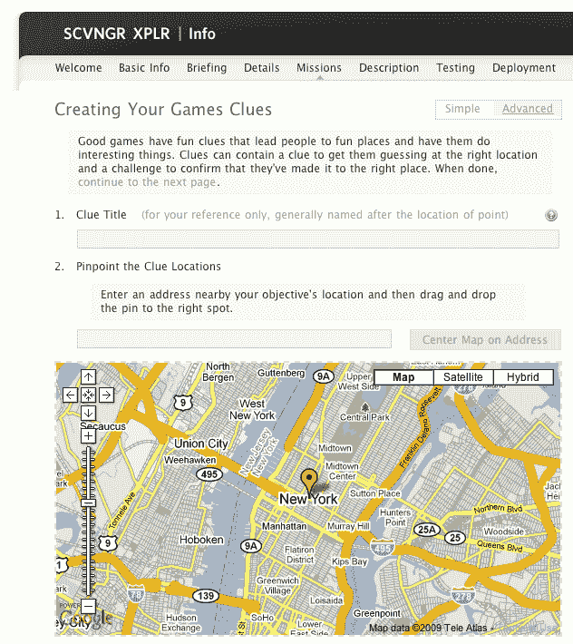

# SCVNGR 可以让你在任何手机上建立令人敬畏的寻宝游戏

> 原文：<https://web.archive.org/web/https://techcrunch.com/2009/08/13/scvngr-lets-you-build-awesome-scavenger-hunts-for-any-mobile-phone/>

对许多人来说,“寻宝游戏”这个词唤起了童年的记忆，在附近跑来跑去寻找顶针和袜子之类的小玩意——这种经历在十岁左右就失去了光彩。但事实证明，它们是大企业:大公司和大学已经成功地将更精细的寻宝游戏用作团队建设练习，一门精心设计的课程可能会非常有趣。SCVNGR 是一家成功打入这个利基市场的年轻初创公司，今天它推出了一个新的消费者平台，允许任何人建立自己的寻宝游戏，该游戏可以在任何手机上运行。这个名为 XPLR 的新平台现在处于私人测试阶段，第一批 100 名 TECHCRUNCH 的读者到[这里](https://web.archive.org/web/20221209230148/http://www.scvngr.com/xplr/beta_register.php)并输入代码“TechCrunch”将能够注册并建立他们自己的任务。

与此同时，该公司还宣布完成了高地资本(Highland Capital)的 75 万美元融资。

SCVNGR 仍然是一家非常新的公司，去年秋天作为 [DreamIt Ventures](https://web.archive.org/web/20221209230148/http://www.dreamitventures.com/) 孵化器项目的一部分首次亮相。但它已经被 300 多所大学使用，包括哈佛大学和普林斯顿大学，以及一些公司，他们使用该公司的企业级游戏生成器进行员工团队建设练习和定向活动。这是一个奇妙的想法，原因有很多:游戏很容易部署，除了许可平台之外几乎没有成本，它可以在任何手机上工作，游戏可以用最少的努力进行调整。

XPLR(发音为“explorer”)旨在作为一个更易于使用的框架来构建这些游戏。而且，与更强大的 SCVNGR 构建器不同，XPLR 是免费的。它有许多限制:你受到多少人可以同时玩游戏的限制，你无法分辨哪些用户一直在玩游戏(就像你在商业应用程序中可能希望的那样)，并且该平台仅用于非商业、非机构用途。但是，如果你想建立一个你的家乡之旅，或者也许是一个酒吧爬行供你的朋友跟随，这正是你想要使用的。下面可以看到编辑器的截图。

那么游戏实际上是如何运作的呢？如果你想自己尝试一下，iPhone 上有一个免费的[应用程序](https://web.archive.org/web/20221209230148/http://itunes.apple.com/WebObjects/MZStore.woa/wa/viewSoftware?id=323248984&mt=8),其中包括一个训练游戏，但它的要点是:该服务向手机发送问题，通常还会附带一个文本、音频或视频线索，以帮助找到答案。一旦你认为你已经解决了它，你输入你的答案，如果你是正确的，你继续下一个问题。该系统作为一个基本的益智游戏工作良好，但当它用于寻宝游戏时，它更有吸引力，因为问题需要你实际走到某个地标。例如，为波士顿[市](https://web.archive.org/web/20221209230148/http://www.boston.scvngr.com/)设置了许多 SCVNGR 任务，引导用户通过该市一些最著名的地标。以下是一系列问题的例子，摘自费城之旅:

> **线索**:哪个更大？费城著名楼梯中的这个楼梯还是这个永无止境的传奇故事的续集？
> **回答**:石阶
> **挑战**:太棒了！现在跑过去告诉我，在顶端的洛基雕像上，他穿多大号的鞋？
> **答案**(通过非常仔细地看洛奇的鞋子获得):9.5
> 另一个挑战可能是:现在给你和你的团队拍一张在山顶做洛奇姿势的照片！上传照片继续前进！

SCVNGR 为 iPhone 和 Android 提供应用程序，但它们也可以在使用 SMS 的更基本的手机上运行(只需向该公司的 shortcode 发送一个特殊的关键字，游戏就会开始向你发送线索)。也就是说，智能手机的体验肯定更好:一些游戏包括多媒体线索，还有一些特殊的照片任务，要求用户提交自己做各种任务的照片。这些照片被上传到网站的服务器上，无论是谁在执行任务，都可以将它们作为纪念品分发出去。

SCVNGR 的服务确实做得很好，其令人印象深刻的客户名单就是证明。将来我们会继续关注他们。

