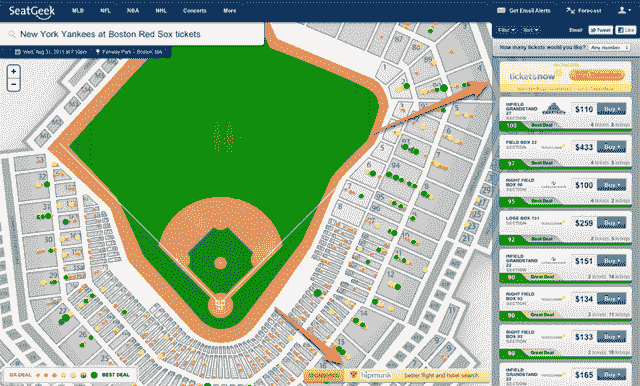

# SeatGeek 重新设计其票务市场，推出赞助商平台 TechCrunch

> 原文：<https://web.archive.org/web/http://techcrunch.com/2011/08/11/seatgeek-redesigns-its-ticket-marketplace-launches-sponsor-platform/>

# SeatGeek 重新设计其票务市场，推出赞助商平台

总部位于纽约的初创公司 [SeatGeek](https://web.archive.org/web/20230203142717/http://www.seatgeek.com/) 为其票务市场增添了一层新的色彩，引入了一种经过彻底改革的设计，融入了一些有用的新功能。它还宣布了一种新的盈利方式，希望这种方式能成为一种强劲的收入来源:赞助配售。

对于那些没有使用过的人来说，SeatGeek 是一个二级门票销售的搜索引擎——它让人们购买在易贝和 TicketsNow 等网站上出售的门票。它非常注重消除其他票务网站上常见的混乱。

本周，该公司推出了一个更干净的外观，有更多的空间专门用于浏览门票和体育场周围。该网站现在有 700 多张交互式体育场地图，其中许多都包括 3D 渲染的快照，显示了从给定座位观看时的实际情况。

SeatGeek 最近还推出了一项名为 Deal Score 的功能。大多数网站让你按价格给门票排序，但不考虑这些价格是否真的划算。毕竟，露天看台的座位可能只有 15 美元，但如果你有机会以 75%的价格买到本垒板后面的票，你可能会决定买这些票。这就是 Deal Score 的用武之地——seat geek 将查看历史数据来确定一张票通常卖多少钱，并突出显示那些特别划算的交易。

SeatGeek 新的赞助商广告本质上是针对性很强的广告，其定价取决于推广在网站中的深度。不同的广告会根据人们观看的事件和浏览的位置而呈现给他们。

其中一些广告是典型的横幅广告，而最昂贵的广告实际上是在机票列表中放置一个按钮。例如，TicketsNow 最近为一些活动赞助了一个按钮，让用户只能通过其网站查看*的*门票(见下面的截图)。启动时，赞助商包括 TicketsNow、Hipmunk、ToughMudder 和《狮子王》音乐剧。

SeatGeek 团队表示，他们对赞助平台感到兴奋，因为 Kayak(旅游门票的聚合器/搜索引擎)从类似的赞助项目中产生了超过 50%的收入。目前，该公司正与每个赞助商直接合作，但它计划推出一个自助服务平台。

