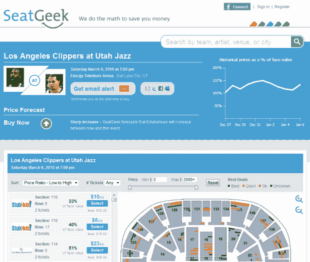

# TC50 决赛入围者 SeatGeek 筹集种子资金，改造网站 

> 原文：<https://web.archive.org/web/https://techcrunch.com/2010/01/08/seatgeek-series-a-funding/>

# TC50 决赛选手 SeatGeek 筹集种子资金，改造网站

 [SeatGeek](https://web.archive.org/web/20221208235635/http://seatgeek.com/) 无疑是最近 [TechCrunch50](https://web.archive.org/web/20221208235635/http://techcrunch50.com/) 会议的入围者之一，我认为从商业模式的角度来看，这是最有趣的。显然，我不是唯一一个，因为这家总部位于纽约的初创公司刚刚结束了由四名企业家/天使投资人领导的一轮融资。

这家羽翼未丰的公司自称为[“体育和音乐会门票转播商”](https://web.archive.org/web/20221208235635/http://www.beta.techcrunch.com/2009/09/14/tc50-seatgeek-is-the-farecast-for-sports-and-music-tickets/)，早些时候从 [DreamIt Ventures](https://web.archive.org/web/20221208235635/http://www.dreamitventures.com/) 获得了 2 万美元的种子资金，现在又获得了 50 万美元到 100 万美元的资金(由于融资中存在一些意外情况，具体金额无法透露)。

SeatGeek 旨在预测二级市场上出售的体育和赛事门票的价格演变，就像 [Farecast](https://web.archive.org/web/20221208235635/http://www.crunchbase.com/company/farecast) (现 [Bing Travel](https://web.archive.org/web/20221208235635/http://www.bing.com/travel/) )预测机票价格一样。它试图使用一个每天抓取数百个二级市场网站的机器人，结合自动算法来做到这一点，这些算法考虑了一系列非常广泛的相关因素，例如周六棒球比赛的预测天气。

今天早上，SeatGeek 推出了一个全新版本的网站，为大约 5000 场活动的门票列表提供互动座位表。这些图表是与 SeatQuest 合作制作的，允许票单以点的形式覆盖在座位表上，这样用户就可以立即看到他们的座位。对于体育赛事，SeatGeek 不仅仅是通过热图来表示，而是根据算法用颜色点来表示每张票有多划算([示例](https://web.archive.org/web/20221208235635/http://seatgeek.com/event/show/115935/houston-rockets-vs-detroit-pistons/))。

除了座位表，这家初创公司还推出了一个电子邮件提醒系统，当 SeatGeek 的预测建议变为“购买”时，以及当低于一定价格的门票变得可用时，用户可以注册接收通知。

当 SeatGeek 在 TC50 推出时，它吹嘘对大约 1200 场活动的价格预测，由于扩展到 NFL、NBA 和几乎所有大型音乐会(NHL 是下一个)的列表，这家初创公司现在对大约 5000 场活动有预测。SeatGeek 声称对所有新活动的预测准确率保持在 82%，该网站使用了历史票价数据库，在过去几个月中，该数据库的销售额已超过 1100 万。

SeatGeek 表示，额外的资金将主要用于招聘——自 TechCrunch50 以来，该团队的规模已经翻了一番，从 4 人增加到 8 人。如上所述，这笔钱来自四位纽约天使投资人，即 Sunil Hirani(2008 年以 6.25 亿美元收购的在线衍生品市场 Creditex 的创始人)、Mark Wachen(三年前以 5200 万美元收购的企业多元测试应用 Optimost 的创始人)、Arie Abe cassis(MindFire 的前总裁)和 Allen Levinson(穆迪 KMV 的前董事总经理)。

