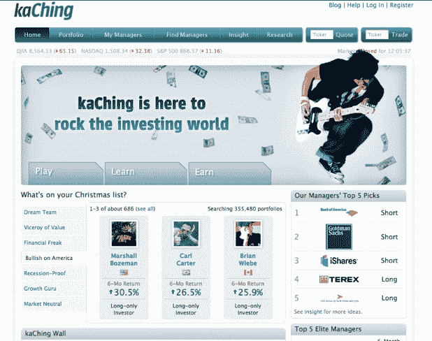
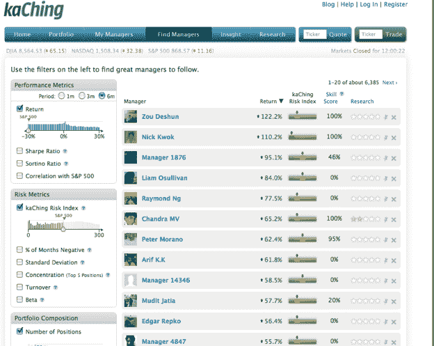

# SEC 批准社交投资网站 kaChing 收购共同基金 

> 原文：<https://web.archive.org/web/https://techcrunch.com/2008/12/15/sec-gives-social-investing-site-kaching-green-light-to-take-on-mutual-funds/>

每个社交投资网站都希望将其交易会员的见解转化为金融产品，人们可以将其与自己的经纪账户联系起来。在人群中找到少数优秀的选股者，然后让其他人跟随他们的投资组合，同时收取管理费，这就是商业模式。KaChing ，这是脸书(以前叫 FSX)最受欢迎的投资应用程序，通过成为美国证券交易委员会的注册投资顾问，向这个方向迈出了重要的一步。明年下半年的某个时候，它将允许其成员将其经纪账户与该网站上精英经理的投资组合联系起来，并自动跟踪他们的交易。

该公司已经从硅谷的一些重量级人物那里筹集了天使轮资金，包括马克·安德森、OpenTable 首席执行官杰夫·乔丹、Benchmark Capital 合伙人安迪·拉赫勒夫和凯鹏华盈合伙人凯文·康普顿。Benchmark 的布鲁斯·邓列维(Bruce Dunlevie)、凯鹏华盈(Kleiner)的道格·麦肯齐(Doug Mackenzie)、Opsware 前首席执行官本·霍洛维茨(Ben Horowitz)也是投资者。(所有风投都是单独投资的)。这轮融资的规模没有披露。

相互竞争的社交投资网站，如 [Cake Financial](https://web.archive.org/web/20221208144154/https://www.cakefinancial.com/) (在 TechCrunch 40 发布) [Covestor](https://web.archive.org/web/20221208144154/http://www.covestor.com/) 和 [PersonalRIA](https://web.archive.org/web/20221208144154/http://www.personalria.com/) (在 TechCrunch 50 发布[)都有相同的计划。所有这些网站都想通过扩大潜在基金经理的范围来扰乱当前的共同基金行业。PersonalRIA 坚持使用专业投资顾问，而 Cake、Covestor 和 kaChing 都为有才华的个人投资者提供了吸引追随者的平台。](https://web.archive.org/web/20221208144154/http://www.beta.techcrunch.com/2008/09/09/personalria-matches-amateur-investors-with-the-pros/)

在某些方面，kaChing 是纯社会投资的最极端的例子。Cake 和 Covestor 都跟踪真实投资组合中的真实交易，而任何人都可以在 kaChing 上创建一个虚拟投资组合。绝对没有准入门槛。首席执行官丹卡罗尔认为这是一件好事，因为你可能是一个优秀的投资者，但没有钱实际交易。KaChing 创造了公平的竞争环境。

相反的观点是，跟随投资真金白银的人风险更小，因为至少他们有一些东西处于危险之中。不仅仅是玩钱。然而，大多数职业基金经理最近的回报并不一定证明了这一点。

卡罗尔说，通过迫使每个人公开他们的投资策略，并展示他们的全部持股和每笔交易，风险就被消除了。换句话说，数据不会说谎。卡罗尔说:

> 很多问题是没有透明度。我们提供完全透明的服务。

嗯，不是*完全*透明。毕竟，他不会说他从天使投资人那里筹集了多少资金。但他确实要求使用他网站的投资者保持透明度。我想这就是他的意思。顺便说一句，卡罗尔本人的选股记录相当不错。他的[投资组合](https://web.archive.org/web/20221208144154/http://www.kaching.com/kaching#portfolio/9/analytics)在过去六个月上涨了 25%，而同期标准普尔指数下跌了 36%。

网站上的其他一些成员做得甚至更好。理查德·琼斯的六个月回报率高达令人瞠目结舌的 372%，而郭炳湘的六个月回报率高达 97.8%。

这些人是谁？我不知道。理查德·琼斯似乎来自英国，并用一张狗的图片作为他的头像。在互联网上，每个人都是一条狗，但是你会把你的钱投资给一个实际上把自己描述成一条狗的人吗？卡罗尔认为这无关紧要。你可以看到他的持有量和风险调整后的回报率。该网站还为你提供了评估琼斯是优秀还是幸运的工具。

卡罗尔有一些前谷歌工程师(这年头谁没有？)开发出像*super runcher*这样的算法，通过将每个投资者的回报来源与他们陈述的投资策略进行比较，得出他们的技能得分。如果你的策略是投资大盘股，但你所有的回报都是小盘股，你可能只是运气好。事实证明，理查德·琼斯的技能得分是 0%。也许他让他的狗挑选他的股票。

相比之下，郭富城的技能得分为 100%。因此，至少他正在完成自己设定的目标，即通过投资金融类股和大盘股来赚钱。但是他的研究分数很低。(每位投资者都被鼓励写出每笔交易的原因，研究分数由有多少其他成员表示同意、不同意或认为它毫无价值来决定)。

在 kaChing 上的 35 万个投资组合中，有 2 万个(其中 1500 个是多元化投资组合)在过去 7 个月里实际上产生了正回报，这是一个不小的成就。kaChing 的一小部分成员可以战胜市场的想法真的很吸引人，我希望卡罗尔是对的。但是我们需要更多的数据。这 20，000 股中有多少能保持在正区间，甚至只是跑赢市场？

领导者很有可能会不断转换，使得长期投资赢家变得非常困难。投资的铁律是，随着时间的推移，每个人的表现都会回归均值，甚至更差。为什么脸书的一群投资者会有所不同呢？

【T2
