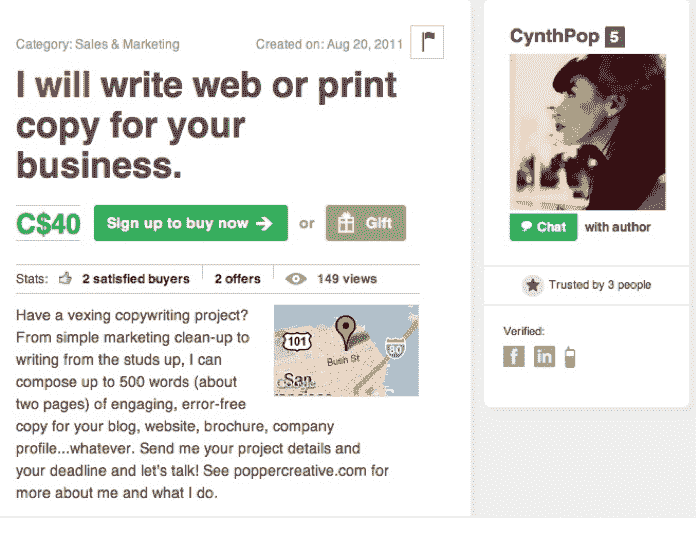

# “第二人生”创始人推出 Coffee & Power，这是一个杰夫·贝索斯支持的技能型工作市场 TechCrunch

> 原文：<https://web.archive.org/web/https://techcrunch.com/2011/11/01/second-life-founder-launches-coffee-power-a-jeff-bezos-backed-marketplace-for-skill-based-jobs/>

第二人生和林登实验室的创始人菲利普·罗斯戴尔(Philip Rosedale)，在[首次亮相](https://web.archive.org/web/20221205121802/http://www.businesswire.com/news/home/20111101005807/en/Coffee-Power-Creates-Marketplace-Small-Fun-Jobs)他今天的新企业——[咖啡&电力](https://web.archive.org/web/20221205121802/http://beta.coffeeandpower.com/)技能型工作市场。这家总部位于旧金山的初创公司已经从亚马逊首席执行官兼创始人杰夫·贝索斯、格雷洛克合伙公司、米切尔·卡普尔、卡特蒙特风险投资公司和凯文·罗斯那里筹集了 100 万美元的资金。

Rosedale 向我解释说，Coffee & Power 背后的想法来自虚拟世界 Second Life 中的连接。他解释说,“第二人生”对用户的吸引力在于，人们能够从彼此身上创造价值，并在虚拟世界中以新颖的方式使用技能和能力。Rosedale 想将这一点转化为现实生活。该公司的技术也是利用其 [Worklist](https://web.archive.org/web/20221205121802/http://www.worklist.net/) 技术开发的，该技术允许软件开发人员为小块代码做出贡献并获得报酬。

因此，咖啡和权力的灵感诞生了。这个平台是一个在线市场，人们可以在这里买卖小工作。该市场包括自己的虚拟货币和支付系统、实时通信和公共聊天、类似游戏的评级和评论系统，以及用户可以见面和一起工作的真实世界设施。Rosedale 解释说，从根本上说，Coffee & Power 提供了一个共享空间，无论是虚拟的还是现实的，人们可以在这里见面，为彼此做一些小而有趣的工作。

它是这样工作的。你告诉别人你现在愿意做什么或需要做什么，多少钱。地图显示您的列表以及其他人的列表。您可以使用短信和手机发送/接收报价并获得报酬。买家和卖家使用虚拟货币系统进行支付。你可以通过出售任务或者用你的信用卡或 PayPal 购买来赚取这笔钱。你也可以通过 Paypal 将虚拟货币兑换成美元。

Coffee & Power 将各种小型服务的卖家聚集在一个地方，卖家和买家可以使用实时聊天空间，因此他们可以交流和分享反馈。Coffee & Power 的清单被称为“任务”，范围从软件开发服务到呼啦圈课程和定制艺术品。咖啡和电力市场通过实时交流、个人资料和声誉、与社交网络的联系以及可搜索的交易历史来匹配买家和卖家。潜在求职者的个人资料可以链接到脸书和 LinkedIn 的个人资料以获得合法性，用户可以对员工进行评论和评级。

咖啡和电力用户通过信用购买或者通过他们自己的任务收入来建立帐户余额。卖家可以通过购买其他人的服务来花费他们的虚拟货币，或者有选择地将其兑换回美元。网站上的虚拟货币被称为咖啡美元，1 美元等于 1 美元的真实美元。对于每笔交易，Coffee & Power 收取 15%的费用。

除了该网站的推出，Coffee & Power 还在旧金山开设了第一个联合工作空间，用户可以在一个安全的公共区域一起工作，进行交易和服务。市场街 1825 号的咖啡馆式空间提供免费咖啡、电力和 Wi-
Fi.随着服务的扩展，Coffee & Power 将在其他地方开设更多的空间。

作为一种轻松尝试该服务的方式，新用户还可以向他们社交网络上的朋友赠送免费任务或礼物。“可送礼”的任务范围很广，从专业文案审阅简历到阅读塔罗牌。Rosedale 表示，Coffee & Power 的用户已经在数百项任务中兑换了超过 10，000 美元，从平面设计到语言课程和定制万圣节服装。

在测试阶段，Coffee & Power 的工作人员一直在市场街的位置上共同工作，在在线研究、专家建议、文案撰写等方面互相帮助。许多人把它作为结识新朋友和获得额外工作的新渠道。

Rosedale 对该领域的竞争对手相当开放，其中包括 [Zaarly](https://web.archive.org/web/20221205121802/http://www.crunchbase.com/company/zaarly) 、 [Gigwalk](https://web.archive.org/web/20221205121802/http://www.crunchbase.com/company/gigwalk) 和 [TaskRabbit](https://web.archive.org/web/20221205121802/http://www.crunchbase.com/company/taskrabbit) 。他说，对于许多这类服务来说，一项技能并不是必需的。Rosedale 正试图“向上移动一层”，更专注于交付和协调基于技能的任务。

撇开竞争对手不谈，杰夫·贝索斯、格雷洛克、凯鹏华盈(Kleiner Perkins)等投资者寻求支持这些就业和工作市场是有原因的。Rosedale 表示，脱颖而出的公司将是让买家和卖家都参与进来的公司，这是基于任务的市场面临的挑战。他认为，Coffee & Power 的物理位置和个性化特性将有助于该服务与其他竞争对手区分开来。你怎么想呢?

