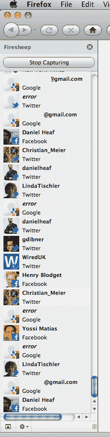

# 安全警报:技术名人在 dld 11 TechCrunch 上轻易被解雇

> 原文：<https://web.archive.org/web/http://techcrunch.com/2011/01/24/security-alert-tech-luminaries-easily-firesheeped-at-dld11/>

# 安全警报:科技名人在 DLD11 上轻易被解雇

还记得 [Firesheep](https://web.archive.org/web/20230202232905/http://codebutler.github.com/firesheep) 吗，Firefox 的扩展让用户[毫不费力地“黑进”](https://web.archive.org/web/20230202232905/https://techcrunch.com/2010/10/24/firesheep-in-wolves-clothing-app-lets-you-hack-into-twitter-facebook-accounts-easily/)任何使用公共网络的人的 Twitter 和脸书账户，通过捕捉用户 cookies？

我目前正在德国慕尼黑参加 [DLD 会议](https://web.archive.org/web/20230202232905/http://www.dld-conference.com/)，这里是众多科技名人、高管、初创公司、媒体和投资者的聚集地。

该组织为每位与会者提供了一个名为 DLDpublic 的公共 WiFi 网络，你瞧，看起来他们中的许多人都没有采取任何[措施](https://web.archive.org/web/20230202232905/https://techcrunch.com/2010/10/25/firesheep/)到[来防止](https://web.archive.org/web/20230202232905/https://techcrunch.com/2010/11/08/firesheep-blacksheep/)上述劫持事件的发生。

果不其然，我的 TechCrunch 同事 Mike Butcher 很快就成了我的受害者，因为我想知道这个安全问题到底有多严重。

郑重声明:我是账户很容易被“HTTP 会话劫持”的人之一，幸运的是，有人——一位不知名的经验丰富的初创公司 CTO——让我注意到了这一点。这个人向我保证，他经营 Firesheep 是出于兴趣和无聊，而不是出于恶意，他最喜欢做的就是警告每个人风险。

我想我应该通过在这里张贴来给予每个人同样的礼貌，因为单独警告数百人是不可行的。

显然，注销这些服务有所帮助。

我还认为这是一个很好的方式来提醒我们所有的读者，像 Firesheep 这样的工具是存在的，[它们不是原因](https://web.archive.org/web/20230202232905/http://revolutionwifi.blogspot.com/2010/11/firesheep-fallacies-and-practical.html)，以及你可以做些什么来避免你的社交网络账户被劫持。

为了绝对明确，我也联系了 DLD 的组织者，他们正在尽一切努力缓解这个问题。

这显然不是他们的错，但他们正在采取一切可能的预防措施，并同意正确的做法是以这种方式发布并警告每个人有关安全问题。

下次你在一个开放 WiFi 网络的活动中，你可能会考虑使用一个安全的 VPN 来连接互联网——你永远不知道谁在嗅探。

这包括你埃丝特·戴森，(Mozilla 首席执行官)米切尔贝克，李开复，亨利布洛杰特，WiredUK，等等。