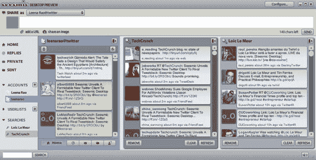
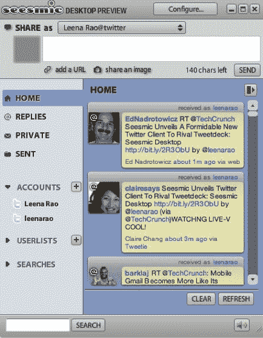

# Seesmic 推出强大的新 Twitter 客户端，与 Tweetdeck 竞争:Seesmic Desktop 

> 原文：<https://web.archive.org/web/https://techcrunch.com/2009/04/07/seesmic-unveils-a-formidable-new-twitter-client-to-rival-tweetdeck-seesmic-desktop/>

我正在视频对话平台 Seesmic 的总部进行博客直播，Seesmic 的创始人 [Loic Le Meur，](https://web.archive.org/web/20221005191226/http://www.crunchbase.com/person/loic-le-meur)正在这里预览一个新的 Twitter 客户端。我们之前报道过该网站的[揭幕](https://web.archive.org/web/20221005191226/http://www.beta.techcrunch.com/2009/04/07/twitter-client-arms-race-continues-seesmic-to-up-the-ante/)。Le Meur 说，这仍然是一项正在进行的工作，并将对产品进行不断的更改。

Seesmic，也拥有流行的 Twitter 应用程序 [Twhirl，](https://web.archive.org/web/20221005191226/http://www.twhirl.org/)推出了新的 Twitter 客户端， [Seesmic Desktop。](https://web.archive.org/web/20221005191226/http://desktop.seesmic.com/)和 Twhirl 一样，Seesmic Desktop 也是一款桌面应用，由 Adobe Air 运营。Seesmic Desktop 允许您在一个窗口中查看多个帐户，不像 Twhirl，您必须在不同的窗口中查看多个帐户。看起来它的设计是为了与竞争对手 [TweetDeck、](https://web.archive.org/web/20221005191226/http://www.tweetdeck.com/beta/)竞争，TweetDeck 是[最受欢迎的](https://web.archive.org/web/20221005191226/http://www.beta.techcrunch.com/2009/02/19/the-top-21-twitter-clients-according-to-twitstat/)Twitter 桌面客户端。Le Meur 表示，Seesmic 将停止向 Twhirl 添加功能(他开玩笑说它的名字很难起)，并将主要专注于构建 Seesmic 桌面。

以下是 Seesmic Desktop 将具备的一些出色功能:

**多个账户**
你不仅可以在一个地方看到多个 Twitter 账户，还可以分栏查看窗口(类似于 Tweetdeck)。通过这个时间线，用户可以轻松地看到来自多个帐户的推文和消息，并轻松地组织不同的应用程序。Le Meur 说这个界面和 Gmail 界面一样简单。

列表你可以将你的社交联系人分组，比如家人、同事和朋友。

**照片和视频**
像 Twhirl 一样，你可以通过 Seesmic 分享照片(集成了 TwitPic)和录制并分享视频(Le Meur 说，这个功能很快就会出现)。您也可以将图像拖放到信息中。您也可以通过网络摄像头导入视频。

对社交网络的支持
目前该客户端仅服务于 Twitter，但 Le Meur 表示，Seesmic Desktop 最终将与脸书、Digg、Identica、Ping 整合。FM 和 FriendFeed。目前，[已经支持](https://web.archive.org/web/20221005191226/http://www.beta.techcrunch.com/2009/02/09/twhirl-gets-an-upgrade-too-and-now-seesmic-has-a-desktop-client/)这些网络。

由于 Seesmic Desktop 建立在 Seesmic 公司的平台和 Adobe Air 的稳定性之上，Le Meur 表示，他的新客户端将比竞争对手 Tweetdeck 稳定得多。

**缩短网址**
也和 Twhirl 一样，你可以缩短网址，通过 Twitter 分享

**搜索**
邮件的搜索查询在不同的栏目中打开并保存。

这个新的客户端就像一个升级的、更强大的 Twhirl，具有更强大的功能。据 LeMeur 称，Twhirl 已经被下载了 120 万次，是网络上领先的 Twitter 客户端。Twitstat 称 Twhirl 是第四大最受欢迎的 Twitter 客户端，仅次于排名第二的竞争对手 Tweetdeck。但这款新应用可能会凭借其新功能超越 Tweetdeck。它实际上在某些方面类似于 [AlertThingy。Le Meur 希望这个客户端成为社交软件的彭博，将所有内容聚合到一个(免费的)桌面应用程序中，也许会成为 FriendFeed 的桌面应用程序版本。](https://web.archive.org/web/20221005191226/http://www.beta.techcrunch.com/2009/02/09/alertthingy-rips-a-page-out-of-tweetdecks-book/)

**免责声明:** TechCrunch 编辑迈克尔·阿灵顿是 Seesmic 的[投资者](https://web.archive.org/web/20221005191226/http://www.beta.techcrunch.com/about-techcrunch/)，尽管我不是。

