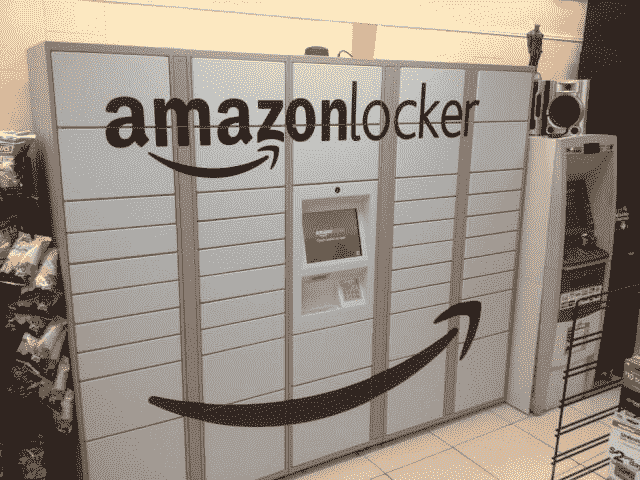

# 据报道，亚马逊盯上了伦敦地铁售票处作为送货点 TechCrunch

> 原文：<https://web.archive.org/web/https://techcrunch.com/2013/11/22/self-service-culture/>

目前，技术在英国运输工人工会中没有赢得任何朋友。伦敦市长鲍里斯·约翰逊也是如此，他昨天宣布，到 2015 年，伦敦地铁网络上几乎所有的售票处都将关闭，大约 750 个工作岗位将会流失。网络上总共有 268 个售票处，大约有 260 个将被关闭，只有大型车站，如国王十字车站和希思罗机场，将在未来保留人工售票设施。

约翰逊认为，通过伦敦牡蛎卡(上图)的非接触式售票和直接非接触式购票支付——明年将在检票口支持非接触式银行支付——使得对工作人员办公室的需求变得多余，在那里穿制服的人发放印刷纸张。

不过，最大的驱动力当然是钱:也就是该计划将在五年内节省的 2.7 亿英镑。

但是，虽然技术摧毁了一系列工作，但电子商务可能会创造其他工作。或者至少用另一套——你猜对了——自助服务机重新利用过去由人工出票的空间。据报道，电子商务巨头亚马逊正在与伦敦交通局谈判，将关闭的售票处用作交付的“下车”点。

亚马逊的谈判早些时候被报道过。《卫报》还称，TfL 正与未透露姓名的“在线零售商”商谈将售票厅转变为商品的“下车”或“点击取货”点。

在撰写本报告时，TfL 尚未对确认会谈的多次请求作出回应。如果他们最终发出声明，我们会用他们的声明更新这篇文章。 **更新:** TfL 现已发出以下声明:

> “作为我们更广泛的商业发展的一部分，我们正在与零售商合作，转变为客户提供的服务。本周，我们宣布正在与 Asda 合作，尝试在我们的六个伦敦地铁站停车场提供点击取货服务，并寻求与其他零售商合作提供类似服务。”

早在 9 月份，另一家电子商务巨头[易贝在英国](https://web.archive.org/web/20221206164652/https://beta.techcrunch.com/2013/09/24/ebay-bridges-online-and-high-street-with-click-and-collect-service-in-the-uk-argos-first-partner/)推出了“点击&领取”服务，买家可以指定一个实体零售店的位置来寄送他们的商品。与此同时，亚马逊已经建立了自己的[储物柜项目](https://web.archive.org/web/20221206164652/https://beta.techcrunch.com/2012/07/30/amazon-lockers-silicon-valley/)一年多了——这让亚马逊的客户可以选择当地的地方，如 7-Eleven 或车站，而不是他们的家或工作地址。

下图所示的储物柜使用一次性密码系统，方便人们领取快递。所以，再一次，不需要人类来为机器配备人员——尽管首先仍然需要人类将东西塞进机器(但可能不到 750 人，因为 TfL 的工作岗位被非接触式支付取代了)。

亚马逊盯上 prime Tube 房地产是很有道理的——这可能使它能够在英国首都建立一个位置便利的送货储物柜网络——为伦敦的通勤者提供一个方便的中途停留点来取货。

然而，该公司拒绝评论或证实其计划重新利用地铁售票处。一位女发言人告诉 TechCrunch:“我们不会谈论我们可能会或可能不会对未来做出的计划，所以我无法在这种情况下协助你的询问。”

亚马逊确实已经在英国提供了储物柜服务——它总共有 270 个储物柜，所有这些机器上共有 12，000 个单独送货的插槽。但是把储物柜放在交通非常繁忙的地方，比如伦敦地铁，会大大增加它们的知名度，也会增加储物柜可以容纳的快递数量。

[专题图片: [TfL 新闻图片](https://web.archive.org/web/20221206164652/http://www.flickr.com/photos/tflpress/7678034050/)