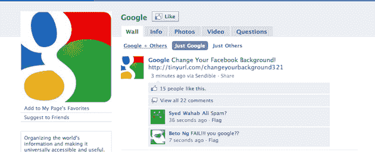

# Sendible 缺陷揭示了一个大的脸书错误；大量页面被垃圾邮件破坏 TechCrunch

> 原文：<https://web.archive.org/web/https://techcrunch.com/2010/11/09/sendible-facebook-hack/>

# Sendible 缺陷揭示了一个大的脸书错误；被垃圾邮件危害的巨大页面

我们刚刚收到了半打快速射击提示，都显示了同样的事情:脸书的应用 Sendible 遭到了严重破坏。

看起来几个最大的脸书网页，包括谷歌、可口可乐、YouTube、南方公园、每日秀、可可队和其他网站，正在向他们所有的粉丝发送一个恶意链接，上面写着“在这里改变你的脸书背景！”显然，不要点击它。

一些点击了这个链接的人报告说，它把你带到了脸书以外的一个页面，要求你提供一些关于你的信息。页面底部写着“由 AWeber 电子邮件营销提供支持”。

最奇怪的是还有多少其他脸书用户“喜欢”这些链接。

我们已经就这个问题联系了脸书，当我们收到他们的回复时会更新。但是这些被泄露的账户似乎表明，这种联系现在已经出现在数千万条反馈中。

**更新**:看起来大部分恶意链接已经被移除。但是越来越多的提示表明攻击正在进行，其他链接不断出现。仍没有来自脸书的关于该事件的消息。

**更新 2** :来自 [Mazy Kazerooni](https://web.archive.org/web/20221005212829/http://twitter.com/#!/Mazy/status/2111588081336320) :

> 这个可发送的黑客攻击了李尔·韦恩的脸书主页(1500 万粉丝)。我是管理员，屏蔽了应用程序。他们多次尝试发帖

**更新 3** :现在 Sendible 是[说](https://web.archive.org/web/20221005212829/http://twitter.com/#!/Sendible/status/2111569047588865)不是他们被黑，而是这可能是脸书的安全漏洞:

> 澄清一下，Sendible 没有被黑。我们的一个用户发现了脸书安全系统的一个重大缺陷。

**2010 年 11 月 11 日更新**:脸书终于全面回应了:

> 我们对此做了更多的调查。我们在发现这些帖子后不久就开始删除它们。它们是由脸书上的一个临时错误引起的，该错误允许应用程序请求的某些帖子在它们不应该被呈现的时候被呈现。Sendible 的 API 调用中有一个缺陷，导致 Sendible 错误地请求用户在他们喜欢的页面上发布的帖子代表这些页面本身进行呈现。这个 bug 导致这些请求通过。发现这个漏洞后，我们立即开始修复它。现在已经解决了，不能再发这些帖子了。Sendible 也已经修复了其终端的缺陷。我们没有发现任何恶意使用该漏洞的案例。

*【图片 via[Moya jaya](https://web.archive.org/web/20221005212829/http://yoinsider.com/)*