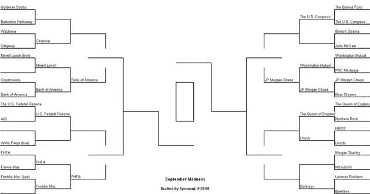

# 九月疯狂 TechCrunch

> 原文：<https://web.archive.org/web/https://techcrunch.com/2008/09/29/september-madness/>

任何最近一直在关注银行破产和整合的大学篮球迷都会理解并欣赏这张 9 月疯狂图表。据报道，这是由 Sansome Partners 的一位普通合伙人马克·斯拉沃尼亚创建的。

我想知道美国国会能否进入四强。点击查看大图。

【T2