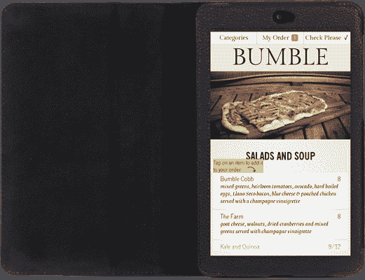
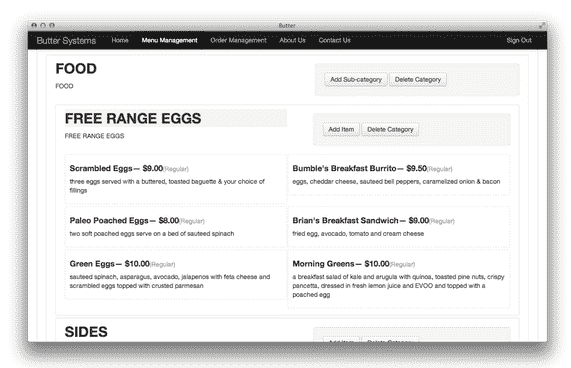

# 谢尔盖·布林(Sergey Brin)的弟弟共同创立了自己的初创公司:Butter，这是一个拥挤空间中的数字餐厅菜单 

> 原文：<https://web.archive.org/web/https://techcrunch.com/2013/07/30/sergey-brins-younger-brother-co-founds-a-startup-of-his-own/>

谷歌联合创始人谢尔盖布林(Sergey Brin)的弟弟、26 岁的萨姆布林(Sam Brin)过去几个月一直与大学好友乔恩李(Jon Li)在一个借来的办公室里，悄悄地建立自己的创业公司。

以免你对兄弟竞争的可能性过于兴奋:山姆和乔恩并没有打算建立一个搜索引擎。他们没有建立一个广告平台。他们没有制造自己的一副疯狂的、有争议的机器人眼镜。

不，他们正在研究谷歌还没有涉足(大概也不会涉足)的领域:餐馆菜单。

山姆和乔恩的公司[Butter Systems](https://web.archive.org/web/20221007103924/http://buttersystems.com/)(Y Combinator 2013 年冬季班的一部分)，想在你的桌子上放一个平板电脑。这种平板电脑将取代(或增强)餐馆的纸质菜单，让顾客可以点食物和饮料，或者要求结账，而不必关掉服务器。他们很快澄清说，他们并没有试图*取代*服务员——他们只是想让服务员的生活更轻松，同时提高餐厅每桌的收入。正如山姆所说，“我们希望在保持人情味的同时，通过让订购变得更容易来增加销售额。”

【YouTube https://www.youtube.com/watch?v=AxD7YaClvA4？feature = player _ detail page & w = 640 & h = 360]

当顾客坐下时，一台安卓平板电脑会在桌旁等候。他们可以像平时一样从服务器上自由订购，但如果他们的服务器忙于帮助他人或因其他原因不可用，平板电脑是次佳选择。在平板电脑上是 Butter 自己的完全可定制的数字菜单系统，以锁定的、只有菜单的模式运行，这使得好奇的修补者很难将设备用于任何意想不到的目的。黄油提供药片，准备好，随时可以接受订单。

吃完后，一句“请结账！”按钮让服务员知道你已经准备好付账了。目前还没有直接通过应用程序支付餐费的方法，他们做出这个决定是为了进一步保持前面提到的去餐馆的人性化。

在餐厅方面，订单是通过在 POS 机旁边的平板电脑上运行的对应应用程序来完成的。当订单到达时，它会闪烁红色，直到服务员检查并确认后，才会将其送到厨房——这样，顾客就不会意外地点了 55 份牛排晚餐。餐馆老板可以通过一个网络界面随时调整菜单，调整价格，并随着时间的推移添加/删除项目或促销活动。

现在，在你跑到最近的屋顶大声说出你肺里酝酿的裙带关系的故事之前，我必须说:在一个创业场景中，它经常被对发展自己的“网络”的令人讨厌的嗜血所驱动，实际上有点令人震惊的是小山姆似乎是如何利用这些家庭关系的。当然，最后一个名字可能会打开一些门——或者至少，打开已经半开的门——但他似乎没有试图利用它。他们最初给我们的电子邮件只是在解释了公司所做的事情很久之后，在最后几行中顺便提到了这种关系。我和萨姆和乔恩坐在一起聊了几个小时，他们只提到了萨姆的哥哥一次，那就是讲述一部即将上映的电影的想法是如何产生的。谢尔盖是山姆的兄弟，也是公司的顾问(不是投资者)，但这是山姆和乔恩的船。

撇开血统不谈，我预计至少会面临两个挑战:平板电脑失窃和扩大销售的难度。

在 Butter 的测试地点，平板电脑就像你在上面的视频中看到的那样，放在每张桌子上，采用时髦、轻便的皮革对开本。这在一个顾客流动率相对较低的单一、古雅的地点可能行得通；但是，如果他们想在数百家各种形状和大小的餐馆中找到自己，他们将不得不面对这样一个事实:作为一个集体，人们可能很糟糕。人们*将*偷走这些药片。他们必须想出如何保护它们的安全，是把它们锁在桌子上(这有点难看)，还是某种基于接近度的警报，当你把设备拿出某个半径时，它就会开始尖叫。

其次，他们必须想出如何以相当低的收购成本让餐馆入伙。正如他们之前的许多创业公司发现的那样，说服一家餐馆以任何方式改变他们的结构和工作流程都是相当困难的。说服他们让这项投资有利可图？异常艰难。在这个空间里有许多其他的 ***许多*** ，像 [E La Carte](https://web.archive.org/web/20221007103924/https://beta.techcrunch.com/2013/06/24/customized-tablet-for-restaurants-e-la-carte-raises-13-5m-from-intel-capital-and-others/) (或 [iMenu](https://web.archive.org/web/20221007103924/http://www.imenu.fr/) 、 [MenuPad](https://web.archive.org/web/20221007103924/http://us.menupad.com/) 或无数其他)已经解决这个问题一段时间了，并取得了不同程度的成功。Butter 说，到目前为止，仅口碑就为他们带来了稳定的推荐流，他们计划给餐馆老板 30 天的免费试用期，以帮助达成交易。

不过，审判结束后他们将如何起诉仍悬而未决。他们要么收取一次性安装费(这将包括设备的成本，随菜单一起提供)，要么收取每月订阅费，或者两者兼而有之。

在我们的谈话中出现了一个特别有趣的概念，Sam 和 Jon 说他们计划解决这个问题，这就是分析。如果菜单本质上可以 A/B 自我测试，找到正确的项目描述，从而带来最大的销售额，会怎么样？当饮料在菜单的顶端或底端时，你会卖出更多的饮料吗？图片是帮助还是伤害？访问这些数据(并且能够在没有重印成本的情况下即时测试变化)可能是平板电脑菜单相对于纸质菜单的最大优势。让它发生，伙计们！

Butter 的菜单目前正在 Los Altos ' s[Bumble](https://web.archive.org/web/20221007103924/http://www.bumblelosaltos.com/)(Sergey 在[投资的一家餐厅，作为其 Los Altos 项目](https://web.archive.org/web/20221007103924/http://online.wsj.com/article/SB10000872396390444506004577615261807454988.html)的一部分)进行测试，并计划在未来几周内扩展到更多地点。感兴趣的餐馆老板可以点击[查看更多细节。](https://web.archive.org/web/20221007103924/http://buttersystems.com/)