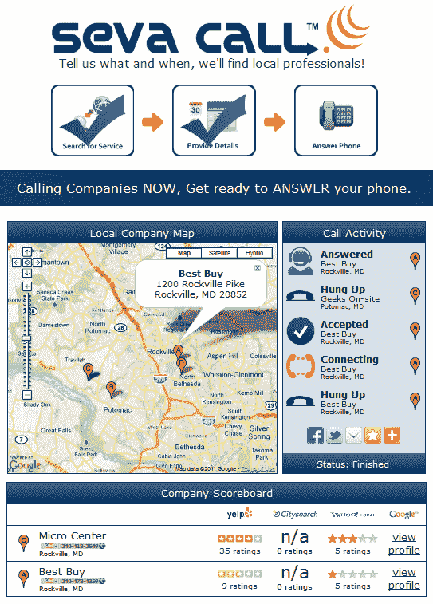

# Seva Search 筹集了 130 万美元，将消费者与当地企业联系起来 TechCrunch

> 原文：<https://web.archive.org/web/http://techcrunch.com/2011/11/01/seva-search-raises-1-3-million-to-connect-consumers-with-local-businesses/>

总部位于华盛顿的 Seva Search 已经为其第一款产品 [Seva Call](https://web.archive.org/web/20230203072723/http://launchrock.sevacall.com/) 筹集了 130 万美元的首轮融资，这是一款让消费者通过电话与当地企业近乎实时联系的搜索引擎。在 Seva Call 网站上(很快会有手机应用)，你可以搜索当地的企业，比如水管工、承包商、电脑维修技术人员、出租车或任何其他类型的依靠来电获得新工作的企业。

要使用该服务，您需要输入方便的日期和时间，以及您的姓名、电话号码和所需服务的描述。然后，企业给你打电话。

A 轮投资方包括 [Fortify.vc](https://web.archive.org/web/20230203072723/http://fortify.vc/) 、 [Ed Mathias](https://web.archive.org/web/20230203072723/http://hbswk.hbs.edu/archive/2139.html) 、 [Tim Sykes](https://web.archive.org/web/20230203072723/http://www.crunchbase.com/person/timothy-sykes) 、 [Jay Virdy](https://web.archive.org/web/20230203072723/http://www.linkedin.com/in/virdy) 、[戴维·艾斯纳](https://web.archive.org/web/20230203072723/http://www.crunchbase.com/person/david-eisner-2)、[安德鲁·巴赫曼](https://web.archive.org/web/20230203072723/http://www.crunchbase.com/person/andrew-bachman)、[吉加尔·沙阿](https://web.archive.org/web/20230203072723/http://www.crunchbase.com/person/jigar-shah)、[克里希纳·苏布拉曼尼安](https://web.archive.org/web/20230203072723/http://www.crunchbase.com/person/krishna-subramanian)、[维沙尔·古尔巴萨尼](https://web.archive.org/web/20230203072723/http://www.crunchbase.com/person/vishal-gurbuxani)、[阿尔琼·德夫·阿罗拉](https://web.archive.org/web/20230203072723/http://www.crunchbase.com/person/arjun-dev-arora)巴德·阿尔加尼姆、詹姆斯和大卫·丁曼、亚历克斯·埃德曼斯和约翰·比利亚被该公司列为“支持者”

Seva Search 由 Gurpreet Singh(首席执行官)、Manpreet Singh(首席运营官)和 Amandeep Bakshi(产品负责人)创建。Gurpreet Singh 是一位经验丰富的企业家，曾在 it 咨询公司 Geeks On-Site 担任管理合伙人。

最初，该公司发现试图让企业注册参与这项服务很困难——他们不想被推销到另一个地方做广告。因此，公司创始人开始给他们打电话。然后，企业来找他们，想知道更多。在那些与 Seva Search 有关系的企业中，1/4 的公司会接听来电。在那些不知道的人中，只有八分之一知道。

但这个想法不是一个一个地给每个企业打电话，而是一次给所有企业打电话。谁先回答，谁就满足了消费者对日期和时间(以及未来的价格)的需求，谁就将成为最终与消费者建立联系的企业。要给客户回电，只需按一下按钮。同时，客户的个人数据(姓名、电话号码等。)仍然不在商家的手中，直到他们选择把它交给他们。

随着时间的推移，通过跟踪电话、预约预订和其他数据，Seva Search 的算法将变得更加智能，学会首先致电哪些企业以及何时致电。它还将开始跟进客户所做的工作，并要求他们进行评价。

企业也可以通过文本和电子邮件收到请求，但需要拨打 Seva 的 1-800 号码才能联系到客户。

Seva Call 一直处于私人测试阶段，但将在一个月后推广到华盛顿特区，并在 2012 年初推广到全国。

