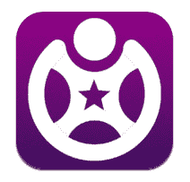
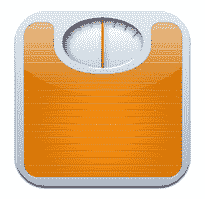
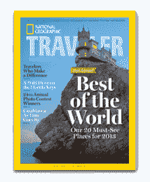

# 让你的新年决心保持活力的 7 个应用程序 TechCrunch

> 原文：<https://web.archive.org/web/https://techcrunch.com/2012/12/31/seven-apps-that-will-keep-your-new-years-resolutions-alive/>

崭新的一年即将来临，是时候开始考虑你想要做出的改变了。但是坚持新年决心是很困难的，尤其是在没有任何帮助或支持的情况下。

但是十有八九，有一个应用程序可以解决这个问题。我们从《时代》杂志列出的十大最违背新年决心的清单中挑选了七个，并确定了哪些应用程序最有助于实现这些新年决心。

所以，废话不多说，下面是帮助你在新的一年过得更好的最佳应用。

### 减肥健身:[健身](https://web.archive.org/web/20221206172701/https://itunes.apple.com/us/app/fitocracy-free-daily-workout/id509253726?mt=8)

 [Fitocracy](https://web.archive.org/web/20221206172701/https://www.fitocracy.com/) 是一款健身应用，利用社交工具和游戏化让健身变得更容易。减肥和经常锻炼是每年最流行和最常见的新年决心，但许多人在几天或几周后就放弃了。保持动力可能很难。

通过自动将朋友包括在内，并增加类似于视频游戏中的竞争水平，Fitocracy 让用户专注于他们的目标，而不必关注定期健身的痛苦。

**优秀奖:**
*[Nike+Running](https://web.archive.org/web/20221206172701/https://itunes.apple.com/us/app/nike+-running/id387771637?mt=8)*
*[健身教练](https://web.archive.org/web/20221206172701/https://itunes.apple.com/us/app/workout-trainer/id395686735?mt=8)*

### 吃得更健康，饮食:[减肥！](https://web.archive.org/web/20221206172701/https://itunes.apple.com/us/app/lose-it!/id297368629?mt=8)

 [丢掉吧！](https://web.archive.org/web/20221206172701/https://itunes.apple.com/us/app/lose-it!/id297368629?mt=8)是一个很棒的追踪热量摄入和饮食的 app。你只需记录下你吃的一切，无论是在餐馆还是自制的，应用程序就会开始跟踪你每周的卡路里预算，碳水化合物、蛋白质和脂肪的比例，并与社交网络集成，让你跟上朋友的进度。

关于节食应用程序最糟糕的事情是输入你的食物摄入量会变得乏味和烦人，但是丢掉它！通过整合餐厅菜单和完整的食品和配料数据库，尽可能地简化了流程。我一直在用丢掉它！一段时间，最好的部分是，一段时间后，你开始了解不同食物的一般热量值，这有助于你在选择吃什么时做出更好、更明智的决定。

**优秀奖:**
*[我的健身伙伴](https://web.archive.org/web/20221206172701/https://itunes.apple.com/en/app/calorie-counter-diet-tracker/id341232718?mt=8)*
*[营养菜单](https://web.archive.org/web/20221206172701/https://itunes.apple.com/us/app/nutrition-menu-calorie-exercise/id294692235?mt=8)*

### 学点新东西: [Snapguide](https://web.archive.org/web/20221206172701/https://itunes.apple.com/en/app/snapguide/id421477397?mt=8)

[snap guide](https://web.archive.org/web/20221206172701/https://beta.techcrunch.com/2012/03/29/snapguide-makes-it-super-easy-to-make-and-share-how-to-guides-via-iphone/)是一款漂亮的 iOS 应用程序，为数字世界带来了“如何”。它允许用户创建和分享指南，培养一个可以互相教学的点对点用户社区。你可以在应用程序中查找各种指南，以帮助你开始你的新手艺。

该应用程序不会对每个指南进行太深入的介绍，所以如果你想成为某方面的专家，这可能不是最佳选择。然而，如果目标是每天学习一点新东西，或者发现一个新的爱好或激情，Snapguide 肯定是适合你的应用程序。

**优秀奖:**
*[可汗书院](https://web.archive.org/web/20221206172701/https://itunes.apple.com/us/app/khan-academy/id469863705?mt=8)* *[点心](https://web.archive.org/web/20221206172701/https://itunes.apple.com/us/app/learn-spanish-mindsnacks/id385497068?mt=8)*

 [【我的最后一根烟】](https://web.archive.org/web/20221206172701/https://itunes.apple.com/us/app/my-last-cigarette-stop-smoking/id301043169?mt=8)通过绘制使用者戒烟时健康状况的变化来帮助他们戒烟。只需输入你的吸烟习惯，该应用程序就会让你了解如何通过戒烟来改善生活。

有十多种不同的读数，指示器显示你的寿命如何增加，你的循环和肺功能如何改善，以及你每天不买一包烟可以节省多少钱。通过看到你生活质量的这些改善，这个应用程序可以在你每次需要点烟的时候作为一个提醒。

**优秀奖:**
*[Livestrong 我的戒烟蔻驰 Lite](https://web.archive.org/web/20221206172701/https://itunes.apple.com/us/app/livestrong-myquit-coach-lite/id508671906?mt=8)*
*[戒烟由 Azati](https://web.archive.org/web/20221206172701/https://play.google.com/store/apps/details?id=com.azati.quit)*

### 减少债务/省钱:[改善](https://web.archive.org/web/20221206172701/https://itunes.apple.com/us/app/betterment/id393156562?mt=8)

 即使“高收益账户”和“投资组合”这些术语让你紧张，[改善](https://web.archive.org/web/20221206172701/https://itunes.apple.com/us/app/betterment/id393156562?mt=8)也能帮上忙。[Disrupt aluminum](https://web.archive.org/web/20221206172701/https://beta.techcrunch.com/2010/05/24/betterment-wants-to-be-your-new-savings-account/)帮助你赚取比标准储蓄账户更多的钱，比高收益账户更灵活。在 Betterment.com 上注册账户后，用户可以从应用程序中实时查看他们投资组合的余额、构成和回报。

用户还可以增加/提取资金，改变股票和债券的分配，以及审查目标和账户活动。显然，摆脱债务的最佳方式是削减开支，但在存钱的同时赚点外快更好。

**优秀奖:**
*[造币厂](https://web.archive.org/web/20221206172701/https://itunes.apple.com/us/app/mint.com-personal-finance/id300238550?mt=8)*
*[page once 钞票&钞票](https://web.archive.org/web/20221206172701/https://itunes.apple.com/us/app/pageonce-money-bills/id285056092?mt=8)*

 [【国家地理】的旅行者杂志【iPad 版绝对是找到你下一个目的地的最佳地点。它载有来自世界上所有最美丽的地方的内容，让你感觉你真的在那里，并帮助你了解每个景点的期望。](https://web.archive.org/web/20221206172701/https://itunes.apple.com/us/app/national-geographic-traveler/id482661394)

该应用包括地图、图库，甚至包括泰姬陵等地的 360 度照片。用户还可以从不同地点的智能旅游博客和 NatGeo Twitter Feed 获得旅游提示和实时信息。

**优秀奖:**
*[苹果地图](https://web.archive.org/web/20221206172701/https://beta.techcrunch.com/2012/09/26/the-apple-ios-6-maps-fiasco-clarified-in-3-minutes/)*
*[皮划艇](https://web.archive.org/web/20221206172701/https://itunes.apple.com/us/app/kayak/id305204535?mt=8)*

### 多陪陪家人:[路径](https://web.archive.org/web/20221206172701/https://itunes.apple.com/en/app/path/id403639508?mt=8)

 我住的地方离我的家人千里之外，但我发现[小路](https://web.archive.org/web/20221206172701/https://itunes.apple.com/en/app/path/id403639508?mt=8)是和他们保持亲近的最好方式，即使我离他们很远。由于 Path 是一个设计精美的社交网络应用程序，每个用户最多只能有 50 个关注者，所以它不像脸书和 Twitter 等其他社交网络那样拥挤。

此外，Path 还提供了一些有趣的功能，比如告诉关注者你何时醒来或入睡。你还可以让你的粉丝知道你在看什么电影，听什么音乐，喜欢去什么餐馆。该应用是免费的，易于设置，使用起来也很愉快，这要归功于一个获奖的用户界面[。](https://web.archive.org/web/20221206172701/https://beta.techcrunch.com/2011/11/29/paths-second-iteration-is-less-photosharing-and-more-everything-sharing/)

**优秀奖:**
*[Skype](https://web.archive.org/web/20221206172701/https://itunes.apple.com/en/app/skype/id304878510?mt=8)*
*[双人](https://web.archive.org/web/20221206172701/https://itunes.apple.com/us/app/pair/id503663173?mt=8)*