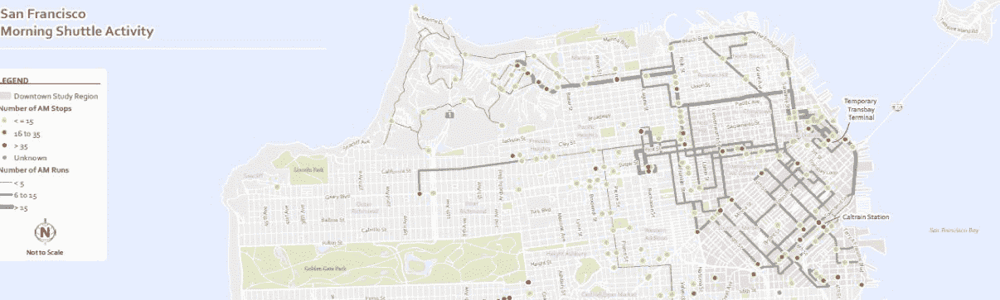

# 尽管公众持有异议，SF 仍批准了科技巴士试点计划

> 原文：<https://web.archive.org/web/https://techcrunch.com/2014/01/21/sf-approves-tech-bus-pilot-program-despite-public-dissent/>

# 尽管公众有异议，旧金山还是批准了科技巴士试点项目

今天，旧金山市交通局批准了一项有争议的[试点项目](https://web.archive.org/web/20221206112927/https://www.sfmta.com/sites/default/files/agendaitems/1-21-14%20Item%2014%20Private%20Commuter%20Shuttle%20policy.pdf)，该项目将向私人班车开放大约 200 个区域公交车站，用于运送公司技术人员到城外的校园。

尽管评论慷慨激昂，偶尔条理清晰——更不用说还有很多[谷歌的谈话要点](https://web.archive.org/web/20221206112927/https://beta.techcrunch.com/2014/01/20/google-sends-high-handed-memo-with-busing-talking-points/)——该机构的最终审议迅速而中肯:是的。

这些经常被称为“谷歌巴士”的班车已经成为以旧金山为家的更年轻、更新和更富裕的技术工人与长期居民之间日益激烈的争论的前沿，后者担心该市不太富裕的人被分割。考虑到大多数行业仍然疲软的就业市场、螺旋上升的租金成本，以及对富有的科技公司留在本地的税收激励，瘴气开始沸腾。

将员工送到南方，而不是强迫他们通勤，具有生态效益:更少的汽车意味着更少的拥堵和更低的碳足迹。但是对于私营公司公然违反法律使用公共空间，许多人表示反对。会议室挤满了人。

此外，谷歌等公司将支付的每站一美元的费用被许多人视为一种敷衍的捐赠，因为该市的人们在他们自己的区号范围内支付更多的公交车费。

坦率地说，科技公司的表现很糟糕:他们没有道歉，没有提出为过去的违规行为支付费用，也没有提出更合理的每次停车税，他们几乎没有提出什么，也没有安抚任何人。尽管如此，他们得到了他们的试点计划，所以他们赢了。

旧金山分裂成两个阵营——那些认为谷歌是公众捐助者的人，和那些认为它是公众威胁的人——对我们这个小社区来说是不健康的。但话说回来，作为一个服用优步的年轻科技相关的混蛋，我可能有偏见。

无论如何，航天飞机将继续运行。试点将继续进行，并遵循更永久的东西将取代它的位置。这就是我们现在的处境。

*顶级图片来源: [Flickr](https://web.archive.org/web/20221206112927/http://www.flickr.com/photos/cjmartin/)*