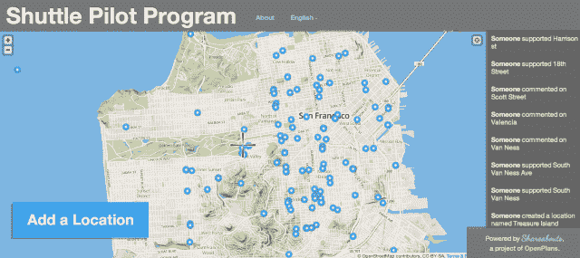

# 告诉旧金山市政府谷歌巴士应该在哪里 

> 原文：<https://web.archive.org/web/https://techcrunch.com/2014/02/08/sfmta-google-bus-program/>

# 告诉旧金山市政府谷歌巴士应该在哪里

既然旧金山市交通局已经批准了一个试点项目，以监管来自半岛的科技通勤巴士，他们正在征求社区的反馈意见。

几周前，SFMTA 董事会批准了一项计划，苹果、谷歌和脸书等科技公司将不得不为他们的每一次停留支付 1 美元。

本周，该机构[在这里](https://web.archive.org/web/20221208171350/http://sfcommutershuttles.sfmta.com/)开辟了一个页面，旧金山居民可以在这里输入公共汽车应该停在哪里。

它们应该集中在一个地方还是分散在整个社区？

是否应该禁止某些站点，因为公共汽车造成了太多的拥堵问题？

无论你是谁——无论你是在旧金山通勤到山景城或门洛帕克的技术工人，还是觉得自己的房租受到硅谷工人涌入的不成比例影响的人，还是不得不绕过这些公交车的自行车手— **你都应该参与进来。**

还有两场听证会，分别是 2 月 10 日在南范尼斯大道[举行的听证会和 2 月 22 日在多洛雷斯公园](https://web.archive.org/web/20221208171350/http://www.sfmta.com/calendar/meetings/pilot-commuter-shuttles-stop-locations-open-house)附近的[教会高中举行的听证会。](https://web.archive.org/web/20221208171350/http://www.sfmta.com/calendar/meetings/pilot-commuter-shuttles-stop-locations-open-house-0)

为什么？因为旧金山市的政策有时确实是由谁能在听证室里容纳最多的人来决定的。(真的。)

尽管该市的监管人员和 MTA 董事会成员试图代表住在这里的人们的最佳长期利益，但他们也是人，可能会受到房间里有人对他们大喊大叫的心理影响。将会有社区组织和当地的倡导团体联合起来消除或移动停车点。

所以如果你真的关心这个问题，请你也发表你的意见。

[*(吉姆·格里尔拍摄)*](https://web.archive.org/web/20221208171350/https://twitter.com/jimgreer)