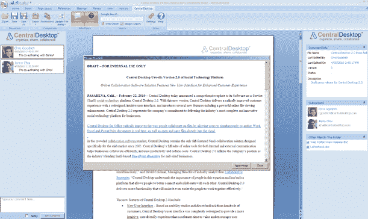

# SharePoint 竞争对手 Central Desktop 推出 Microsoft Office 协作工具 

> 原文：<https://web.archive.org/web/https://techcrunch.com/2010/05/04/sharepoint-competitor-central-desktop-launches-microsoft-office-collaboration-tool/>

# SharePoint 竞争对手 Central Desktop 推出 Microsoft Office 协作工具

[Central Desktop](https://web.archive.org/web/20221209214653/http://www.centraldesktop.com/) ，一个类似 SharePoint 的 SaaS 企业协作平台，推出了一个新工具，允许微软 Office 用户进行云文档协作。Central Desktop 的工具允许用户实时地同时共同创作 Word、Excel 和 PowerPoint 文档，并直接在云中打开和保存文件。

用于办公的中央桌面利用了来自的 [OffiSync 的技术，并且兼容任何版本的微软 Office，包括 2003、2007 和 2010。安装后，Central Desktop for Office 在 Microsoft Word、Excel 和 PowerPoint 中添加了一个新的工具栏，使用户能够直接在 Office 中打开、保存、编辑和共同创作存储在云中的文件。这个新工具允许用户评论文件，管理订阅者和跟踪版本历史。Central Desktop 的共同创作功能允许多个用户同时编辑 Office 文件，方法是跟踪和同步协作者所做的所有更改，并将它们正确合并到一个更新版本中。](https://web.archive.org/web/20221209214653/http://www.crunchbase.com/company/offisync)

当然，微软 Office [在其](https://web.archive.org/web/20221209214653/https://beta.techcrunch.com/2009/09/17/imitation-isnt-always-flattery-microsoft-previews-google-apps-killer-to-beta-testers/)[新的网络版 Office 中包含了](https://web.archive.org/web/20221209214653/https://beta.techcrunch.com/2009/07/13/the-complete-guide-to-microsofts-office-2010/)类似的多作者协作功能。但 Central Desktop 表示，他们的工具将文档协作带到了旧版本的 Office 上，成本比升级到新版 Office 要低得多。

除了 Central Desktop，还有其他工具提供类似的功能，例如 [DocVerse、](https://web.archive.org/web/20221209214653/https://beta.techcrunch.com/2009/11/03/docverse-turns-microsoft-office-into-google-docs-with-collaboration-plug-in/)最近被谷歌[收购](https://web.archive.org/web/20221209214653/http://www.centraldesktop.com/)。

[http://vimeo.com/moogaloop.swf?clip_id=11454273&server = vimeo . com&show _ title = 1&show _ byline = 1&show _ portrait = 0&color = ffffff&full screen = 1](https://web.archive.org/web/20221209214653/http://vimeo.com/moogaloop.swf?clip_id=11454273&server=vimeo.com&show_title=1&show_byline=1&show_portrait=0&color=ffffff&fullscreen=1)

[办公视频中央桌面](https://web.archive.org/web/20221209214653/http://vimeo.com/11454273)来自[中央桌面](https://web.archive.org/web/20221209214653/http://vimeo.com/user3140616)上 [Vimeo](https://web.archive.org/web/20221209214653/http://vimeo.com/) 。