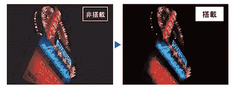
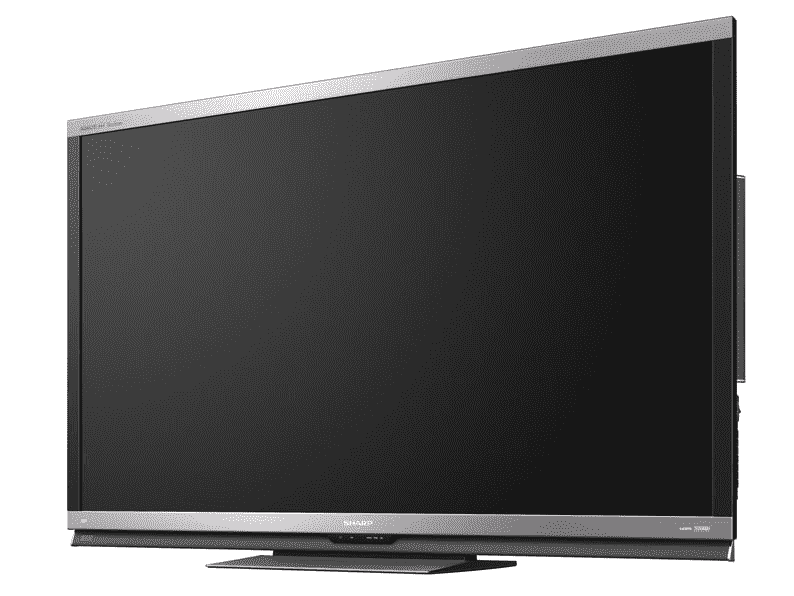

# 夏普展示带有“高亮度”面板的 70 英寸 Aquos Quattron 液晶 3D 电视 

> 原文：<https://web.archive.org/web/http://techcrunch.com/2011/09/02/sharp-shows-70-inch-aquos-quattron-lcd-3d-tv-with-mega-brightness-panel/>

# 夏普展示带有“高亮度”面板的 70 英寸 Aquos Quattron 液晶 3D 电视

昨天，夏普日本公司宣布了面向日本市场的 Aquos Quattron 3D LC-70X5，这是已经在美国上市几个月的 [LC-70LE735U](https://web.archive.org/web/20230204230614/http://www.sharpusa.com/ForHome/HomeEntertainment/LCDTVs/LC70LE735U.aspx) 的后续产品。就像那个型号一样，LCD 尺寸为 70 英寸，可以产生 3D 图像，并提供夏普的“Quattron Quad Pixel 技术”以更好地显示色彩。

这款新机型的主要卖点是全阵列 LED 背光，夏普将其称为“百万亮度技术”。据该公司称，LC-70X5 的背光强度是上一款的两倍，显然导致了更明亮的图像(见下文的示例)。

该电视具有全高清分辨率、THX 3D、15，000，000:1、动态对比度、两个 USB 端口、四个 HDMI 端口、以太网、网络连接(VOD)、与智能手机和蓝光刻录机等其他 Aquos 设备的无线连接、在外部硬盘上录制以及 176 度视角。

夏普计划于 9 月 25 日开始在日本销售这款设备(价格:10，400 美元)。