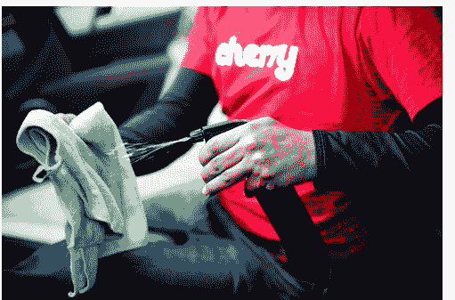

# Shasta Ventures，Founders Fund 在优步投资 450 万美元用于洗车，Cherry 

> 原文：<https://web.archive.org/web/https://techcrunch.com/2012/04/17/shasta-ventures-founders-fund-put-4-5-million-in-the-uber-for-carwashes-cherry/>

Cherry 最近成立了一家初创公司，为你和你的汽车提供按需洗车服务，该公司从 Shasta Ventures、Founders Fund、Shervin Pishevar 和 Bill Lee 那里获得了 450 万美元的新资金。沙斯塔管理合伙人托德弗朗西斯将加入樱桃的董事会。这家初创公司此前从一些前 PayPal 员工那里筹集了 75 万美元的种子资金，其中包括 Yammer 首席执行官大卫·萨克斯、PayPal 创始人麦克斯·拉夫琴和 Square 首席运营官基思·拉博伊斯。除了融资新闻，Cherry 还将他们的服务扩展到湾区的 10 个城市，并发布了新的 iPhone 应用程序。

与 Airbnb、优步和 GetAround 类似，Cherry 是一家[希望利用数据、定位和移动技术让我们在现实世界中的生活](https://web.archive.org/web/20221221185854/https://techcrunch.com/2011/11/08/max-levchin-keith-rabois-and-davis-sacks-back-the-uber-for-carwashes-cherry/)变得更好的企业。通过网络或原生 iOS 应用程序(Android 将在一个月后发布)，用户可以指定他们的车在街道上的位置(以及车的类型、颜色和车牌号码)，在停车场或其他公共区域。一旦你在 Cherry 上登记了你的车的位置，该服务的技术就会立即找到并派遣一名专业洗车人员在你停车的地方洗车，你甚至不需要去那里。

Cherry 每次洗车收费 29 美元，包括清洗汽车外部和空气清新剂。Cherry 会在每次洗衣后自动向顾客的卡收费，这样他们就不需要去见洗衣者付款了。顾客对他们洗的衣物进行评分，Cherry 将这些评分作为顾客的小费，并为五星级的衣物支付额外的奖励。

29 美元还包括内部清洁。车主要么不锁门，要么在洗衣机到达时下来开锁(Cherry 会给车主发短信)。洗完之后，洗衣机会把车锁上。

在保险方面，每一位顾客都在 Cherry 的保障范围之内，它涵盖了顾客汽车的所有意外损坏。Cherry 的联合创始人特拉维斯·范德赞登(Travis VanderZanden，前 Yammer 高管)和另一位创始人阿特·亨利(Art Henry)亲自会见、审查、培训每一位受雇为 Cherry 洗衣的洗衣工，并为他们提供设备。

在新版的 iOS 应用中，Cherry 实现了用户界面的重新设计，增加了取消任务而不会受到惩罚的功能，以及查看用户账户余额和其他功能。

该公司表示，到目前为止，很大一部分使用 Cherry 的公司将 Cherry 作为员工的额外津贴，或者作为朋友和同事的“随机洗车行为”等。Cherry 最初在旧金山推出，现在在门洛帕克、帕洛阿尔托、红木城、库比蒂诺、山景城、桑尼维尔、圣克拉拉、洛斯阿尔托斯和圣何塞都有销售。

新的资金将用于扩展到旧金山以外的其他城市。

正如我在对该服务的最初评论中提到的，Cherry 解决了洗车时的整个懒惰问题。虽然我不太喜欢不锁车，但如果我所在的地区有这项服务，我肯定会尝试一下。

