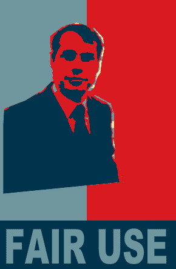

# 谢泼德·费尔雷回应美联社:是的，我撒谎了。但这仍然是合理使用。

> 原文：<https://web.archive.org/web/https://techcrunch.com/2009/10/16/shepard-fairey-responds-to-the-ap-yes-i-lied-but-it-was-still-fair-use/>

# 谢泼德·费尔雷回应美联社:是的，我撒谎了。但这仍然是合理使用。

我们就美联社今晚发布的消息联系了谢泼德·费尔雷[声称](https://web.archive.org/web/20221205070151/http://www.beta.techcrunch.com/2009/10/16/ap-claims-shepard-fairey-admits-to-lying-and-trying-to-destroy-evidence-his-counsel-quits/)他已经承认在使用哪张图片作为他标志性的希望海报的来源图片上撒了谎。他给我们发来了回复(转载如下)，这有效地证实了美联社所说的。

今晚的承认集中在费尔雷最初声称在创作“希望”海报时使用的照片上——他声称使用的图像不是美联社声称拥有的图像，然后在他意识到自己错了时撒谎并删除了证据。两张照片都是在同一个新闻发布会上拍的。费尔雷最初说他用的那张照片显示奥巴马在乔治·克鲁尼旁边，他真正用的是一张特写。美联社在诽谤方面取得了成功(考虑到费尔雷的行为，这或许是理所当然的)，但费尔雷可能仍然有理由认为他的形象受到合理使用的保护。不管他用的是哪张照片，通过绘制图像并把它变成一个国家图标，他可能已经改变了它，足以使美联社的声明无效。

> SHEPARD FAIREY 关于美联社公平使用案例的声明
> 2009 年 10 月 16 日
> 为了让所有人了解我为维护版权法中的公平使用原则而进行的法律斗争的最新情况，我想向大家通报一下我起诉美联社一案的最新进展。2009 年 10 月 9 日，我的律师通过他们的律师给美联社和摄影师曼尼·加西亚写了一封信，通知他们我打算修改我的法庭诉状。在整个案件中，一直有一个问题，即我使用哪张曼尼加西亚的照片作为设计希望图像的参考。美联社声称是一张照片，而我声称是另一张。新的文件声明美联社关于我用哪张照片作为参考是正确的，而我错了。虽然我最初认为我提到的照片是另一张，但我很早就发现我错了。为了掩盖我的错误，我提交了虚假的图片并删除了其他图片。我真诚地为我的判断失误道歉，我为我自己的行为承担全部责任。我正在采取一切措施纠正这些信息，我很后悔没有早点站出来。
> 
> 我很抱歉伤害和失望了在我生命中这个艰难的时刻支持我的同事、朋友和家人。我也很抱歉，因为我的行为可能会分散我案件的真正焦点——合理使用的权利，以便所有艺术家都能自由创作。无论使用两个图像中的哪一个，合理使用问题应该是相同的。