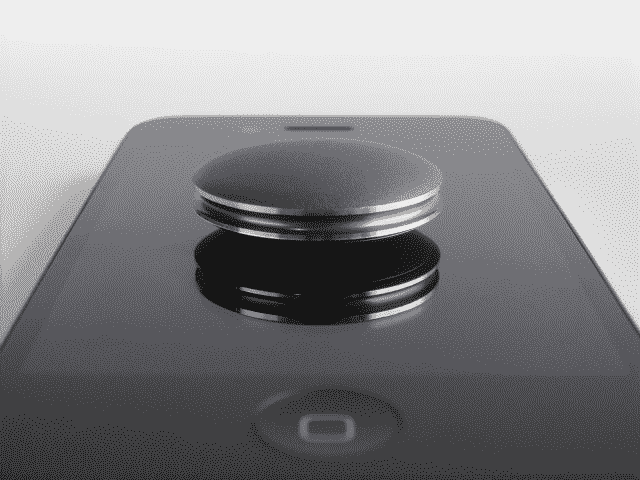

# Meet Shine:优雅的活动跟踪器，有一个与 iPhone 同步的巧妙技巧

> 原文：<https://web.archive.org/web/https://techcrunch.com/2012/11/14/shine-misfit-wearables/>

# Meet Shine:优雅的活动跟踪器，有一个与 iPhone 同步的巧妙技巧

几个月前，我们发现由苹果前首席执行官约翰·斯卡利和几名硬件资深人士共同创立的一家公司正在研究一些隐形可穿戴计算概念，该公司让 iPhone 连接的血糖仪在糖尿病患者中很受欢迎。[今年 4 月，他们的公司 Misfit Wearables 在由 Founders Fund 和 Khosla Ventures 牵头的一轮融资中筹集了 760 万美元。](https://web.archive.org/web/20230225230138/https://techcrunch.com/2012/04/27/the-wearable-computing-startup-from-agamatrixs-founders-former-apple-ceo-john-sculley-just-raised-7-6m/)

现在我们终于可以一窥接近完成的产品了。

名为 Shine 的 Misfit 可穿戴设备的第一款设备是一款时尚的活动跟踪器，可以像 FitBit 或耐克的 Fuelband 一样记录你的运动量。

外形简洁优雅。Shine 是一个大约 25 美分硬币大小的小圆盘。它有一个全金属铝外壳，该公司花了几个月来完善。

该公司的首席执行官 Sonny Vu 告诉我们，他们实际上必须找出如何在发光处钻大约 3000 个微孔，以便让活动指示灯发光。

它们太小了，当光线处于休眠状态时，你看不见它们。但是当你轻触这个设备时，围绕着灯的边缘的一个小圆圈就会活跃起来。你越接近完成你的日常目标，你就越接近一个完整的光环。如果一半的光芒亮起，那么你已经成功了一半。Shine 完全防水，可以跟踪从游泳到骑自行车的任何东西。

它最巧妙的地方可能是它如何与 iPhone 同步。(抱歉，还没有安卓。)它不依赖蓝牙或任何物理连接器。你打开该公司的应用程序，然后将光照在你的 iPhone 屏幕上，手机就会自动从设备上下载数据。[滚动到下面视频中的 0:50，看看它的动作](https://web.archive.org/web/20230225230138/https://www.youtube.com/watch?v=1RL8PjiOoGI)。Vu 没有透露这项技术是如何工作的，因为这是该公司的专有秘密，不想让竞争对手知道。它甚至可以在手机处于飞行模式时工作。

像许多已经获得资金的硬件初创公司一样，Misfit 正在使用一个众筹网站来吸引人们的兴趣。他们今天在 Indiegogo】上发起了一项活动。另一个受欢迎的选择 Kickstarter 不愿意接受健康或医疗设备。Vu 将此称为“精益硬件”方法，这是对 Eric Ries 的“精益创业”哲学的一种发挥，在制造最终产品之前，Misfit 将首先通过众筹网站证明消费者需求。

他们计划明年初推出售价 99 美元的设备。还将有一个售价 19 美元的腕带配件和一个售价 49 美元的皮革表带。Shine 已经配备了一个小橡胶夹，可以轻松挂在皮带、鞋子或其他皮带上。Vu 表示，将会有一个开放的 API 供第三方开发者使用。

至于公司本身，它有 30 名员工分散在世界各地，这是一个真正的全球性公司结构。工业设计在旧金山完成，软件在越南完成，Vu 在越南找到了几个有才华的美国培训的机器学习专家，他们搬到了越南。

Vu 和他的另一位联合创始人斯里达尔·艾扬格在硅谷可能不太出名，但他们之前的公司是合法的。这不是一个消费网络或移动公司可以廉价获取用户或病毒式增长。这是一家名为 AgaMatrix 的医疗设备公司，Vu 和 Iyengar 在 10 年间将其发展成为每年 5000 万至 1 亿美元的业务。AgaMatrix 是苹果为 iPhone 批准的第一个第三方硬件插件。这是糖尿病患者用来控制胰岛素水平的血糖仪。想想吧。和食品药品管理局打交道多年。那是硬核。

[YouTube http://www.youtube.com/watch?v=1RL8PjiOoGI]