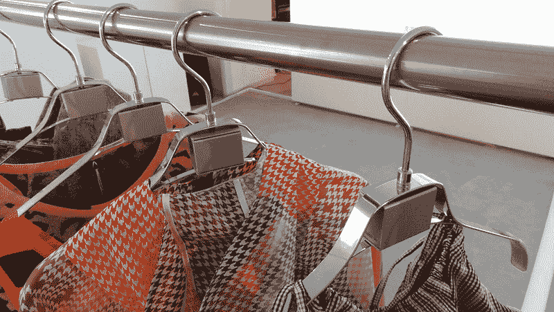
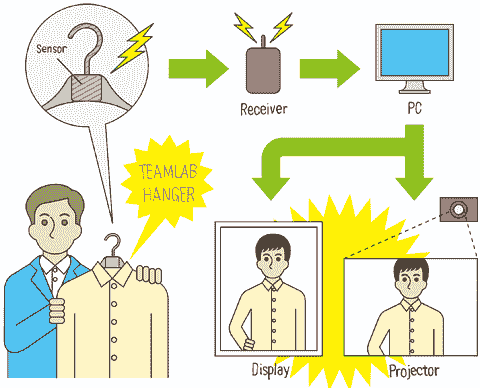

# 购物 2.0:日本服装店使用的互动衣架(视频)

> 原文：<https://web.archive.org/web/http://techcrunch.com/2011/10/14/shopping-2-0-interactive-hangers-used-in-japanese-clothes-store-videos/>

# 购物 2.0:日本服装店使用的互动衣架(视频)

购物 2.0:毫不奇怪，[【互动衣架】](https://web.archive.org/web/20230203080635/http://www.team-lab.net/portfolio/teamlabhanger/hanger.html)【向下滚动查看英文解释】首先出现在日本这个痴迷于服务、购物、时尚和科技的国家。问题商店 Vanquish 位于东京市中心一家名为[109 门](https://web.archive.org/web/20230203080635/http://www.109mens.jp/)的百货商店。

它的工作方式非常简单:每次购物者拿起衣架，商品上方的电脑屏幕就会显示相关的图片和视频，例如显示一件 t 恤穿起来的样子或其他适合所选商品的衣服。

诀窍是在衣架内放置一个传感器，它可以自动触发动作，但也可以用来立即改变商店的背景音乐或灯光，例如:

这种互动衣架的制造商，总部位于东京的 T4 T3 团队实验室，去年开始尝试这一概念。

潮流咨询公司 [Cscout Japan](https://web.archive.org/web/20230203080635/http://www.cscoutjapan.com/) 已经试水衣架:
【YouTube = http://www . YouTube . com/watch？v = nu 116 yttzqa&w = 560&h = 315】

下面再来两个 Team Lab 自己的视频:
【YouTube = http://www . YouTube . com/watch？v = ldrzz 8 uhzmg&w = 560&h = 315】
【YouTube = http://www . YouTube . com/watch？v = uktuhsvl 1 tw&w = 560&h = 315】

Via [日本趋势/ CScout 日本](https://web.archive.org/web/20230203080635/http://www.japantrends.com/shopping-goes-hi-tec-with-interactive-hangers/)